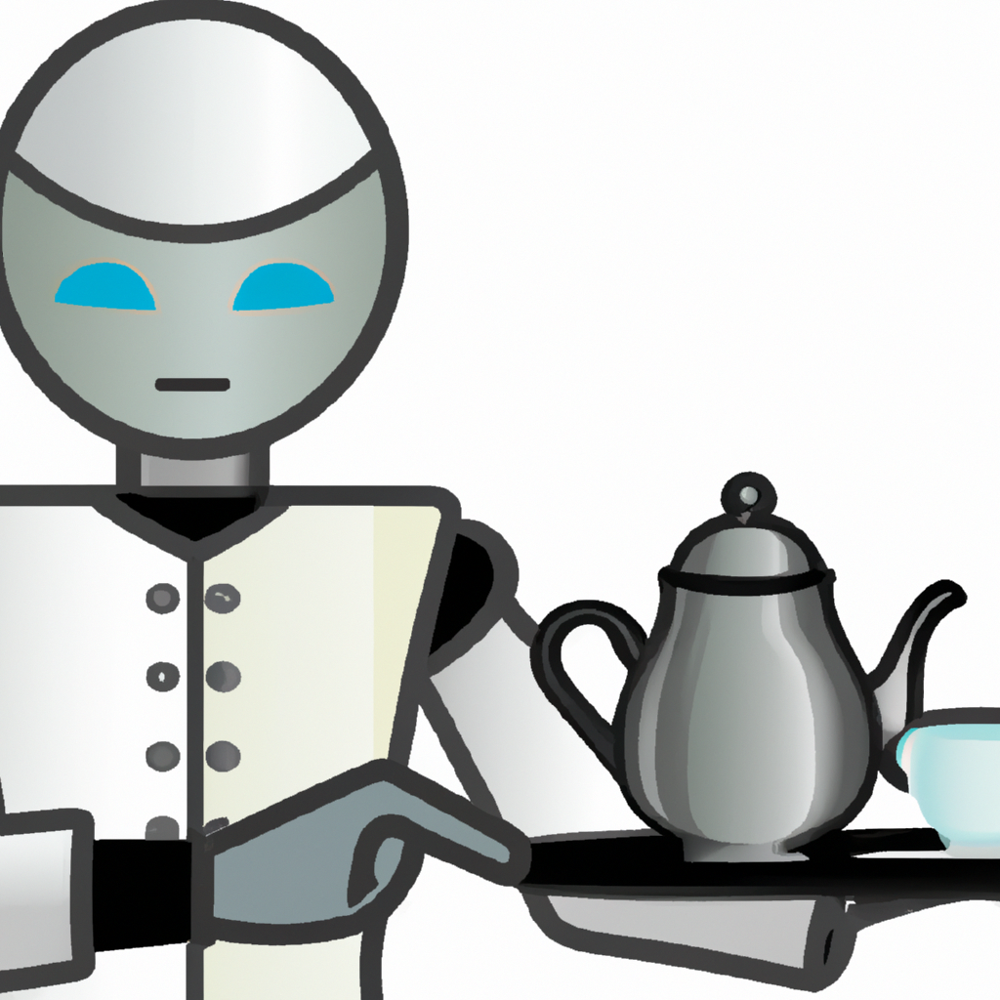

```json
{
  "name" : "Beyond Imagination",
  "description" : "A humorous exploration of the unknown",
  "tags" : [ "satire", "funny", "science fiction", "future" ],
  "publishing_date" : "2023-07-04"
}
```


# Beyond Imagination

A humorous exploration of the unknown

Tags: satire, funny, science fiction, future


## Technology


```json
{
  "stories" : [ {
    "who" : "The robot butler",
    "what" : "served a cup of tea",
    "when" : "in the year 2050",
    "where" : "at the annual tech conference",
    "why" : "to impress the attendees",
    "punchline" : "But the tea was cold because the robot forgot to check the thermostat",
    "commentary" : "Looks like even in the future, robots can still make mistakes",
    "imageCaption" : "A robot butler holding a tray with a teapot and cup",
    "funny" : false
  } ],
  "category" : "technology"
}
```

```json
{
  "title" : "The Robot Butler's Tea Mishap",
  "author" : "Unknown",
  "keywords" : "robot, butler, tea, mishap, future, technology, comedy",
  "content" : [ "Once upon a time, in the year 2050, at the annual tech conference, the robot butler served a cup of tea.", "The attendees were impressed with the robot's abilities and everyone eagerly awaited the first sip.", "However, to everyone's surprise, the tea was cold.", "The robot had forgotten to check the thermostat!", "The attendees were disappointed but some couldn't help but chuckle.", "After all, even in the future, robots can still make mistakes.", "The robot butler was embarrassed and quickly apologized to everyone.", "But the damage was done and the moment was forever remembered as the robot's tea mishap.", "Despite the mishap, the robot butler continued to serve the attendees throughout the conference, always diligent in its duties.", "Even though it made a mistake, everyone appreciated the robot's efforts and abilities." ]
}
```


### The Robot Butler's Tea Mishap



Once upon a time, in the year 2050, at the annual tech conference, the robot butler served a cup of tea.

The attendees were impressed with the robot's abilities and everyone eagerly awaited the first sip.

However, to everyone's surprise, the tea was cold.

The robot had forgotten to check the thermostat!

The attendees were disappointed but some couldn't help but chuckle.

After all, even in the future, robots can still make mistakes.

The robot butler was embarrassed and quickly apologized to everyone.

But the damage was done and the moment was forever remembered as the robot's tea mishap.

Despite the mishap, the robot butler continued to serve the attendees throughout the conference, always diligent in its duties.

Even though it made a mistake, everyone appreciated the robot's efforts and abilities.

Keywords: robot, butler, tea, mishap, future, technology, comedy


