# Prime_Numbers

In this test we will used AI Coding Assistant to implement the Prime_Numbers class to solve the following problem:

```
Print all prime numbers from 1 to 100
```

## Implementation

The first step is to translate the problem into code. We can do this by using the "Insert Implementation" command.

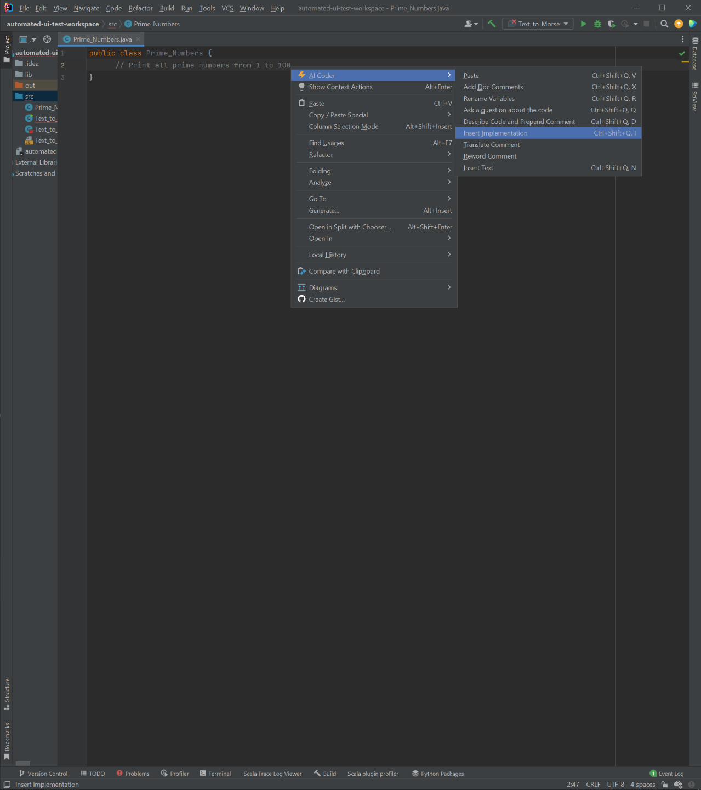


This results in the following code:

```java
public class Prime_Numbers {
    public static void main(String[] args) {
        for (int i = 1; i <= 100; i++) {
            boolean isPrime = true;
            for (int j = 2; j < i; j++) {
                if (i % j == 0) {
                    isPrime = false;
                    break;
                }
            }
            if (isPrime) {
                System.out.print(i + " ");
            }
        }
    }

}
```

## Execution

This code can be executed by pressing the "Run" button in the top right corner of the IDE. 
What could possibly go wrong?


```
C:\Users\andre\.jdks\openjdk-19.0.1\bin\java.exe ...
1 2 3 5 7 11 13 17 19 23 29 31 37 41 43 47 53 59 61 67 71 73 79 83 89 97 
Process finished with exit code 0
```
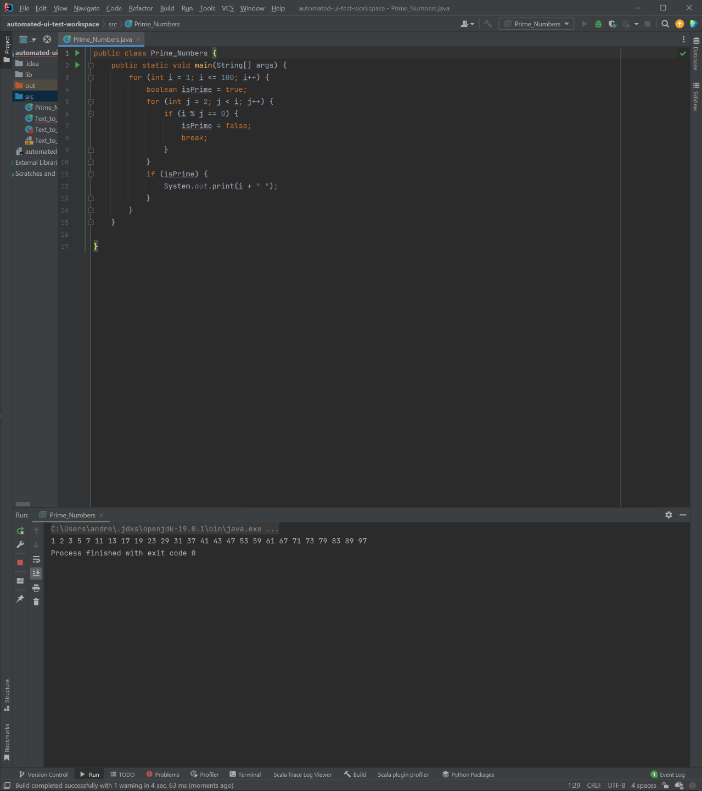


## Rename Variables

The code is not very readable. We can use the "Rename Variables" command to make it more readable...

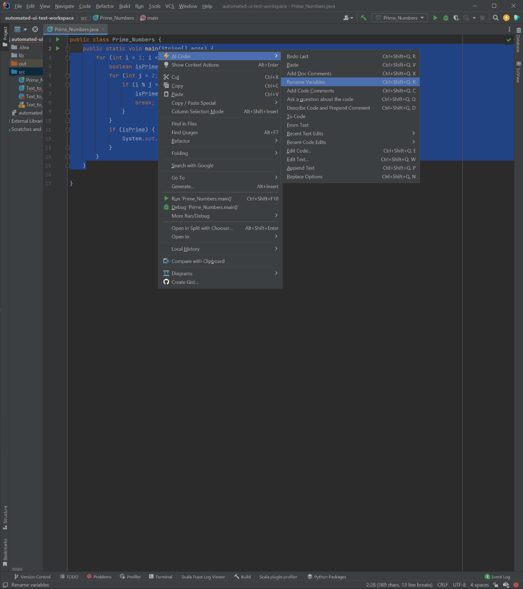

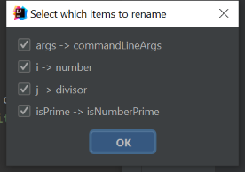


## Documentation Comments

We also want good documentation for our code. We can use the "Add Documentation Comments" command to do this.

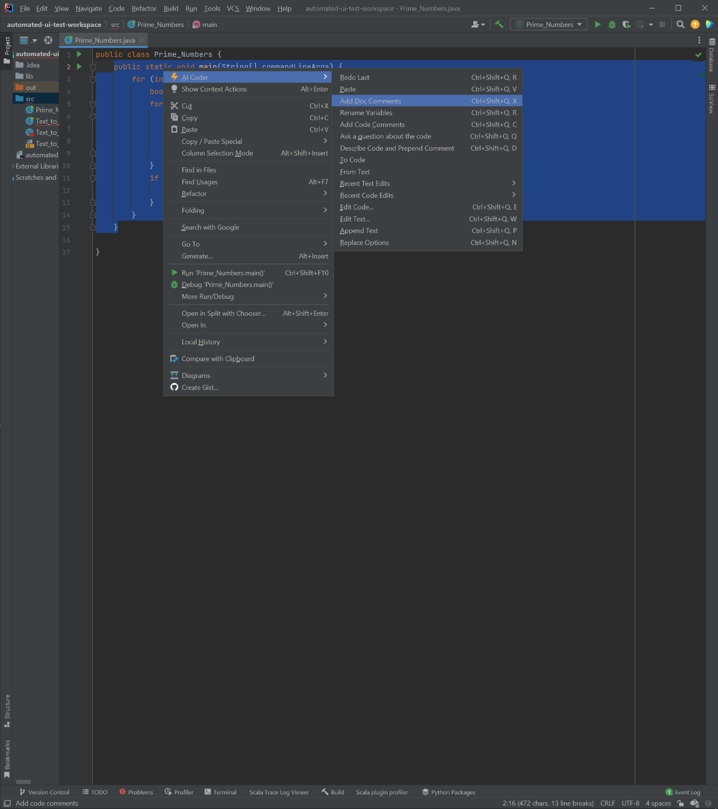

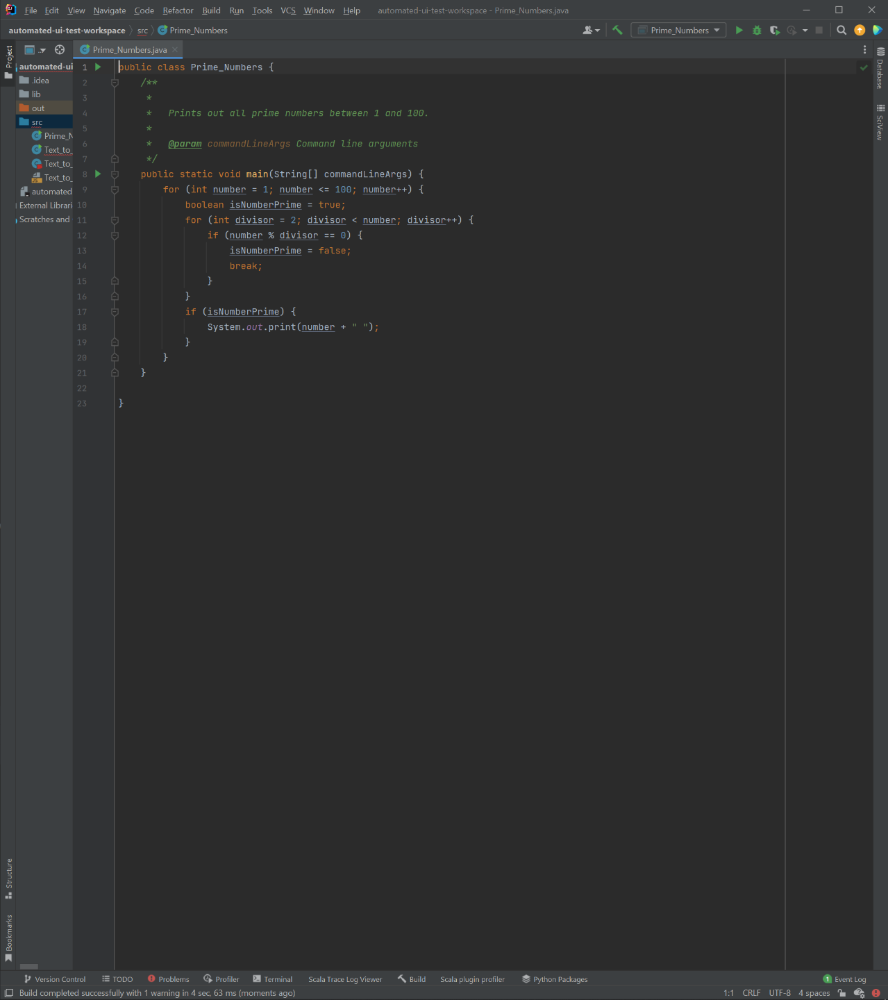


## Ad-Hoc Questions

We can also ask questions about the code. For example, we can ask what the big-O runtime is for this code.

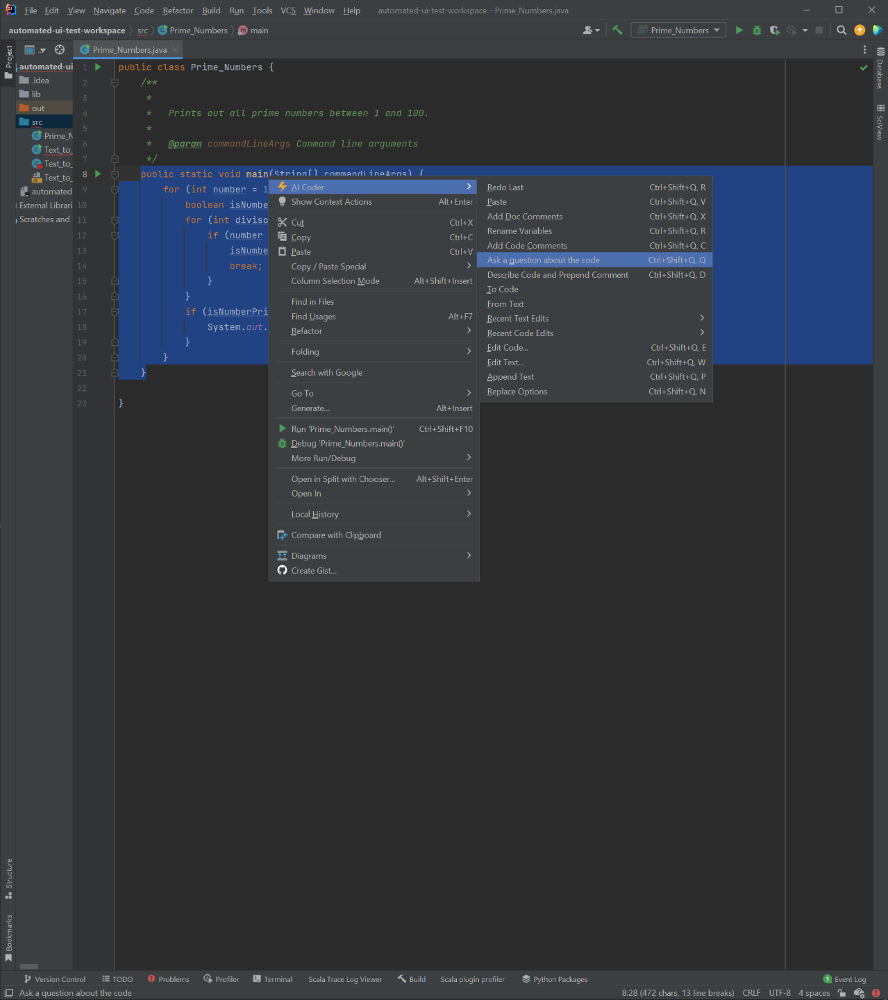

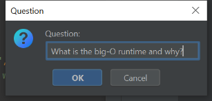

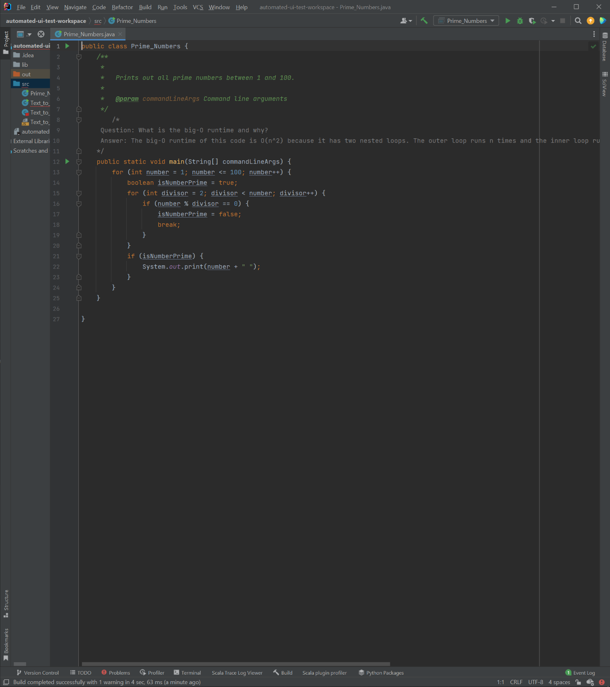


## Code Comments

We can also add code comments to the code. This is useful for explaining the code to other developers.

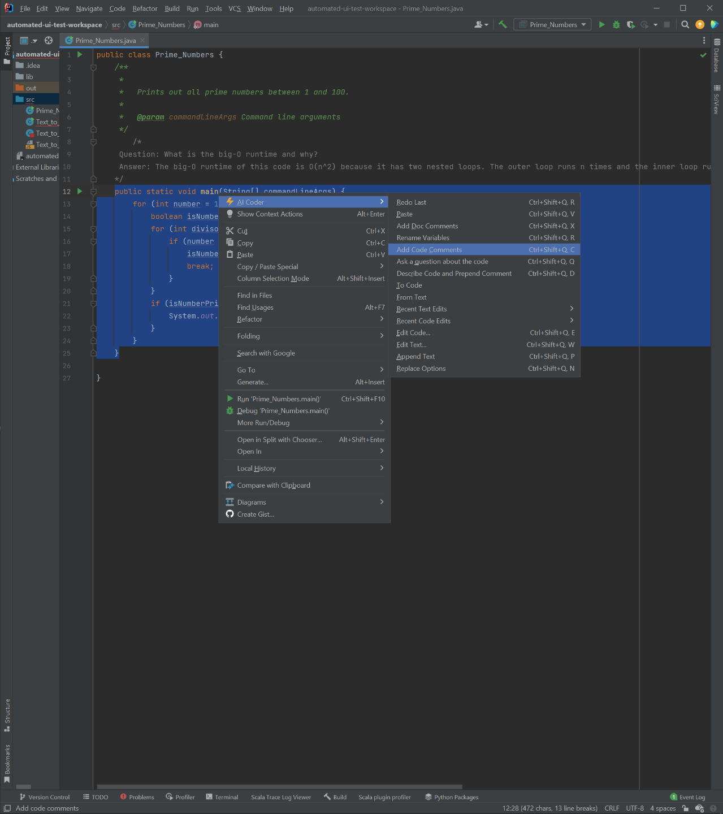

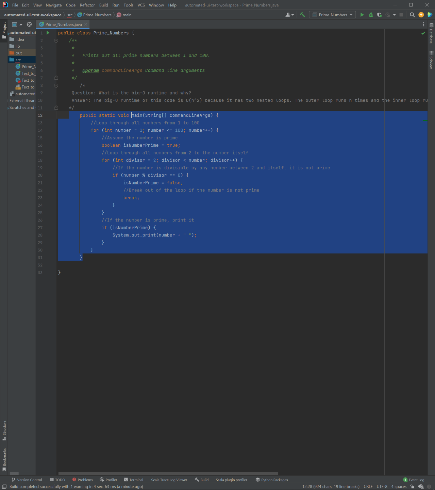


```java
public class Prime_Numbers {
    /**
     *
     *   Prints out all prime numbers between 1 and 100.
     *
     *   @param commandLineArgs Command line arguments
     */
        /*
     Question: What is the big-O runtime and why?
     Answer: The big-O runtime of this code is O(n^2) because it has two nested loops. The outer loop runs n times and the inner loop runs n times for each iteration of the outer loop, resulting in n^2 total iterations.
    */
    public static void main(String[] commandLineArgs) {
        //Loop through all numbers from 1 to 100
        for (int number = 1; number <= 100; number++) {
            //Assume the number is prime
            boolean isNumberPrime = true;
            //Loop through all numbers from 2 to the number itself
            for (int divisor = 2; divisor < number; divisor++) {
                //If the number is divisible by any number between 2 and itself, it is not prime
                if (number % divisor == 0) {
                    isNumberPrime = false;
                    //Break out of the loop if the number is not prime
                    break;
                }
            }
            //If the number is prime, print it
            if (isNumberPrime) {
                System.out.print(number + " ");
            }
        }
    }

}
```


## Conversion to other languages

### JavaScript

We can also convert the code to other languages. For example, we can convert the code to JavaScript.

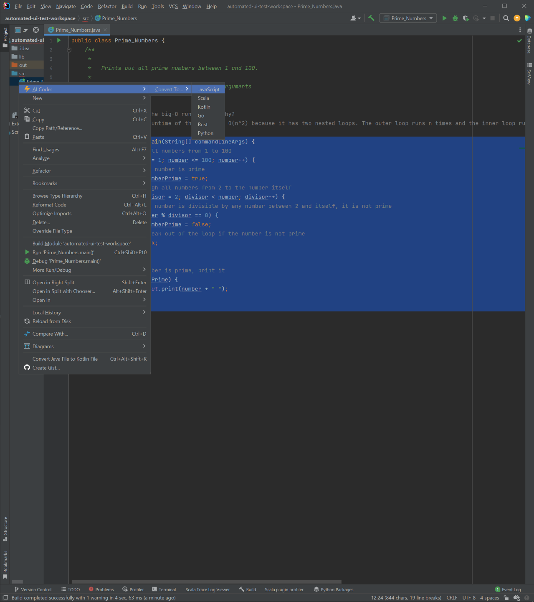


```js
function Prime_Numbers() {
  /*
     Question: What is the big-O runtime and why?
     Answer: The big-O runtime of this code is O(n^2) because it has two nested loops. The outer loop runs n times and the inner loop runs n times for each iteration of the outer loop, resulting in n^2 total iterations.
    */
/**
     *
     *   Prints out all prime numbers between 1 and 100.
     *
     *   @param commandLineArgs Command line arguments
     */
        /*
     Question: What is the big-O runtime and why?
     Answer: The big-O runtime of this code is O(n^2) because it has two nested loops. The outer loop runs n times and the inner loop runs n times for each iteration of the outer loop, resulting in n^2 total iterations.
    */
    function main(commandLineArgs) {
        //Loop through all numbers from 1 to 100
        for (let number = 1; number <= 100; number++) {
            //Assume the number is prime
            let isNumberPrime = true;
            //Loop through all numbers from 2 to the number itself
            for (let divisor = 2; divisor < number; divisor++) {
                //If the number is divisible by any number between 2 and itself, it is not prime
                if (number % divisor == 0) {
                    isNumberPrime = false;
                    //Break out of the loop if the number is not prime
                    break;
                }
            }
            //If the number is prime, print it
            if (isNumberPrime) {
                console.log(number + " ");
            }
        }
    }
}
```
### Conversion to Scala

We can also convert the code to Scala.

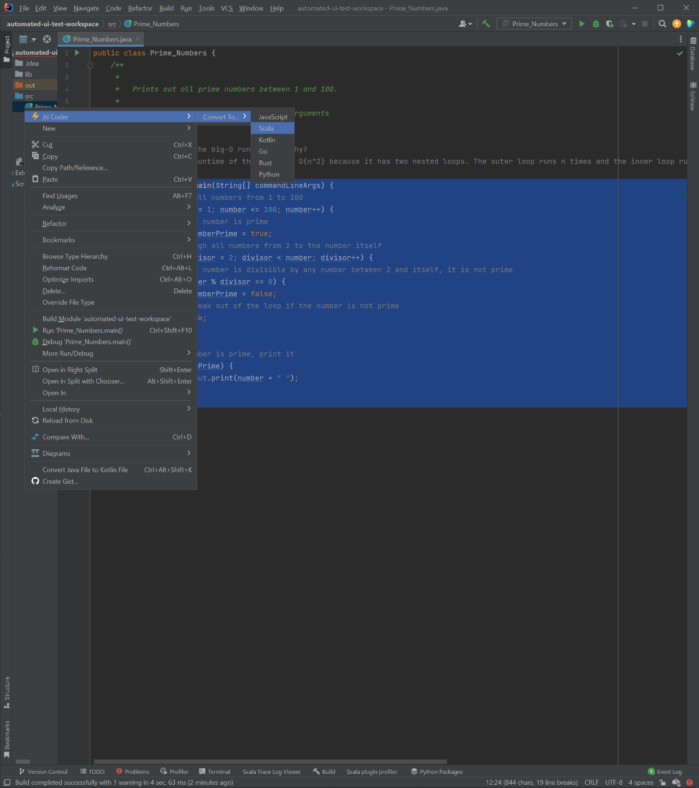

```scala
object Prime_Numbers {
                                /*
     Question: What is the big-O runtime and why?
     Answer: The big-O runtime of this code is O(n^2) because it has two nested loops. The outer loop runs n times and the inner loop runs n times for each iteration of the outer loop, resulting in n^2 total iterations.
    */
/**
     *
     *   Prints out all prime numbers between 1 and 100.
     *
     *   @param commandLineArgs Command line arguments
     */
        /*
     Question: What is the big-O runtime and why?
     Answer: The big-O runtime of this code is O(n^2) because it has two nested loops. The outer loop runs n times and the inner loop runs n times for each iteration of the outer loop, resulting in n^2 total iterations.
    */
    def main(commandLineArgs: Array[String]): Unit = {
        //Loop through all numbers from 1 to 100
        for (number <- 1 to 100) {
            //Assume the number is prime
            var isNumberPrime = true
            //Loop through all numbers from 2 to the number itself
            for (divisor <- 2 until number) {
                //If the number is divisible by any number between 2 and itself, it is not prime
                if (number % divisor == 0) {
                    isNumberPrime = false
                    //Break out of the loop if the number is not prime
                    break
                }
            }
            //If the number is prime, print it
            if (isNumberPrime) {
                println(number + " ")
            }
        }
    }

                
                }
```
