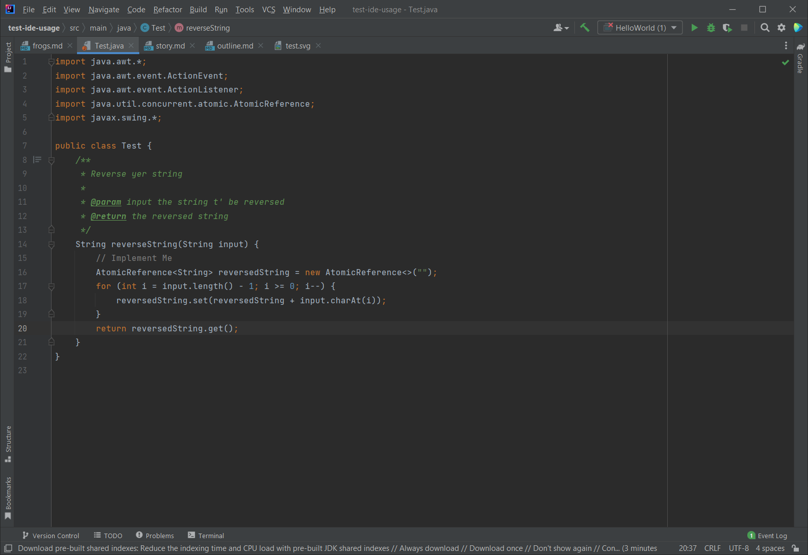
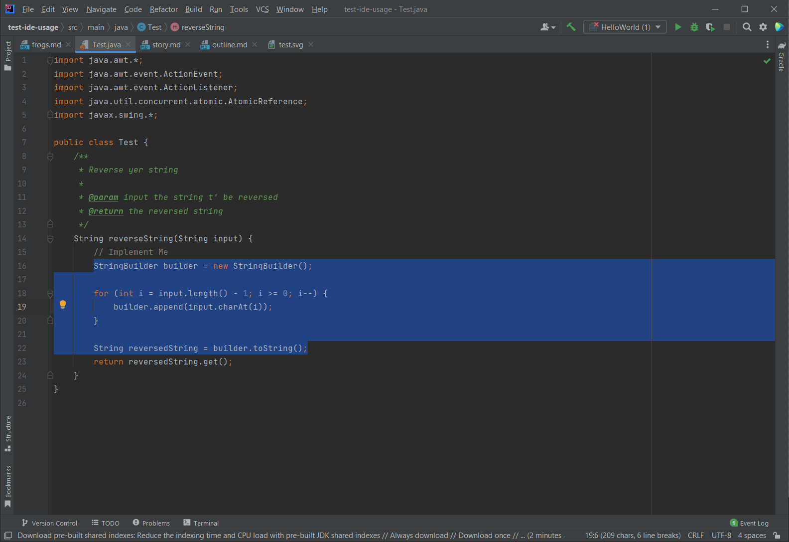

# intellij-aicoder

<!-- Plugin description -->

Ahoy, mateys! This plugin be a powerful tool fer yer coding needs. It be adding some editor context menu options that be providing text processing functions powered by OpenAI's GPT models.

Supported languages include [Java](https://dev.java/), [C++](https://en.wikipedia.org/wiki/C%2B%2B), [C#](https://docs.microsoft.com/en-us/dotnet/csharp/), [JavaScript](https://developer.mozilla.org/en-US/docs/Web/JavaScript), [Python](https://www.python.org/), [Ruby](https://www.ruby-lang.org/en/), [PHP](https://php.net/), [Go](https://golang.org/), [Perl](https://www.perl.org/), [R](https://www.r-project.org/), [Swift](https://swift.org/), [SQL](https://www.postgresql.org/), [HTML](https://www.w3schools.com/html/), [CSS](https://www.w3schools.com/css/), [TypeScript](https://www.typescriptlang.org/), [Kotlin](https://kotlinlang.org/), [Dart](https://dart.dev/), [Rust](https://www.rust-lang.org/), [Scala](https://www.scala-lang.org/), [Assembly](https://en.wikipedia.org/wiki/Assembly_language), [Ada](https://en.wikipedia.org/wiki/Ada_(programming_language)), [Basic](https://en.wikipedia.org/wiki/BASIC), [COBOL](https://en.wikipedia.org/wiki/COBOL), [Clojure](https://clojure.org/), [Delphi](https://www.embarcadero.com/products/delphi), [Erlang](https://www.erlang.org/), [Elixir](https://elixir-lang.org/), [FORTRAN](https://en.wikipedia.org/wiki/Fortran), [F#](https://fsharp.org/), [Groovy](https://groovy-lang.org/), [Haskell](https://www.haskell.org/), [Julia](https://julialang.org/), [Lisp](https://lisp-lang.org/), [Logo](https://en.wikipedia.org/wiki/Logo_(programming_language)), [MATLAB](https://www.mathworks.com/products/matlab.html), [OCaml](https://ocaml.org/), [Pascal](https://www.freepascal.org/), [Prolog](https://www.swi-prolog.org/), [Racket](https://racket-lang.org/), [Smalltalk](https://smalltalk.org/), [Tcl](https://www.tcl.tk/), and [Visual Basic](https://docs.microsoft.com/en-us/dotnet/visual-basic/).

Features:
- Automatic code commenting and documentation
- Code generation based on plain-text requirements, with context awareness
- Directive-based code editing
- Custom styles (e.g. write like a pirate!)

To use, simply access the context menu within any editor window and view the options under "AI Coder".

Ye need yer own [OpenAPI access token](https://beta.openai.com/) fer this plugin. This be intended as a development tool fer developers who already have an OpenAI access token; it be not itself to be considered an end-product. This plugin be provided free of charge and without any guarantee. So what be ye waitin' fer? Get yer hands on this plugin now!<!-- Plugin description end -->

<!-- Plugin description end -->

## Installation

- Using IDE built-in plugin system:
  
  <kbd>Settings/Preferences</kbd> > <kbd>Plugins</kbd> > <kbd>Marketplace</kbd> > <kbd>Search for "intellij-aicoder"</kbd> >
  <kbd>Install Plugin</kbd>
  
- Manually:

  Download the [latest release](https://github.com/SimiaCryptus/intellij-aicoder/releases/latest) and install it manually using
  <kbd>Settings/Preferences</kbd> > <kbd>Plugins</kbd> > <kbd>⚙️</kbd> > <kbd>Install plugin from disk...</kbd>

## Usage

After installation, edit the settings and add your API key. If desired, customize your style!

Use the context menu to access features. In this example, we use the "Insert Implementation" tool. 
_Note: After inserting, the code needs reformatting and some manual cleanup (e.g. correcting additional ending braces)_

After reviewing the code, we can easily add documentation.

We can also iterate and use the AI to refactor the code using custom edits:

---
Plugin based on the [IntelliJ Platform Plugin Template][template].

[template]: https://github.com/JetBrains/intellij-platform-plugin-template
