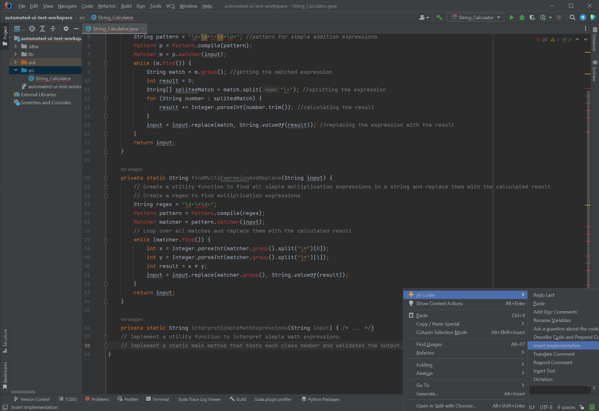
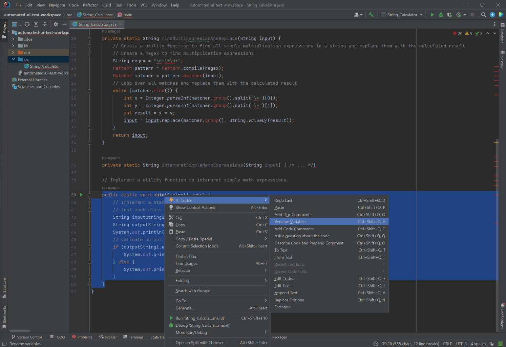
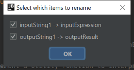
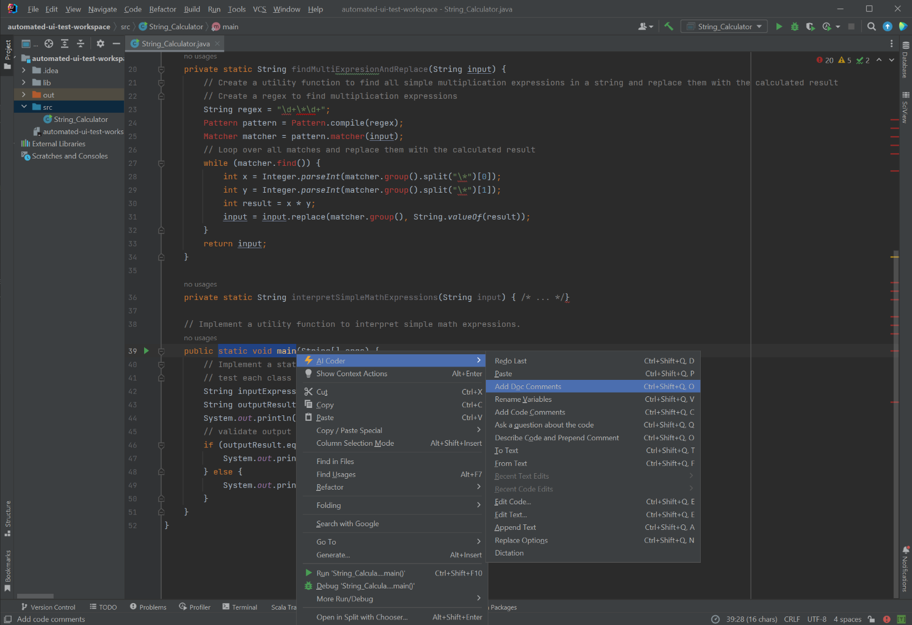
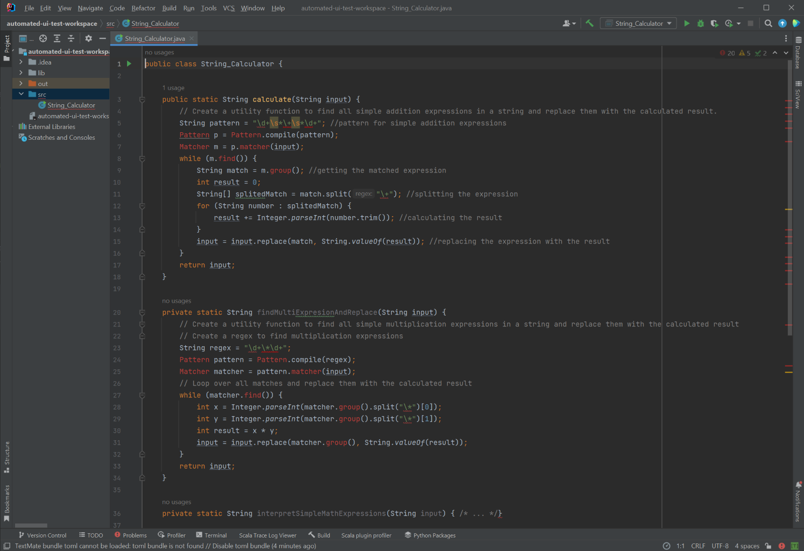
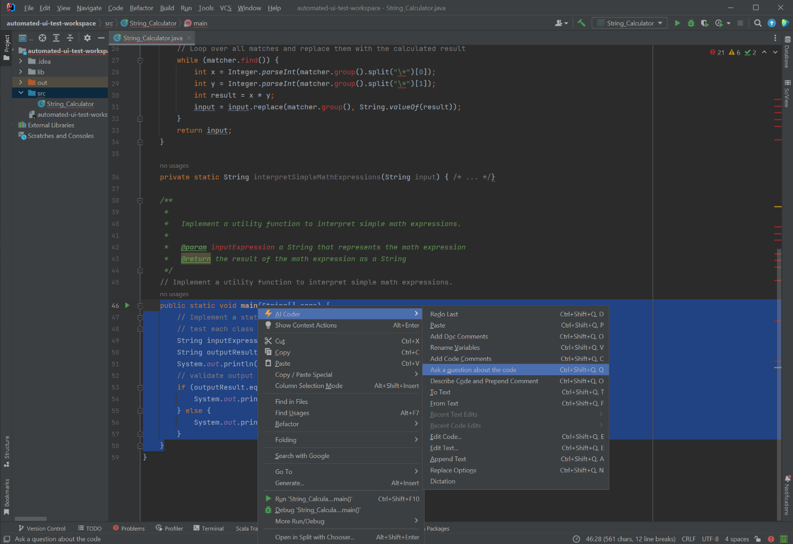
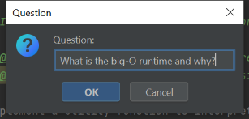
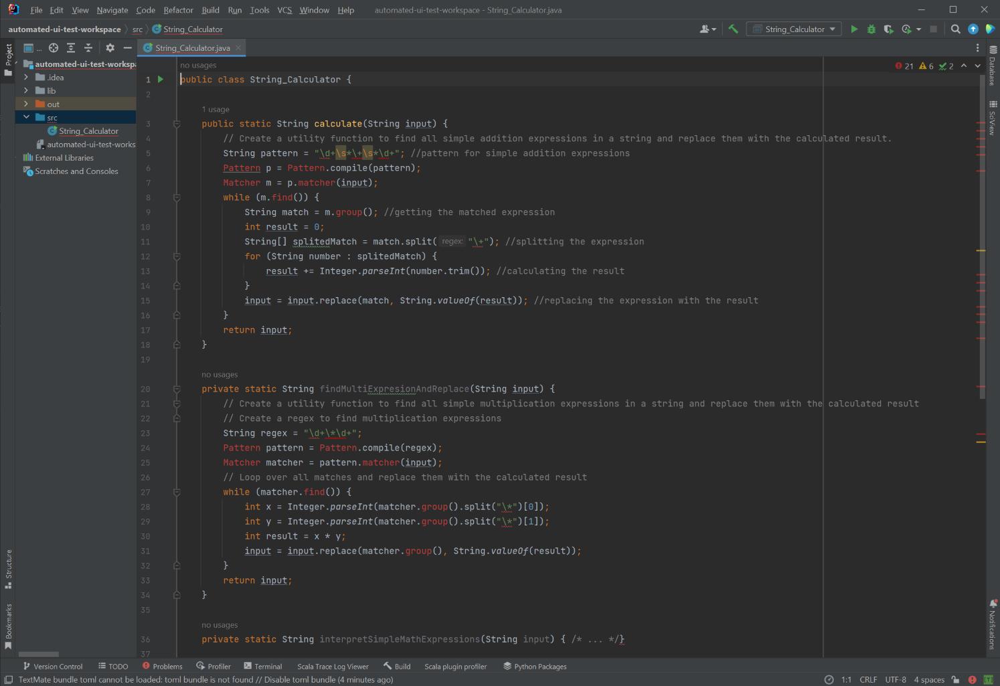
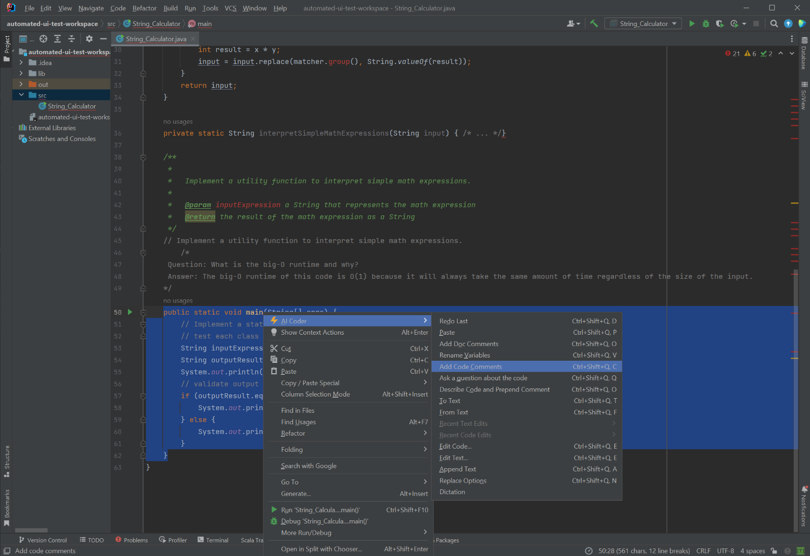
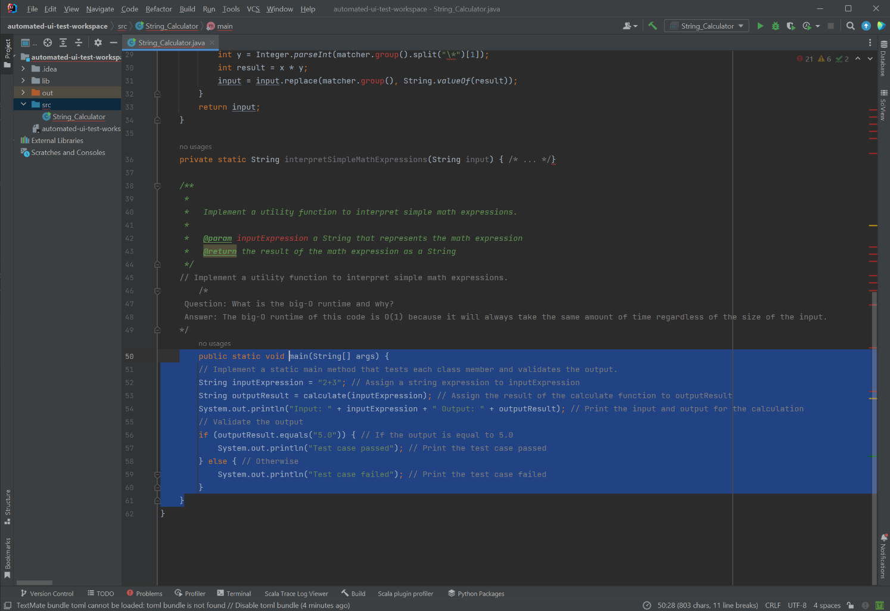

# String_Calculator

In this test we will used AI Coding Assistant to implement the String_Calculator class to solve the following problem:

```
[Create a utility function to find all simple addition expressions in a string and replace them with the calculated result., Create a utility function to find all simple multiplication expressions in a string and replace them with the calculated result, Implement a utility function to interpret simple math expressions., Implement a static main method that tests each class member and validates the output.]
```

## Implementation

The first step is to translate the problem into code. We can do this by using the "Insert Implementation" command.




This results in the following code:

```java
public class String_Calculator {

    public static String calculate(String input) {
        // Create a utility function to find all simple addition expressions in a string and replace them with the calculated result.
        String pattern = "\d+\s*\+\s*\d+"; //pattern for simple addition expressions
        Pattern p = Pattern.compile(pattern);
        Matcher m = p.matcher(input);
        while (m.find()) {
            String match = m.group(); //getting the matched expression
            int result = 0;
            String[] splitedMatch = match.split("\+"); //splitting the expression
            for (String number : splitedMatch) {
                result += Integer.parseInt(number.trim()); //calculating the result
            }
            input = input.replace(match, String.valueOf(result)); //replacing the expression with the result
        }
        return input;
    }

    private static String findMultiExpresionAndReplace(String input) {
        // Create a utility function to find all simple multiplication expressions in a string and replace them with the calculated result
        // Create a regex to find multiplication expressions
        String regex = "\d+\*\d+";
        Pattern pattern = Pattern.compile(regex);
        Matcher matcher = pattern.matcher(input);
        // Loop over all matches and replace them with the calculated result
        while (matcher.find()) {
            int x = Integer.parseInt(matcher.group().split("\*")[0]);
            int y = Integer.parseInt(matcher.group().split("\*")[1]);
            int result = x * y;
            input = input.replace(matcher.group(), String.valueOf(result));
        }
        return input;
    }

    private static String interpretSimpleMathExpressions(String input) { /* ... */}

    // Implement a utility function to interpret simple math expressions.
    public static void main(String[] args) {
        // Implement a static main method that tests each class member and validates the output.
        // test each class member
        String inputString1 = "2+3";
        String outputString1 = calculate(inputString1);
        System.out.println("Input: " + inputString1 + " Output: " + outputString1);
        // validate output
        if (outputString1.equals("5.0")) {
            System.out.println("Test case passed");
        } else {
            System.out.println("Test case failed");
        }
    }
}
```

## Rename Variables

We can use the "Rename Variables" command to make the code more readable...






## Documentation Comments

We also want good documentation for our code. We can use the "Add Documentation Comments" command to do 






## Ad-Hoc Questions

We can also ask questions about the code. For example, we can ask what the big-O runtime is for this code.








## Code Comments

We can also add code comments to the code. This is useful for explaining the code to other developers.






```java
public class String_Calculator {

    public static String calculate(String input) {
        // Create a utility function to find all simple addition expressions in a string and replace them with the calculated result.
        String pattern = "\d+\s*\+\s*\d+"; //pattern for simple addition expressions
        Pattern p = Pattern.compile(pattern);
        Matcher m = p.matcher(input);
        while (m.find()) {
            String match = m.group(); //getting the matched expression
            int result = 0;
            String[] splitedMatch = match.split("\+"); //splitting the expression
            for (String number : splitedMatch) {
                result += Integer.parseInt(number.trim()); //calculating the result
            }
            input = input.replace(match, String.valueOf(result)); //replacing the expression with the result
        }
        return input;
    }

    private static String findMultiExpresionAndReplace(String input) {
        // Create a utility function to find all simple multiplication expressions in a string and replace them with the calculated result
        // Create a regex to find multiplication expressions
        String regex = "\d+\*\d+";
        Pattern pattern = Pattern.compile(regex);
        Matcher matcher = pattern.matcher(input);
        // Loop over all matches and replace them with the calculated result
        while (matcher.find()) {
            int x = Integer.parseInt(matcher.group().split("\*")[0]);
            int y = Integer.parseInt(matcher.group().split("\*")[1]);
            int result = x * y;
            input = input.replace(matcher.group(), String.valueOf(result));
        }
        return input;
    }

    private static String interpretSimpleMathExpressions(String input) { /* ... */}

    /**
     *
     *   Implement a utility function to interpret simple math expressions.
     *
     *   @param inputExpression a String that represents the math expression
     *   @return the result of the math expression as a String
     */
    // Implement a utility function to interpret simple math expressions.
        /*
     Question: What is the big-O runtime and why?
     Answer: The big-O runtime of this code is O(1) because it will always take the same amount of time regardless of the size of the input.
    */
    public static void main(String[] args) {
        // Implement a static main method that tests each class member and validates the output.
        String inputExpression = "2+3"; // Assign a string expression to inputExpression
        String outputResult = calculate(inputExpression); // Assign the result of the calculate function to outputResult
        System.out.println("Input: " + inputExpression + " Output: " + outputResult); // Print the input and output for the calculation
        // Validate the output
        if (outputResult.equals("5.0")) { // If the output is equal to 5.0
            System.out.println("Test case passed"); // Print the test case passed
        } else { // Otherwise
            System.out.println("Test case failed"); // Print the test case failed
        }
    }
}
```

