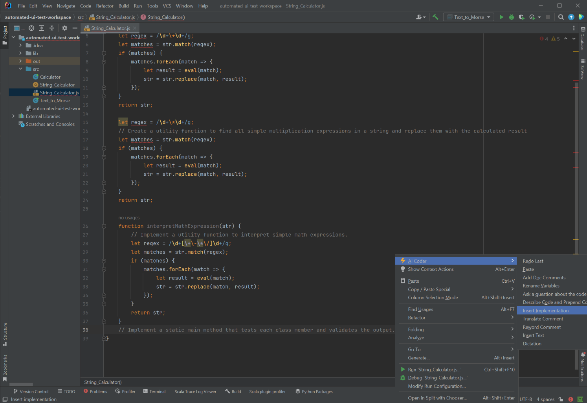

# String_Calculator

In this test we will used AI Coding Assistant to implement the String_Calculator class to solve the following problem:

```
[Create a utility function to find all simple addition expressions in a string and replace them with the calculated result., Create a utility function to find all simple multiplication expressions in a string and replace them with the calculated result, Implement a utility function to interpret simple math expressions., Implement a static main method that tests each class member and validates the output.]
```

## Implementation

The first step is to translate the problem into code. We can do this by using the "Insert Implementation" command.




This results in the following code:

```js
function String_Calculator() {

    let str = "";
    // Create a utility function to find all simple addition expressions in a string and replace them with the calculated result.
    let regex = /\d+\+\d+/g;
    let matches = str.match(regex);
    if (matches) {
        matches.forEach(match => {
            let result = eval(match);
            str = str.replace(match, result);
        });
    }
    return str;

    let regex = /\d+\*\d+/g;
    // Create a utility function to find all simple multiplication expressions in a string and replace them with the calculated result
    let matches = str.match(regex);
    if (matches) {
        matches.forEach(match => {
            let result = eval(match);
            str = str.replace(match, result);
        });
    }
    return str;

    function interpretMathExpression(str) {
        // Implement a utility function to interpret simple math expressions.
        let regex = /\d+[\+\-\*\/]\d+/g;
        let matches = str.match(regex);
        if (matches) {
            matches.forEach(match => {
                let result = eval(match);
                str = str.replace(match, result);
            });
        }
        return str;
    }

    static
    main()
    {
        // Implement a static main method that tests each class member and validates the output.
        let testString1 = "2+2";
        let testString2 = "2*2";
        let testString3 = "2+2*2";
        let expectedResult1 = 4;
        let expectedResult2 = 4;
        let expectedResult3 = 6;
        let result1 = String_Calculator(testString1);
        let result2 = String_Calculator(testString2);
        let result3 = interpretMathExpression(testString3);
        if (result1 === expectedResult1 && result2 === expectedResult2 && result3 === expectedResult3) {
            console.log("Test passed!");
        } else {
            console.log("Test failed!");
        }
    }

}
```

## Rename Variables

We can use the "Rename Variables" command to make the code more readable...

