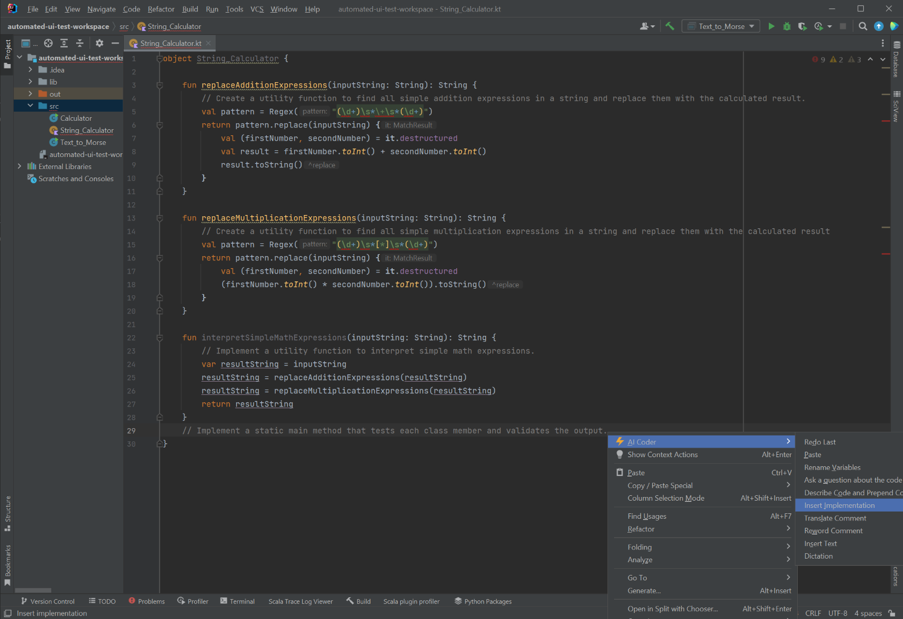
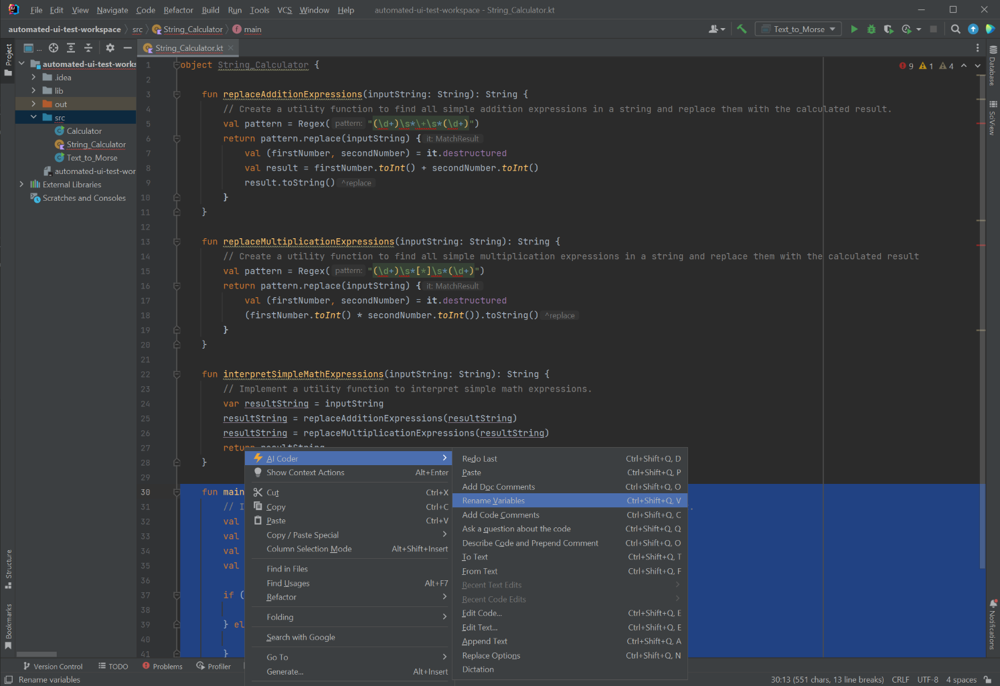
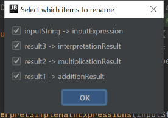
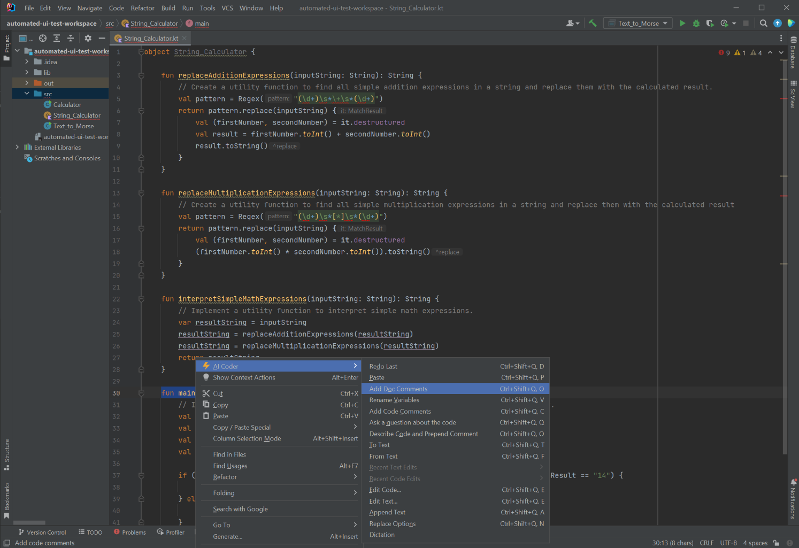
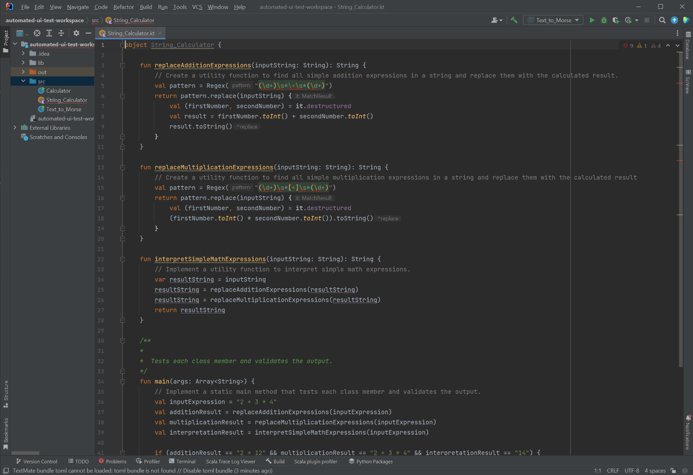
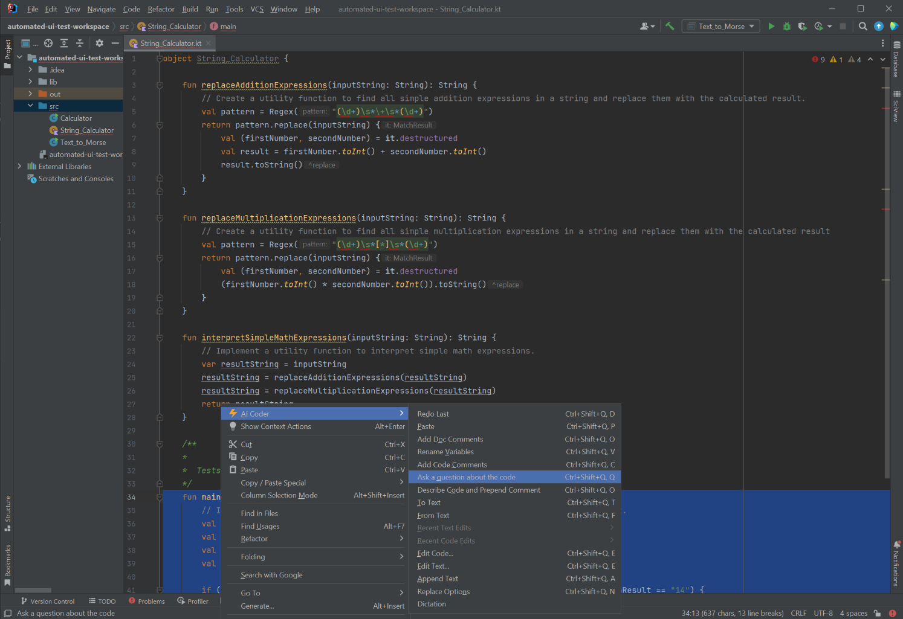
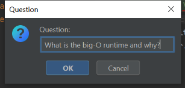
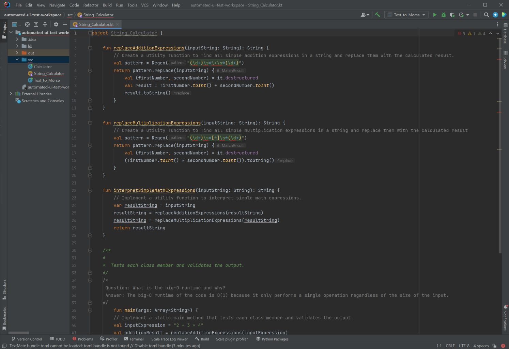
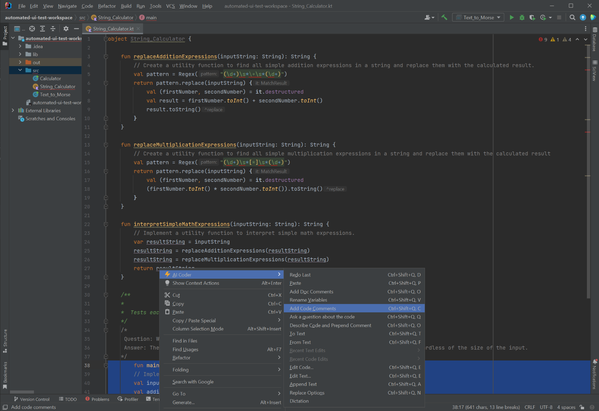
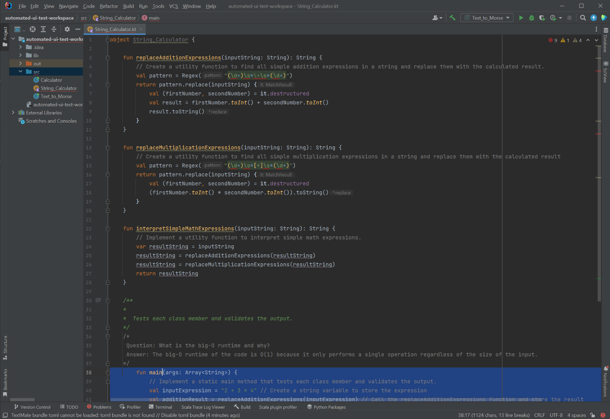

# String_Calculator

In this test we will used AI Coding Assistant to implement the String_Calculator class to solve the following problem:

```
[Create a utility function to find all simple addition expressions in a string and replace them with the calculated result., Create a utility function to find all simple multiplication expressions in a string and replace them with the calculated result, Implement a utility function to interpret simple math expressions., Implement a static main method that tests each class member and validates the output.]
```

## Implementation

The first step is to translate the problem into code. We can do this by using the "Insert Implementation" command.




This results in the following code:

```kt
object String_Calculator {

    fun replaceAdditionExpressions(inputString: String): String {
        // Create a utility function to find all simple addition expressions in a string and replace them with the calculated result.
        val pattern = Regex("(\d+)\s*\+\s*(\d+)")
        return pattern.replace(inputString) {
            val (firstNumber, secondNumber) = it.destructured
            val result = firstNumber.toInt() + secondNumber.toInt()
            result.toString()
        }
    }

    fun replaceMultiplicationExpressions(inputString: String): String {
        // Create a utility function to find all simple multiplication expressions in a string and replace them with the calculated result
        val pattern = Regex("(\d+)\s*[*]\s*(\d+)")
        return pattern.replace(inputString) {
            val (firstNumber, secondNumber) = it.destructured
            (firstNumber.toInt() * secondNumber.toInt()).toString()
        }
    }

    fun interpretSimpleMathExpressions(inputString: String): String {
        // Implement a utility function to interpret simple math expressions.
        var resultString = inputString
        resultString = replaceAdditionExpressions(resultString)
        resultString = replaceMultiplicationExpressions(resultString)
        return resultString
    }

    fun main(args: Array<String>) {
        // Implement a static main method that tests each class member and validates the output.
        val inputString = "2 + 3 * 4"
        val result1 = replaceAdditionExpressions(inputString)
        val result2 = replaceMultiplicationExpressions(inputString)
        val result3 = interpretSimpleMathExpressions(inputString)

        if (result1 == "2 + 12" && result2 == "2 + 3 * 4" && result3 == "14") {
            println("Test passed")
        } else {
            println("Test failed")
        }
    }
}
```

## Rename Variables

We can use the "Rename Variables" command to make the code more readable...






## Documentation Comments

We also want good documentation for our code. We can use the "Add Documentation Comments" command to do 






## Ad-Hoc Questions

We can also ask questions about the code. For example, we can ask what the big-O runtime is for this code.








## Code Comments

We can also add code comments to the code. This is useful for explaining the code to other developers.






```kt
object String_Calculator {

    fun replaceAdditionExpressions(inputString: String): String {
        // Create a utility function to find all simple addition expressions in a string and replace them with the calculated result.
        val pattern = Regex("(\d+)\s*\+\s*(\d+)")
        return pattern.replace(inputString) {
            val (firstNumber, secondNumber) = it.destructured
            val result = firstNumber.toInt() + secondNumber.toInt()
            result.toString()
        }
    }

    fun replaceMultiplicationExpressions(inputString: String): String {
        // Create a utility function to find all simple multiplication expressions in a string and replace them with the calculated result
        val pattern = Regex("(\d+)\s*[*]\s*(\d+)")
        return pattern.replace(inputString) {
            val (firstNumber, secondNumber) = it.destructured
            (firstNumber.toInt() * secondNumber.toInt()).toString()
        }
    }

    fun interpretSimpleMathExpressions(inputString: String): String {
        // Implement a utility function to interpret simple math expressions.
        var resultString = inputString
        resultString = replaceAdditionExpressions(resultString)
        resultString = replaceMultiplicationExpressions(resultString)
        return resultString
    }

    /**
    *
    *  Tests each class member and validates the output.
    */
    /*
     Question: What is the big-O runtime and why?
     Answer: The big-O runtime of the code is O(1) because it only performs a single operation regardless of the size of the input.
    */
    fun main(args: Array<String>) {
        // Implement a static main method that tests each class member and validates the output.
        val inputExpression = "2 + 3 * 4" // Create a string variable to store the expression
        val additionResult =
            replaceAdditionExpressions(inputExpression) // Call the replaceAdditionExpressions function and store the result
        val multiplicationResult =
            replaceMultiplicationExpressions(inputExpression) // Call the replaceMultiplicationExpressions function and store the result
        val interpretationResult =
            interpretSimpleMathExpressions(inputExpression) // Call the interpretSimpleMathExpressions function and store the result

        // Check if the results of the functions are correct
        if (additionResult == "2 + 12" && multiplicationResult == "2 + 3 * 4" && interpretationResult == "14") {
            println("Test passed") // Print "Test passed" if the results are correct
        } else {
            println("Test failed") // Print "Test failed" if the results are incorrect
        }
    }}
```

