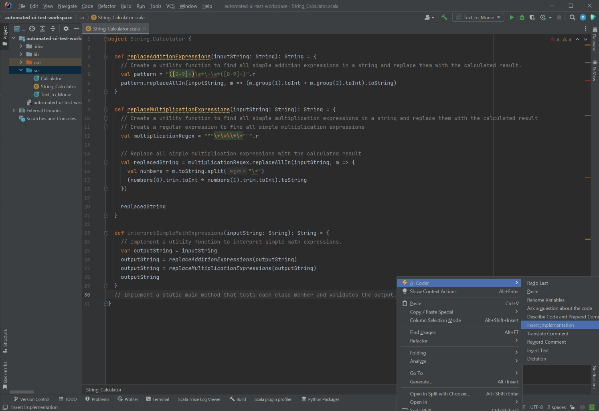
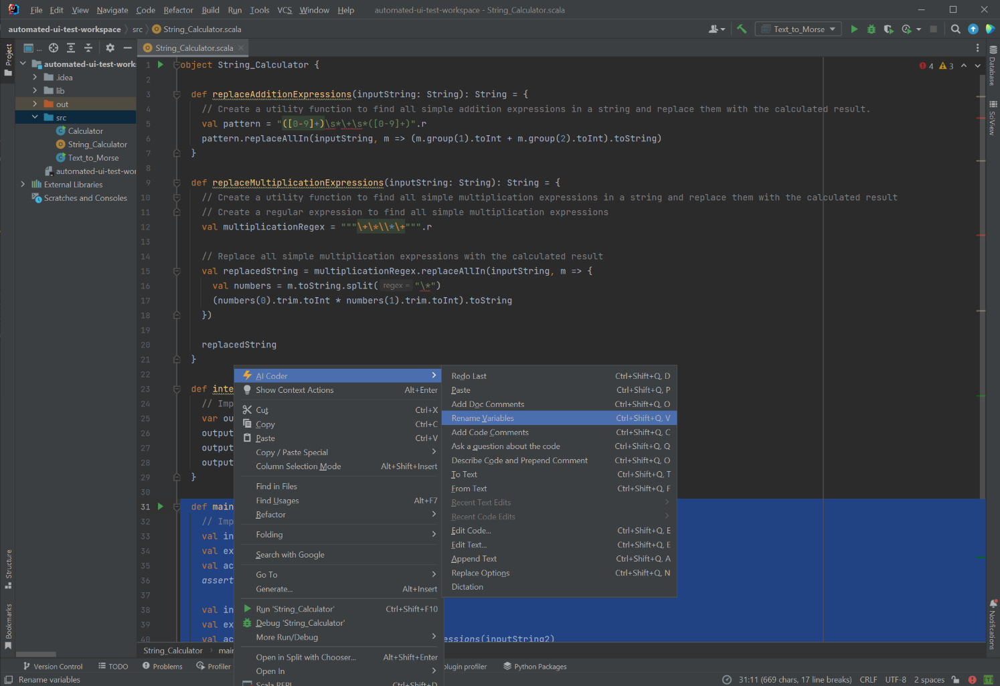
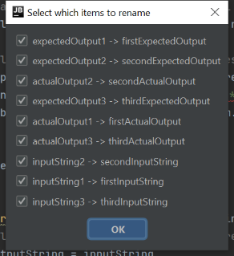
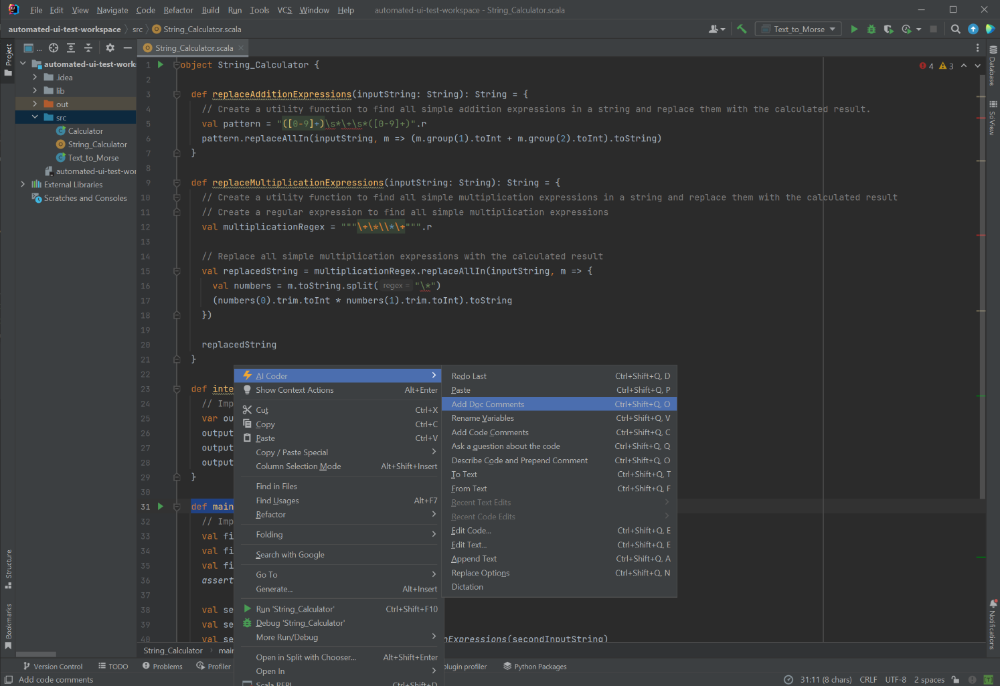
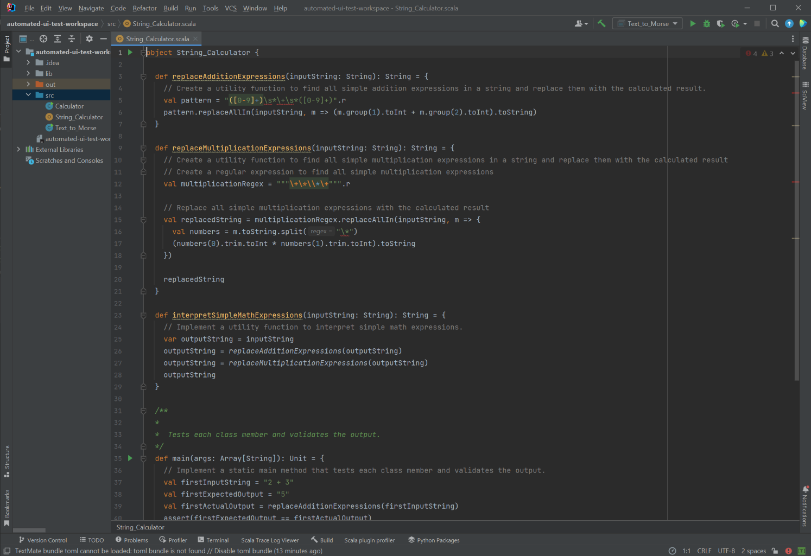
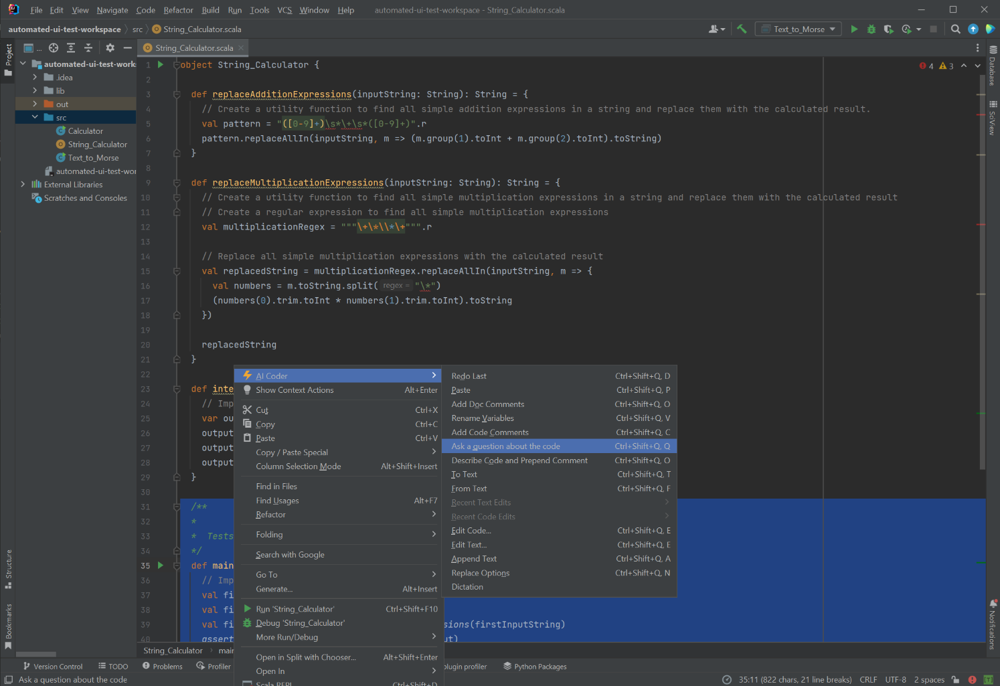
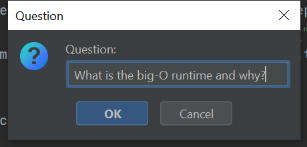
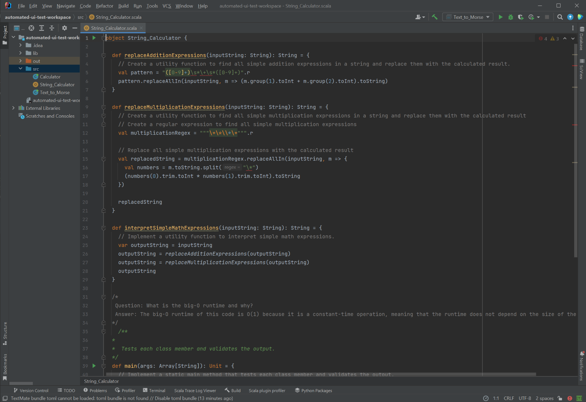
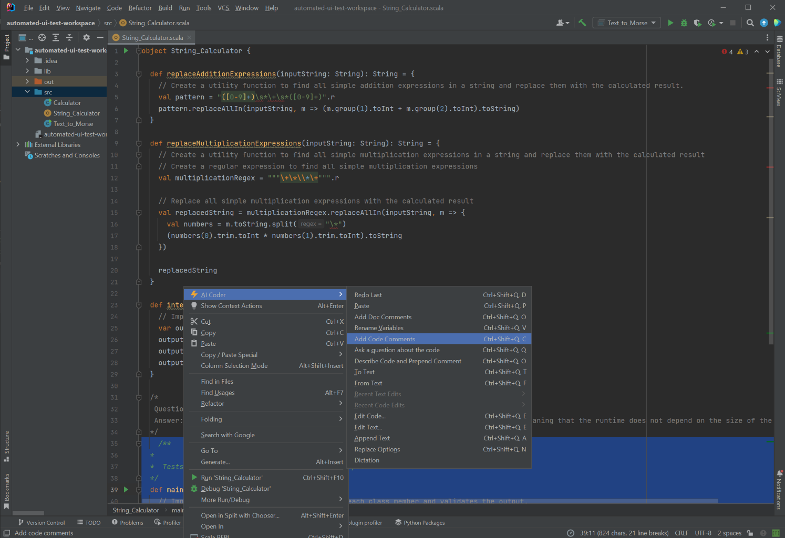
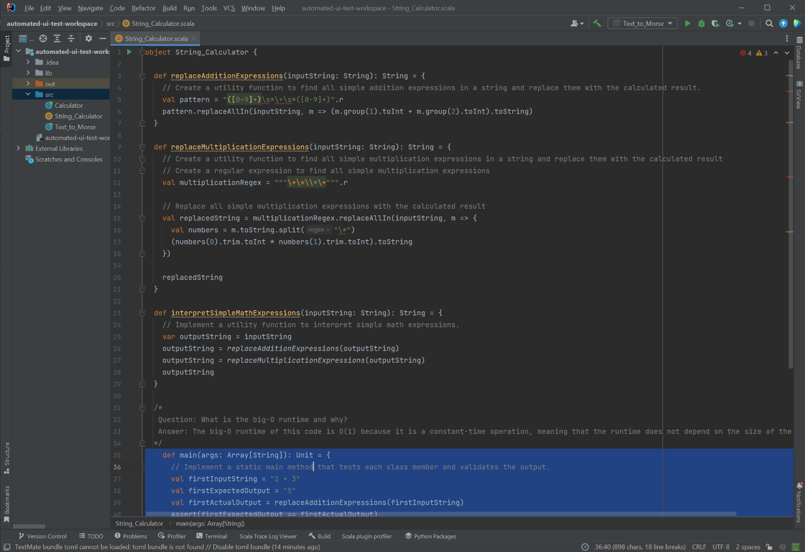

# String_Calculator

In this test we will used AI Coding Assistant to implement the String_Calculator class to solve the following problem:

```
[Create a utility function to find all simple addition expressions in a string and replace them with the calculated result., Create a utility function to find all simple multiplication expressions in a string and replace them with the calculated result, Implement a utility function to interpret simple math expressions., Implement a static main method that tests each class member and validates the output.]
```

## Implementation

The first step is to translate the problem into code. We can do this by using the "Insert Implementation" command.




This results in the following code:

```scala
object String_Calculator {

  def replaceAdditionExpressions(inputString: String): String = {
    // Create a utility function to find all simple addition expressions in a string and replace them with the calculated result.
    val pattern = "([0-9]+)\s*\+\s*([0-9]+)".r
    pattern.replaceAllIn(inputString, m => (m.group(1).toInt + m.group(2).toInt).toString)
  }

  def replaceMultiplicationExpressions(inputString: String): String = {
    // Create a utility function to find all simple multiplication expressions in a string and replace them with the calculated result
    // Create a regular expression to find all simple multiplication expressions
    val multiplicationRegex = """\+\*\\*\+""".r

    // Replace all simple multiplication expressions with the calculated result
    val replacedString = multiplicationRegex.replaceAllIn(inputString, m => {
      val numbers = m.toString.split("\*")
      (numbers(0).trim.toInt * numbers(1).trim.toInt).toString
    })

    replacedString
  }

  def interpretSimpleMathExpressions(inputString: String): String = {
    // Implement a utility function to interpret simple math expressions.
    var outputString = inputString
    outputString = replaceAdditionExpressions(outputString)
    outputString = replaceMultiplicationExpressions(outputString)
    outputString
  }

  def main(args: Array[String]): Unit = {
    // Implement a static main method that tests each class member and validates the output.
    val inputString1 = "2 + 3"
    val expectedOutput1 = "5"
    val actualOutput1 = replaceAdditionExpressions(inputString1)
    assert(expectedOutput1 == actualOutput1)

    val inputString2 = "2 * 3"
    val expectedOutput2 = "6"
    val actualOutput2 = replaceMultiplicationExpressions(inputString2)
    assert(expectedOutput2 == actualOutput2)

    val inputString3 = "2 + 3 * 4"
    val expectedOutput3 = "14"
    val actualOutput3 = interpretSimpleMathExpressions(inputString3)
    assert(expectedOutput3 == actualOutput3)
  }
}
```

## Rename Variables

We can use the "Rename Variables" command to make the code more readable...






## Documentation Comments

We also want good documentation for our code. We can use the "Add Documentation Comments" command to do 






## Ad-Hoc Questions

We can also ask questions about the code. For example, we can ask what the big-O runtime is for this code.








## Code Comments

We can also add code comments to the code. This is useful for explaining the code to other developers.






```scala
object String_Calculator {

  def replaceAdditionExpressions(inputString: String): String = {
    // Create a utility function to find all simple addition expressions in a string and replace them with the calculated result.
    val pattern = "([0-9]+)\s*\+\s*([0-9]+)".r
    pattern.replaceAllIn(inputString, m => (m.group(1).toInt + m.group(2).toInt).toString)
  }

  def replaceMultiplicationExpressions(inputString: String): String = {
    // Create a utility function to find all simple multiplication expressions in a string and replace them with the calculated result
    // Create a regular expression to find all simple multiplication expressions
    val multiplicationRegex = """\+\*\\*\+""".r

    // Replace all simple multiplication expressions with the calculated result
    val replacedString = multiplicationRegex.replaceAllIn(inputString, m => {
      val numbers = m.toString.split("\*")
      (numbers(0).trim.toInt * numbers(1).trim.toInt).toString
    })

    replacedString
  }

  def interpretSimpleMathExpressions(inputString: String): String = {
    // Implement a utility function to interpret simple math expressions.
    var outputString = inputString
    outputString = replaceAdditionExpressions(outputString)
    outputString = replaceMultiplicationExpressions(outputString)
    outputString
  }

  /*
   Question: What is the big-O runtime and why?
   Answer: The big-O runtime of this code is O(1) because it is a constant-time operation, meaning that the runtime does not depend on the size of the input.
  */
  def main(args: Array[String]): Unit = {
    // Implement a static main method that tests each class member and validates the output.
    val firstInputString = "2 + 3"
    val firstExpectedOutput = "5"
    val firstActualOutput = replaceAdditionExpressions(firstInputString)
    assert(firstExpectedOutput == firstActualOutput)

    // Test the replaceMultiplicationExpressions method
    val secondInputString = "2 * 3"
    val secondExpectedOutput = "6"
    val secondActualOutput = replaceMultiplicationExpressions(secondInputString)
    assert(secondExpectedOutput == secondActualOutput)

    // Test the interpretSimpleMathExpressions method
    val thirdInputString = "2 + 3 * 4"
    val thirdExpectedOutput = "14"
    val thirdActualOutput = interpretSimpleMathExpressions(thirdInputString)
    assert(thirdExpectedOutput == thirdActualOutput)
  }}
```

