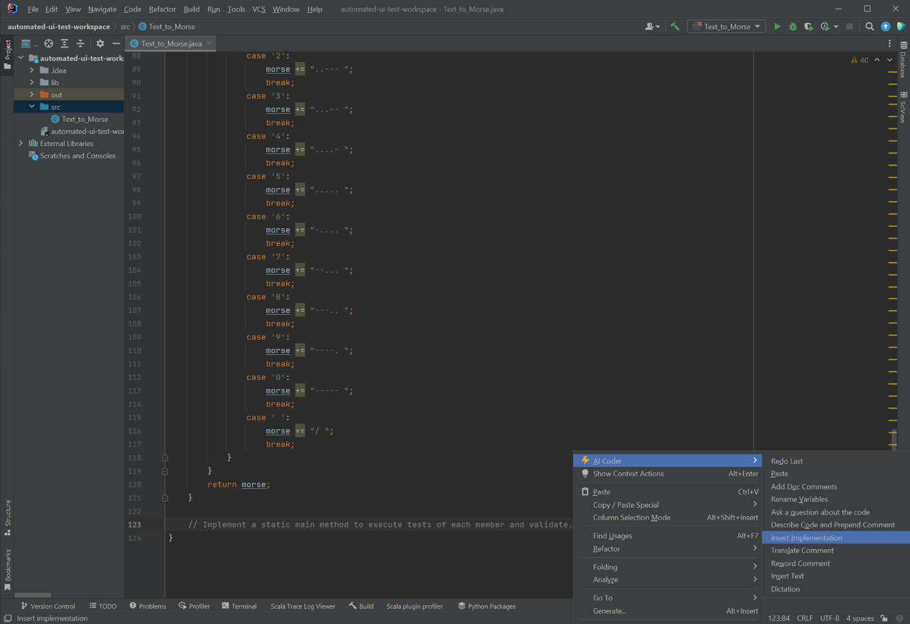

# Text_to_Morse

In this test we will used AI Coding Assistant to implement the Text_to_Morse class to solve the following problem:

```
[Implement a utility function that converts text to Morse code., Implement a static main method to execute tests of each member and validate.]
```

## Implementation

The first step is to translate the problem into code. We can do this by using the "Insert Implementation" command.




This results in the following code:

```java
public class Text_to_Morse {

    public static String textToMorse(String text) {
        String morse = "";
        for (int i = 0; i < text.length(); i++) {
            switch (text.charAt(i)) {
                case 'A':
                    morse += ".- ";
                    break;
                case 'B':
                    morse += "-... ";
                    break;
                case 'C':
                    morse += "-.-. ";
                    break;
                case 'D':
                    morse += "-.. ";
                    break;
                case 'E':
                    morse += ". ";
                    break;
                case 'F':
                    morse += "..-. ";
                    break;
                case 'G':
                    morse += "--. ";
                    break;
                case 'H':
                    morse += ".... ";
                    break;
                case 'I':
                    morse += ".. ";
                    break;
                case 'J':
                    morse += ".--- ";
                    break;
                case 'K':
                    morse += "-.- ";
                    break;
                case 'L':
                    morse += ".-.. ";
                    break;
                case 'M':
                    morse += "-- ";
                    break;
                case 'N':
                    morse += "-. ";
                    break;
                case 'O':
                    morse += "--- ";
                    break;
                case 'P':
                    morse += ".--. ";
                    break;
                case 'Q':
                    morse += "--.- ";
                    break;
                case 'R':
                    morse += ".-. ";
                    break;
                case 'S':
                    morse += "... ";
                    break;
                case 'T':
                    morse += "- ";
                    break;
                case 'U':
                    morse += "..- ";
                    break;
                case 'V':
                    morse += "...- ";
                    break;
                case 'W':
                    morse += ".-- ";
                    break;
                case 'X':
                    morse += "-..- ";
                    break;
                case 'Y':
                    morse += "-.-- ";
                    break;
                case 'Z':
                    morse += "--.. ";
                    break;
                case '1':
                    morse += ".---- ";
                    break;
                case '2':
                    morse += "..--- ";
                    break;
                case '3':
                    morse += "...-- ";
                    break;
                case '4':
                    morse += "....- ";
                    break;
                case '5':
                    morse += "..... ";
                    break;
                case '6':
                    morse += "-.... ";
                    break;
                case '7':
                    morse += "--... ";
                    break;
                case '8':
                    morse += "---.. ";
                    break;
                case '9':
                    morse += "----. ";
                    break;
                case '0':
                    morse += "----- ";
                    break;
                case ' ':
                    morse += "/ ";
                    break;
            }
        }
        return morse;
    }

    public static void main(String[] args) {
        // Test each member of the class
        // Validate the results
    }

}
```

## Rename Variables

We can use the "Rename Variables" command to make the code more readable...

