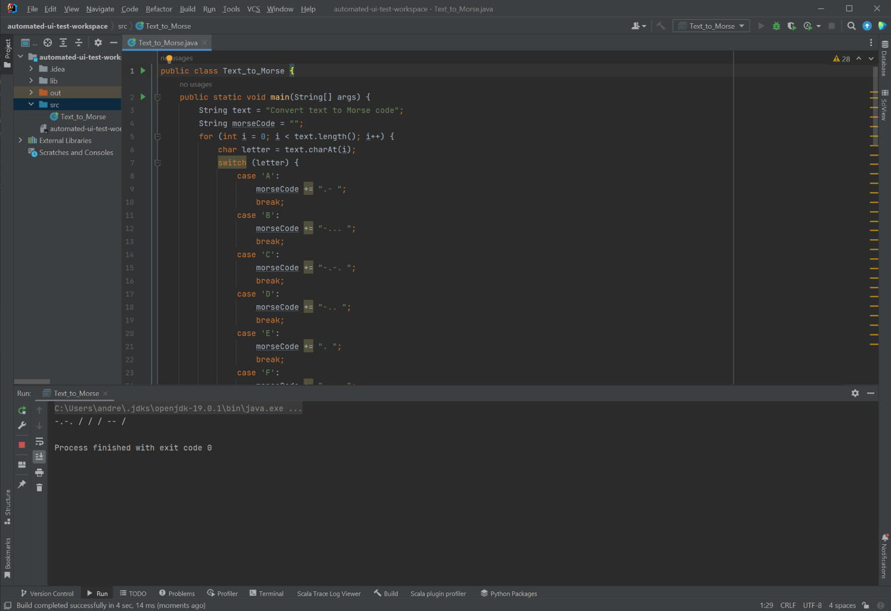
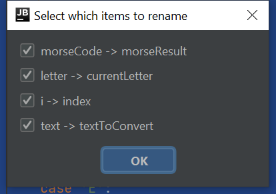
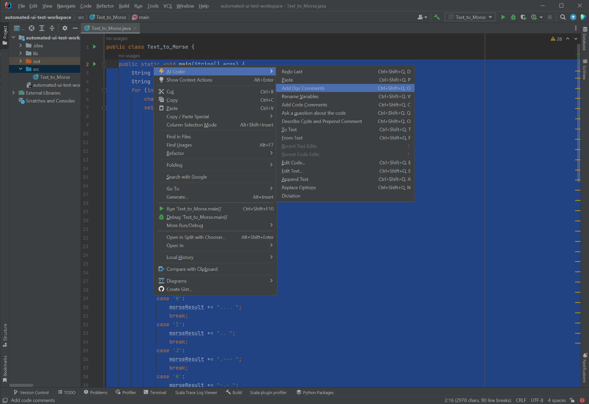
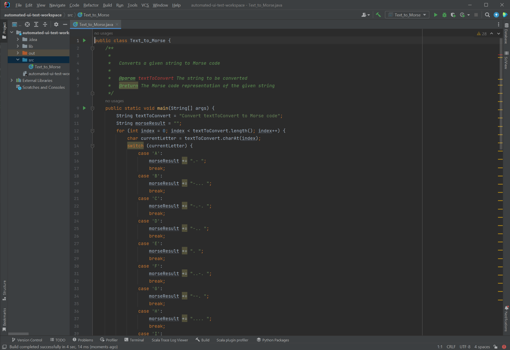
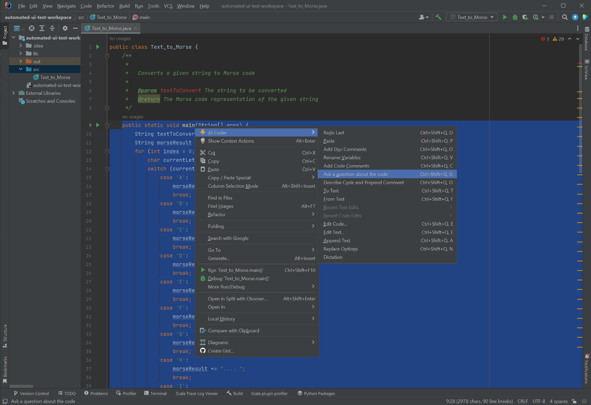
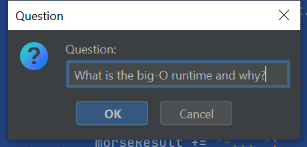
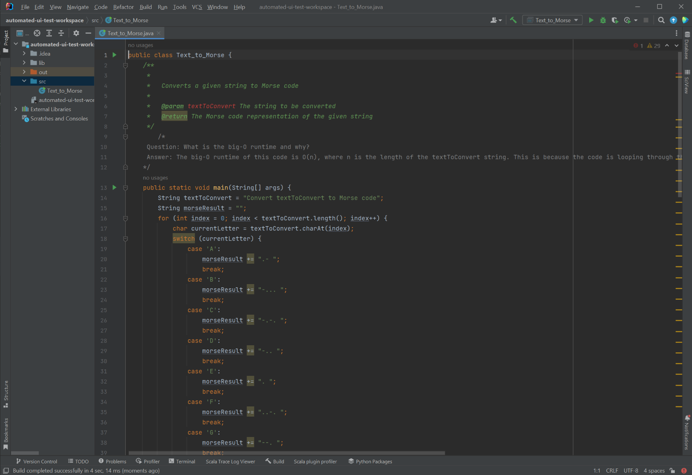
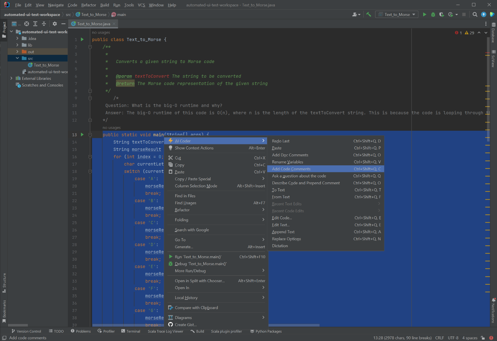

# Text_to_Morse

In this test we will used AI Coding Assistant to implement the Text_to_Morse class to solve the following problem:

```
Convert text to Morse code
```

## Implementation

The first step is to translate the problem into code. We can do this by using the "Insert Implementation" command.


This results in the following code:

```java
public class Text_to_Morse {
    public static void main(String[] args) {
        String text = "Convert text to Morse code";
        String morseCode = "";
        for (int i = 0; i < text.length(); i++) {
            char letter = text.charAt(i);
            switch (letter) {
                case 'A':
                    morseCode += ".- ";
                    break;
                case 'B':
                    morseCode += "-... ";
                    break;
                case 'C':
                    morseCode += "-.-. ";
                    break;
                case 'D':
                    morseCode += "-.. ";
                    break;
                case 'E':
                    morseCode += ". ";
                    break;
                case 'F':
                    morseCode += "..-. ";
                    break;
                case 'G':
                    morseCode += "--. ";
                    break;
                case 'H':
                    morseCode += ".... ";
                    break;
                case 'I':
                    morseCode += ".. ";
                    break;
                case 'J':
                    morseCode += ".--- ";
                    break;
                case 'K':
                    morseCode += "-.- ";
                    break;
                case 'L':
                    morseCode += ".-.. ";
                    break;
                case 'M':
                    morseCode += "-- ";
                    break;
                case 'N':
                    morseCode += "-. ";
                    break;
                case 'O':
                    morseCode += "--- ";
                    break;
                case 'P':
                    morseCode += ".--. ";
                    break;
                case 'Q':
                    morseCode += "--.- ";
                    break;
                case 'R':
                    morseCode += ".-. ";
                    break;
                case 'S':
                    morseCode += "... ";
                    break;
                case 'T':
                    morseCode += "- ";
                    break;
                case 'U':
                    morseCode += "..- ";
                    break;
                case 'V':
                    morseCode += "...- ";
                    break;
                case 'W':
                    morseCode += ".-- ";
                    break;
                case 'X':
                    morseCode += "-..- ";
                    break;
                case 'Y':
                    morseCode += "-.-- ";
                    break;
                case 'Z':
                    morseCode += "--.. ";
                    break;
                case ' ':
                    morseCode += "/ ";
                    break;
            }
        }
        System.out.println(morseCode);
    }

}
```

## Execution

This code can be executed by pressing the "Run" button in the top right corner of the IDE. 
What could possibly go wrong?


```
C:\Users\andre\.jdks\openjdk-19.0.1\bin\java.exe ...
-.-. / / / -- / 
Process finished with exit code 0
```



## Rename Variables

The code is not very readable. We can use the "Rename Variables" command to make it more readable...





## Documentation Comments

We also want good documentation for our code. We can use the "Add Documentation Comments" command to do this.






## Ad-Hoc Questions

We can also ask questions about the code. For example, we can ask what the big-O runtime is for this code.








## Code Comments

We can also add code comments to the code. This is useful for explaining the code to other developers.




```java
public class Text_to_Morse {
    /**
     *
     *   Converts a given string of text to Morse code
     *
     *   @param textToConvert The string of text to convert to Morse code
     *   @return The Morse code representation of the given string
     */
        /*
     Question: What is the big-O runtime and why?
     Answer: The big-O runtime of this code is O(n), where n is the length of the textToConvert string. This is because the code is looping through the string one character at a time, so the runtime is directly proportional to the length of the string.
    */
    public static void main(String[] args) {
        // Declare a String variable to store the text to be converted
        String textToConvert = "Convert textToConvert to Morse code";
        // Declare a String variable to store the result of the conversion
        String morseResult = "";
        // Iterate through each character in the textToConvert String
        for (int index = 0; index < textToConvert.length(); index++) {
            // Store the current character in a char variable
            char currentLetter = textToConvert.charAt(index);
            // Use a switch statement to determine the Morse code equivalent of the current character
            switch (currentLetter) {
                case 'A':
                    morseResult += ".- ";
                    break;
                case 'B':
                    morseResult += "-... ";
                    break;
                case 'C':
                    morseResult += "-.-. ";
                    break;
                case 'D':
                    morseResult += "-.. ";
                    break;
                case 'E':
                    morseResult += ". ";
                    break;
                case 'F':
                    morseResult += "..-. ";
                    break;
                case 'G':
                    morseResult += "--. ";
                    break;
                case 'H':
                    morseResult += ".... ";
                    break;
                case 'I':
                    morseResult += ".. ";
                    break;
                case 'J':
                    morseResult += ".--- ";
                    break;
                case 'K':
                    morseResult += "-.- ";
                    break;
                case 'L':
                    morseResult += ".-.. ";
                    break;
                case 'M':
                    morseResult += "-- ";
                    break;
                case 'N':
                    morseResult += "-. ";
                    break;
                case 'O':
                    morseResult += "--- ";
                    break;
                case 'P':
                    morseResult += ".--. ";
                    break;
                case 'Q':
                    morseResult += "--.- ";
                    break;
                case 'R':
                    morseResult += ".-. ";
                    break;
                case 'S':
                    morseResult += "... ";
                    break;
                case 'T':
                    morseResult += "- ";
                    break;
                case 'U':
                    morseResult += "..- ";
                    break;
                case 'V':
                    morseResult += "...- ";
                    break;
                case 'W':
                    morseResult += ".-- ";
                    break;
                case 'X':
                    morseResult += "-..- ";
                    break;
                case 'Y':
                    morseResult += "-.-- ";
                    break;
                case 'Z':
                    morseResult += "--.. ";
                    break;
                case ' ':
                    morseResult += "/ ";
                    break;
            }
        }
        // Print the result of the conversion
        System.out.println(morseResult);
    }

}
```


## Conversion to other languages

### JavaScript

We can also convert the code to other languages. For example, we can convert the code to JavaScript.


```js
function Text_to_Morse() {
  /*
     Question: What is the big-O runtime and why?
     Answer: The big-O runtime of this code is O(n), where n is the length of the textToConvert string. This is because the code is looping through the string one character at a time, so the runtime is directly proportional to the length of the string.
    */
/**
     *
     *   Converts a given string of text to Morse code
     *
     *   @param textToConvert The string of text to convert to Morse code
     *   @return The Morse code representation of the given string
     */
        /*
     Question: What is the big-O runtime and why?
     Answer: The big-O runtime of this code is O(n), where n is the length of the textToConvert string. This is because the code is looping through the string one character at a time, so the runtime is directly proportional to the length of the string.
    */
    function main(args) {
        // Declare a String variable to store the text to be converted
        let textToConvert = "Convert textToConvert to Morse code";
        // Declare a String variable to store the result of the conversion
        let morseResult = "";
        // Iterate through each character in the textToConvert String
        for (let index = 0; index < textToConvert.length; index++) {
            // Store the current character in a char variable
            let currentLetter = textToConvert.charAt(index);
            // Use a switch statement to determine the Morse code equivalent of the current character
            switch (currentLetter) {
                case 'A':
                    morseResult += ".- ";
                    break;
                case 'B':
                    morseResult += "-... ";
                    break;
                case 'C':
                    morseResult += "-.-. ";
                    break;
                case 'D':
                    morseResult += "-.. ";
                    break;
                case 'E':
                    morseResult += ". ";
                    break;
                case 'F':
                    morseResult += "..-. ";
                    break;
                case 'G':
                    morseResult += "--. ";
                    break;
                case 'H':
                    morseResult += ".... ";
                    break;
                case 'I':
                    morseResult += ".. ";
                    break;
                case 'J':
                    morseResult += ".--- ";
                    break;
                case 'K':
                    morseResult += "-.- ";
                    break;
                case 'L':
                    morseResult += ".-.. ";
                    break;
                case 'M':
                    morseResult += "-- ";
                    break;
                case 'N':
                    morseResult += "-. ";
                    break;
                case 'O':
                    morseResult += "--- ";
                    break;
                case 'P':
                    morseResult += ".--. ";
                    break;
                case 'Q':
                    morseResult += "--.- ";
                    break;
                case 'R':
                    morseResult += ".-. ";
                    break;
                case 'S':
                    morseResult += "... ";
                    break;
                case 'T':
                    morseResult += "- ";
                    break;
                case 'U':
                    morseResult += "..- ";
                    break;
                case 'V':
                    morseResult += "...- ";
                    break;
                case 'W':
                    morseResult += ".-- ";
                    break;
                case 'X':
                    morseResult += "-..- ";
                    break;
                case 'Y':
                    morseResult += "-.-- ";
                    break;
                case 'Z':
                    morseResult += "--.. ";
                    break;
                case ' ':
                    morseResult += "/ ";
                    break;
            }
        }
        // Print the result of the conversion
        console.log(morseResult);
    }
}
```
### Conversion to Scala

We can also convert the code to Scala.


```scala
class Text_to_Morse {
  /*
     Question: What is the big-O runtime and why?
     Answer: The big-O runtime of this code is O(n), where n is the length of the textToConvert string. This is because the code is looping through the string one character at a time, so the runtime is directly proportional to the length of the string.
    */
/**
     *
     *   Converts a given string of text to Morse code
     *
     *   @param textToConvert The string of text to convert to Morse code
     *   @return The Morse code representation of the given string
     */
        /*
     Question: What is the big-O runtime and why?
     Answer: The big-O runtime of this code is O(n), where n is the length of the textToConvert string. This is because the code is looping through the string one character at a time, so the runtime is directly proportional to the length of the string.
    */
    def main(args: Array[String]): Unit = {
        // Declare a String variable to store the text to be converted
        val textToConvert = "Convert textToConvert to Morse code"
        // Declare a String variable to store the result of the conversion
        var morseResult = ""
        // Iterate through each character in the textToConvert String
        for (index <- 0 until textToConvert.length) {
            // Store the current character in a char variable
            val currentLetter = textToConvert.charAt(index)
            // Use a match statement to determine the Morse code equivalent of the current character
            currentLetter match {
                case 'A' => morseResult += ".- "
                case 'B' => morseResult += "-... "
                case 'C' => morseResult += "-.-. "
                case 'D' => morseResult += "-.. "
                case 'E' => morseResult += ". "
                case 'F' => morseResult += "..-. "
                case 'G' => morseResult += "--. "
                case 'H' => morseResult += ".... "
                case 'I' => morseResult += ".. "
                case 'J' => morseResult += ".--- "
                case 'K' => morseResult += "-.- "
                case 'L' => morseResult += ".-.. "
                case 'M' => morseResult += "-- "
                case 'N' => morseResult += "-. "
                case 'O' => morseResult += "--- "
                case 'P' => morseResult += ".--. "
                case 'Q' => morseResult += "--.- "
                case 'R' => morseResult += ".-. "
                case 'S' => morseResult += "... "
                case 'T' => morseResult += "- "
                case 'U' => morseResult += "..- "
                case 'V' => morseResult += "...- "
                case 'W' => morseResult += ".-- "
                case 'X' => morseResult += "-..- "
                case 'Y' => morseResult += "-.-- "
                case 'Z' => morseResult += "--.. "
                case ' ' => morseResult += "/ "
            }
        }
        // Print the result of the conversion
        println(morseResult)
    }
}
```
