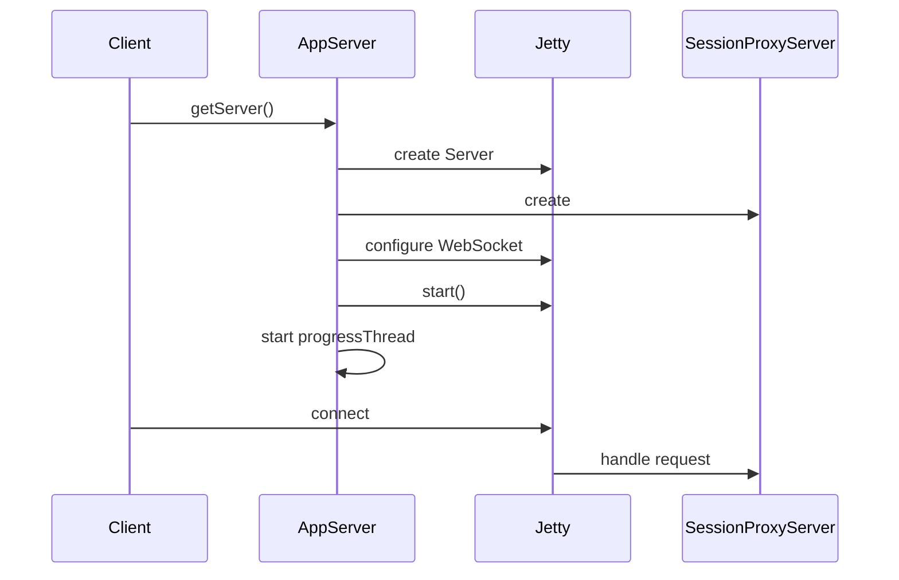

## Code Overview
- **Language & Frameworks:** Kotlin, Jetty, WebSocket
- **Primary Purpose:** To create and manage a web server for the AI Coder plugin
- **Brief Description:** This class sets up and manages a Jetty server that hosts a web application for the AI Coder plugin. It includes functionality for starting the server, handling WebSocket connections, and managing the server lifecycle.

## Public Interface
- **Exported Functions/Classes:**
  - `AppServer` class
  - `getServer` companion object function
- **Public Constants/Variables:**
  - `server` property (lazy-initialized)

## Dependencies
- **External Libraries**
  - Jetty
  - WebSocket
  - SLF4J
- **Internal Code: Symbol References**
  - `SessionProxyServer`
  - `AppSettingsState`
  - `UITools`

## Architecture
- **Sequence or Flow Diagrams:**


## Example Usage
```kotlin
val project: Project = // ... obtain project reference
val server = AppServer.getServer(project)
// Server is now running and accessible
```

## Code Analysis
- **Code Style Observations:**
  - Uses Kotlin idioms like lazy initialization and property delegates
  - Follows a singleton-like pattern with companion object
- **Code Review Feedback:**
  - Consider making the class thread-safe
  - Error handling could be improved
- **Features:**
  - Configurable port and listening endpoint
  - WebSocket support
  - Progress indication during server runtime
- **Potential Improvements:**
  - Implement proper shutdown mechanism
  - Add more robust error handling and logging
  - Consider using dependency injection for better testability

## Tags
- **Keyword Tags:** WebServer, Jetty, WebSocket, AICoderPlugin
- **Key-Value Tags:**
  - Type: Server
  - Framework: Jetty
  - Protocol: WebSocket