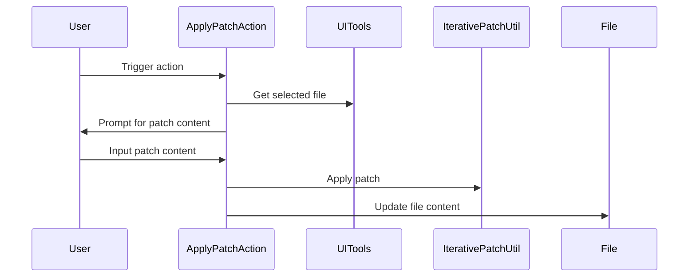

Here's the documentation for the provided code:

## Code Overview
- **Language & Frameworks:** Kotlin, IntelliJ Platform SDK
- **Primary Purpose:** To apply a patch to a selected file in an IntelliJ IDEA project
- **Brief Description:** This action allows users to input a patch and apply it to the currently selected file in the IDE.

## Public Interface
- **Exported Functions/Classes:** 
  - `ApplyPatchAction` class (extends `BaseAction`)

## Dependencies
- **External Libraries**
  - IntelliJ Platform SDK
  - `com.simiacryptus.diff.IterativePatchUtil`
- **Internal Code: Symbol References**
  - `com.github.simiacryptus.aicoder.util.UITools`
  - `com.github.simiacryptus.aicoder.actions.BaseAction`

## Architecture
- **Sequence Diagram:**

## Example Usage
This action would typically be triggered from the IDE's action system, such as a menu item or toolbar button. When activated, it prompts the user for patch content and applies it to the selected file.

## Code Analysis
- **Code Style Observations:** 
  - Follows Kotlin coding conventions
  - Uses IntelliJ Platform SDK idioms
- **Features:**
  - User input for patch content
  - Applies patch to selected file
  - Handles potential errors (null checks)
- **Potential Improvements:**
  - Add error handling for invalid patch content
  - Provide option to preview changes before applying
  - Support applying patches to multiple files

## Tags
- **Keyword Tags:** IntelliJ, Plugin, Patch, File Modification
- **Key-Value Tags:**
  - Type: Action
  - Platform: IntelliJ IDEA
  - Language: Kotlin