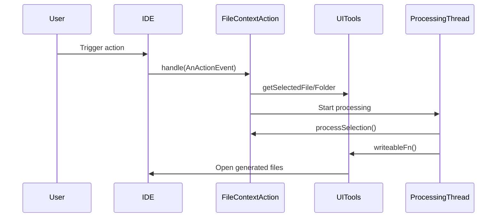

Here's a documentation overview for the provided code:

## Code Overview
- **Language & Frameworks:** Kotlin, IntelliJ Platform SDK
- **Primary Purpose:** Provides a base class for actions that operate on file or folder contexts within an IntelliJ IDEA plugin.
- **Brief Description:** This abstract class, `FileContextAction`, extends `BaseAction` and provides a framework for creating actions that can be performed on selected files or folders in an IntelliJ IDEA project.

## Public Interface
- **Exported Classes:**
  - `FileContextAction<T : Any>`
- **Public Constants/Variables:**
  - `isDevAction: Boolean`
- **Types/Interfaces:**
  - `SelectionState` (data class)

## Dependencies
- **External Libraries:**
  - IntelliJ Platform SDK
  - SLF4J (for logging)
- **Internal Code: Symbol References:**
  - `com.github.simiacryptus.aicoder.config.AppSettingsState`
  - `com.github.simiacryptus.aicoder.util.UITools`

## Architecture
- **Sequence Diagram:**


## Example Usage
```kotlin
class MyFileAction : FileContextAction<MyConfig>() {
    override fun processSelection(state: SelectionState, config: MyConfig?): Array<File> {
        // Process the selected file or folder
        // Return an array of generated or modified files
    }

    override fun getConfig(project: Project?, e: AnActionEvent): MyConfig? {
        // Return configuration for the action
    }
}
```

## Code Analysis
- **Code Style Observations:**
  - Follows Kotlin coding conventions
  - Uses nullable types and safe calls extensively
- **Code Review Feedback:**
  - Good use of generics for configuration
  - Proper error handling and logging
- **Features:**
  - Supports both file and folder selection
  - Allows for custom configuration per action
  - Handles file opening and refreshing
- **Potential Improvements:**
  - Consider using coroutines instead of raw threads
  - Add more documentation for overridable methods

## Tags
- **Keyword Tags:** IntelliJ, Plugin, Action, File, Folder, Context
- **Key-Value Tags:**
  - Type: Abstract Class
  - Platform: IntelliJ IDEA
  - Language: Kotlin