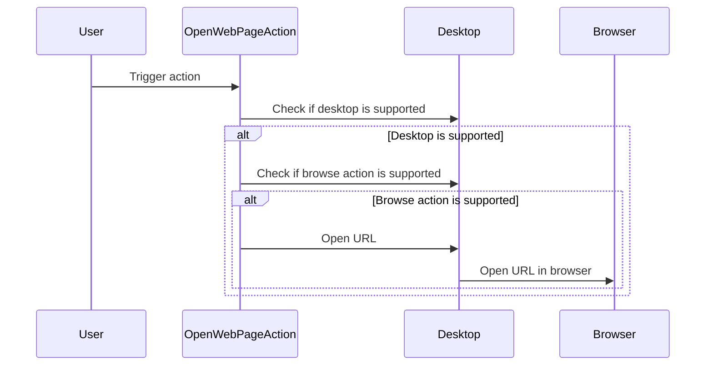

Here's the documentation for the provided code:

## Code Overview
- **Language & Frameworks:** Kotlin, IntelliJ Platform SDK
- **Primary Purpose:** Open a specific web page in the default browser
- **Brief Description:** This action opens the URL "http://apps.simiacrypt.us/" in the system's default web browser when triggered.

## Public Interface
- **Exported Functions/Classes:** 
  - `OpenWebPageAction` class (extends AnAction)

## Dependencies
- **External Libraries**
  - IntelliJ Platform SDK
- **Internal Code: Symbol References**
  - `com.intellij.openapi.actionSystem.AnAction`
  - `com.intellij.openapi.actionSystem.AnActionEvent`

## Architecture
- **Sequence Diagram:**

## Example Usage
This action is typically used in the IntelliJ IDEA environment and can be bound to a menu item, toolbar button, or keyboard shortcut. When triggered, it will open the specified web page.

## Code Analysis
- **Code Style Observations:** 
  - The code follows Kotlin style guidelines.
  - It's concise and focused on a single responsibility.
- **Features:**
  - Opens a specific web page in the default browser.
  - Checks for desktop and browse action support before attempting to open the URL.
- **Potential Improvements:**
  - Consider making the URL configurable rather than hardcoded.
  - Add error handling for cases where the desktop or browse action is not supported.
  - Provide user feedback if the action fails to open the web page.

## Tags
- **Keyword Tags:** IntelliJ, Action, Web, Browser
- **Key-Value Tags:**
  - Type: Action
  - Platform: IntelliJ
  - Function: OpenWebPage