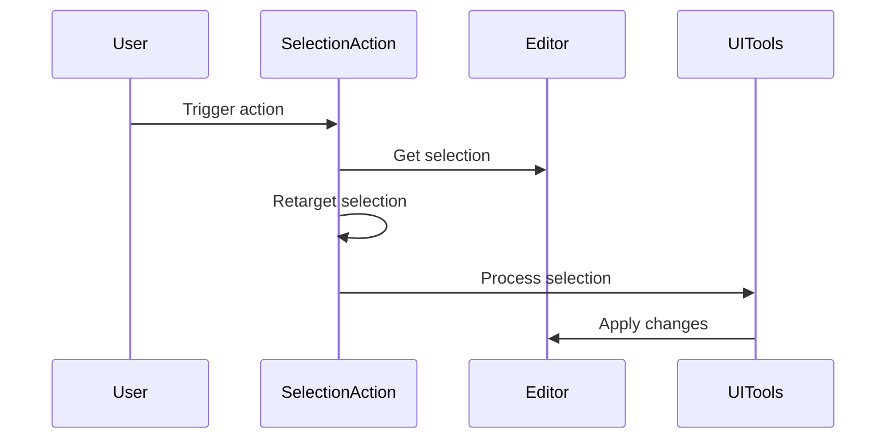

Here's a documentation overview for the provided Kotlin code:

## Code Overview
- **Language & Frameworks:** Kotlin, IntelliJ Platform SDK
- **Primary Purpose:** Provides a base class for actions that operate on selected text in an editor
- **Brief Description:** This file defines an abstract class `SelectionAction` that extends `BaseAction` and provides functionality for handling text selection in IntelliJ-based IDEs.

## Public Interface
- **Exported Classes:**
  - `SelectionAction<T : Any>`
- **Types/Interfaces:**
  - `EditorState` data class
  - `ContextRange` data class
  - `SelectionState` data class

## Dependencies
- **External Libraries:**
  - IntelliJ Platform SDK
- **Internal Code: Symbol References:**
  - `com.github.simiacryptus.aicoder.util.ComputerLanguage`
  - `com.github.simiacryptus.aicoder.util.UITools`
  - `com.github.simiacryptus.aicoder.actions.BaseAction`

## Architecture
- **Sequence Diagram:**


## Example Usage
```kotlin
class MyCustomSelectionAction : SelectionAction<MyConfig>() {
    override fun processSelection(state: SelectionState, config: MyConfig?): String {
        // Custom logic to process the selected text
        return "Processed: ${state.selectedText}"
    }
}
```

## Code Analysis
- **Code Style Observations:**
  - Follows Kotlin coding conventions
  - Uses data classes for state representation
  - Utilizes generics for configuration
- **Features:**
  - Handles text selection and modification in IntelliJ-based IDEs
  - Supports custom configuration for actions
  - Provides context-aware selection handling
- **Potential Improvements:**
  - Consider adding more documentation for complex methods
  - Implement unit tests for core functionality

## Tags
- **Keyword Tags:** IntelliJ, Editor, Selection, Action, Kotlin
- **Key-Value Tags:**
  - Type: Abstract Class
  - Platform: IntelliJ
  - Functionality: Text Selection