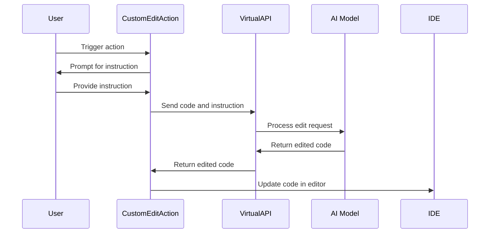

## Code Overview
- **Language & Frameworks:** Kotlin, IntelliJ Platform SDK
- **Primary Purpose:** Provide a custom code editing action for IntelliJ-based IDEs
- **Brief Description:** This class implements a custom edit action that allows users to input instructions for modifying selected code using AI-powered editing.

## Public Interface
- **Exported Functions/Classes:** 
  - `CustomEditAction` class (extends `SelectionAction<String>`)
  - `VirtualAPI` interface (nested within `CustomEditAction`)
- **Public Constants/Variables:** None
- **Types/Interfaces:**
  - `VirtualAPI`: Interface for AI-powered code editing
  - `VirtualAPI.EditedText`: Data class for holding edited code and language

## Dependencies
- **External Libraries**
  - IntelliJ Platform SDK
  - OpenAI API (via `com.simiacryptus.jopenai.proxy.ChatProxy`)
- **Internal Code: Symbol References**
  - `com.github.simiacryptus.aicoder.actions.SelectionAction`
  - `com.github.simiacryptus.aicoder.config.AppSettingsState`
  - `com.github.simiacryptus.aicoder.util.UITools`

## Architecture
- **Sequence Diagram:**


## Example Usage
```kotlin
// Assuming the action is registered in the IDE
// User selects code in the editor
// User triggers the CustomEditAction
// User inputs an instruction, e.g., "Add error handling"
// The action processes the selected code and applies the AI-generated changes
```

## Code Analysis
- **Code Style Observations:** 
  - Follows Kotlin coding conventions
  - Uses modern Kotlin features like data classes and nullable types
- **Code Review Feedback:**
  - Consider adding more robust error handling
  - The `getConfig` method could benefit from remembering recent instructions
- **Features:**
  - AI-powered code editing based on natural language instructions
  - Integration with IntelliJ Platform
  - Customizable language settings
- **Potential Improvements:**
  - Add more examples to the `ChatProxy` for better AI responses
  - Implement caching to improve performance for repeated edits
  - Add unit tests to ensure reliability

## Tags
- **Keyword Tags:** #IntelliJPlugin #AICodeEditing #Kotlin #OpenAI
- **Key-Value Tags:**
  - complexity: medium
  - feature: code-editing
  - ai-integration: openai