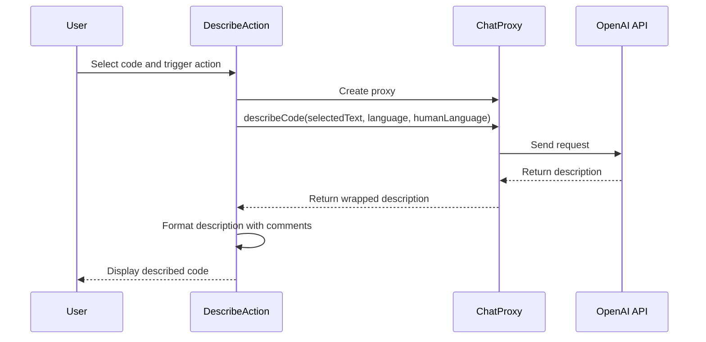

## Code Overview
- **Language & Frameworks:** Kotlin, IntelliJ Platform SDK
- **Primary Purpose:** To provide a code description action for selected text in an IDE
- **Brief Description:** This class implements a custom action that describes selected code in a specified human language, wrapping the description in appropriate comments.

## Public Interface
- **Exported Functions/Classes:** 
  - `DescribeAction` class (extends `SelectionAction<String>`)
  - `DescribeAction_VirtualAPI` interface (nested within `DescribeAction`)
- **Public Constants/Variables:** None
- **Types/Interfaces:**
  - `DescribeAction_VirtualAPI`: Interface for describing code
  - `DescribeAction_VirtualAPI.DescribeAction_ConvertedText`: Data class for holding described text and language

## Dependencies
- **External Libraries**
  - IntelliJ Platform SDK
  - OpenAI API (via `com.simiacryptus.jopenai` package)
- **Internal Code: Symbol References**
  - `com.github.simiacryptus.aicoder.actions.SelectionAction`
  - `com.github.simiacryptus.aicoder.config.AppSettingsState`
  - `com.github.simiacryptus.aicoder.util.IndentedText`

## Architecture
- **Sequence Diagram:**


## Example Usage
```kotlin
// Assuming this action is registered in the IDE
// User selects code in the editor and triggers the DescribeAction
// The action will then describe the selected code and wrap it in comments
```

## Code Analysis
- **Code Style Observations:** 
  - Follows Kotlin coding conventions
  - Uses functional programming concepts (e.g., lambda expressions)
- **Code Review Feedback:**
  - Well-structured and modular design
  - Good use of dependency injection for API client
- **Features:**
  - Describes selected code in a specified human language
  - Automatically wraps description in appropriate comment style (line or block)
  - Supports multiple programming languages
- **Potential Improvements:**
  - Add error handling for API calls
  - Implement caching to improve performance for repeated descriptions

## Tags
- **Keyword Tags:** #Kotlin #IntelliJ #CodeDescription #AIAssistant #OpenAI
- **Key-Value Tags:**
  - Type: Action
  - Framework: IntelliJ Platform SDK
  - AI-Integration: OpenAI