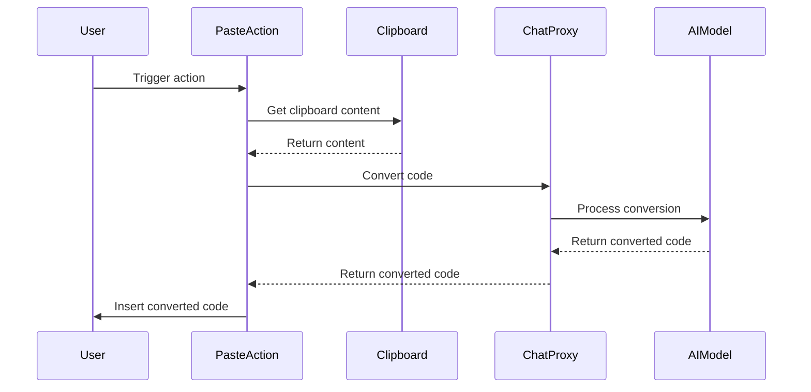

## Code Overview
- **Language & Frameworks:** Kotlin, IntelliJ Platform SDK
- **Primary Purpose:** Implement a smart paste action for code in IntelliJ-based IDEs
- **Brief Description:** This action extends SelectionAction to provide a smart paste functionality that can convert code from one language to another using an AI model.

## Public Interface
- **Exported Functions/Classes:** 
  - `PasteAction` class
  - `VirtualAPI` interface (nested within PasteAction)
- **Public Constants/Variables:** None
- **Types/Interfaces:**
  - `VirtualAPI` interface with `convert` method
  - `ConvertedText` class (nested within VirtualAPI)

## Dependencies
- **External Libraries**
  - IntelliJ Platform SDK
  - OpenAI API (via `com.simiacryptus.jopenai.proxy.ChatProxy`)
- **Internal Code: Symbol References**
  - `com.github.simiacryptus.aicoder.actions.SelectionAction`
  - `com.github.simiacryptus.aicoder.config.AppSettingsState`
  - `com.github.simiacryptus.aicoder.util.ComputerLanguage`

## Architecture
- **Sequence Diagram:**

## Example Usage
This action would typically be triggered by a user shortcut or menu item in an IntelliJ-based IDE. When activated, it reads the clipboard content, attempts to convert it to the target language of the current file, and inserts the converted code at the cursor position or replaces the selected text.

## Code Analysis
- **Code Style Observations:** 
  - Follows Kotlin coding conventions
  - Uses nullable types and safe calls appropriately
- **Code Review Feedback:**
  - Good use of IntelliJ Platform SDK for action handling
  - Clever use of ChatProxy for AI-powered code conversion
- **Features:**
  - Smart paste functionality
  - Language auto-detection
  - Code conversion between languages
- **Potential Improvements:**
  - Add error handling for API calls
  - Implement caching to improve performance for repeated conversions
  - Add user feedback for long-running conversions

## Tags
- **Keyword Tags:** #kotlin #intellij-plugin #code-conversion #ai-assisted #clipboard
- **Key-Value Tags:**
  - complexity: medium
  - feature: smart-paste
  - ai-integration: yes