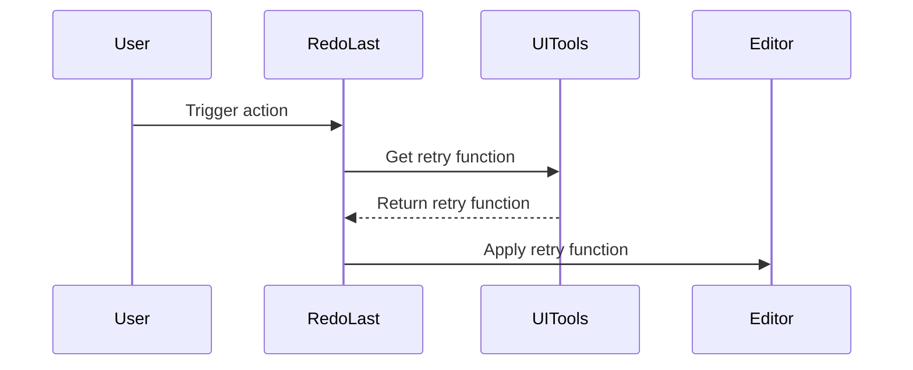

Here's the documentation for the provided code:

## Code Overview
- **Language & Frameworks:** Kotlin, IntelliJ Platform SDK
- **Primary Purpose:** To provide a redo functionality for the last AI Coder action in the IntelliJ IDEA editor
- **Brief Description:** This class implements a custom action that allows users to redo the last AI Coder action performed in the editor. It extends the BaseAction class and overrides necessary methods to integrate with IntelliJ's action system.

## Public Interface
- **Exported Functions/Classes:** 
  - `RedoLast` class (extends BaseAction)
- **Public Constants/Variables:** None
- **Types/Interfaces:** None

## Dependencies
- **External Libraries:**
  - IntelliJ Platform SDK (com.intellij.openapi.actionSystem.*)
- **Internal Code: Symbol References:**
  - `com.github.simiacryptus.aicoder.actions.BaseAction`
  - `com.github.simiacryptus.aicoder.util.UITools.retry`

## Architecture
- **Sequence Diagram:**


## Example Usage
```kotlin
// This action is typically triggered through the IntelliJ IDEA UI
// For example, it might be bound to a menu item or keyboard shortcut
val redoLastAction = RedoLast()
redoLastAction.actionPerformed(anActionEvent)
```

## Code Analysis
- **Code Style Observations:** 
  - Follows Kotlin coding conventions
  - Uses IntelliJ Platform SDK idioms
- **Code Review Feedback:**
  - The code is concise and focused on its specific task
  - Good use of IntelliJ's action system
- **Features:**
  - Redo functionality for AI Coder actions
  - Integration with IntelliJ's action system
  - Background thread handling for action updates
- **Potential Improvements:**
  - Consider adding error handling for cases where the retry function is not available
  - Add logging for debugging purposes

## Tags
- **Keyword Tags:** #IntelliJ #AICoderAction #Redo #EditorAction
- **Key-Value Tags:**
  - Type: Action
  - Platform: IntelliJ
  - Functionality: Redo