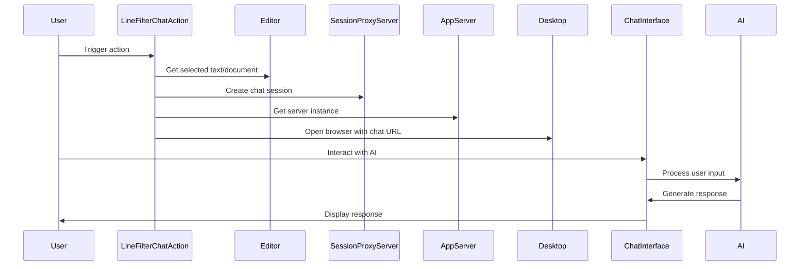

Here's the documentation for the provided code:

## Code Overview
- **Language & Frameworks:** Kotlin, IntelliJ Platform SDK
- **Primary Purpose:** Implements a custom action for IntelliJ-based IDEs that allows users to interact with selected code using an AI-powered chat interface.
- **Brief Description:** This action creates a chat session where users can ask questions about selected code, with the AI assistant providing context-aware responses.

## Public Interface
- **Exported Functions/Classes:** 
  - `LineFilterChatAction` class (extends `BaseAction`)
- **Public Constants/Variables:**
  - `path: String = "/codeChat"`

## Dependencies
- **External Libraries**
  - IntelliJ Platform SDK
  - SkyeNet library (com.simiacryptus.skyenet)
- **Internal Code: Symbol References**
  - `BaseAction`
  - `AppServer`
  - `AppSettingsState`
  - `ComputerLanguage`
  - `SessionProxyServer`

## Architecture
- **Sequence Diagram:**

## Example Usage
1. User selects code in the IDE editor
2. User triggers the LineFilterChatAction
3. A new browser window opens with a chat interface
4. User can ask questions about the selected code
5. AI responds with context-aware answers, referencing specific code lines when appropriate

## Code Analysis
- **Code Style Observations:**
  - Follows Kotlin coding conventions
  - Uses IntelliJ Platform SDK idioms
  - Implements custom chat behavior by extending ChatSocketManager
- **Code Review Feedback:**
  - Consider adding error handling for cases where required data is not available
  - The `handle` method is quite long and could potentially be split into smaller functions
- **Features:**
  - Integrates AI-powered code chat directly into the IDE
  - Allows line-specific referencing in AI responses
  - Supports multiple programming languages
- **Potential Improvements:**
  - Add user settings for customizing AI behavior or chat interface
  - Implement caching to improve performance for repeated queries
  - Add support for multi-file context in chat sessions

## Tags
- **Keyword Tags:** IntelliJ, Plugin, AI, Code Chat, Kotlin
- **Key-Value Tags:**
  - Type: IDE Action
  - Integration: AI Chat
  - Platform: IntelliJ