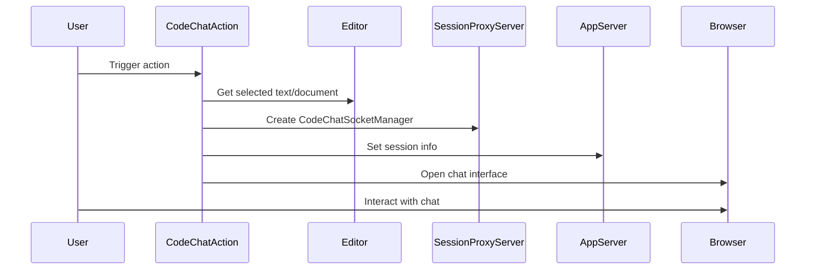

## Code Overview
- **Language & Frameworks:** Kotlin, IntelliJ Platform SDK
- **Primary Purpose:** Implement a code chat action for the IntelliJ IDEA plugin
- **Brief Description:** This class, `CodeChatAction`, extends `BaseAction` to provide a chat interface for discussing code within the IDE. It sets up a session for code chat and opens a browser window to interact with the chat.

## Public Interface
- **Exported Functions/Classes:** 
  - `CodeChatAction` class
- **Public Constants/Variables:** None
- **Types/Interfaces (if applicable):** None

## Dependencies
- **External Libraries**
  - IntelliJ Platform SDK
  - SkyeNet library
  - SLF4J for logging
- **Internal Code: Symbol References**
  - `BaseAction`
  - `AppSettingsState`
  - `CodeChatSocketManager`
  - `ComputerLanguage`
  - `AppServer`
  - `SessionProxyServer`

## Architecture
- **Sequence or Flow Diagrams:** 

## Example Usage
This action is typically triggered by the user through the IDE's action system, such as a menu item or keyboard shortcut.

## Code Analysis
- **Code Style Observations:** 
  - Follows Kotlin coding conventions
  - Uses nullable types and safe calls
- **Code Review Feedback:**
  - Good use of IntelliJ Platform SDK for editor interaction
  - Proper error handling and logging
- **Features:**
  - Integrates code chat functionality into the IDE
  - Supports multiple programming languages
  - Opens chat interface in the default browser
- **Potential Improvements:**
  - Consider adding more configuration options for the chat interface
  - Implement error handling for browser opening failure

## Tags
- **Keyword Tags:** IntelliJ, Plugin, Code Chat, AI, Editor Integration
- **Key-Value Tags:**
  - Type: Action
  - Integration: Browser
  - AI: Code Analysis