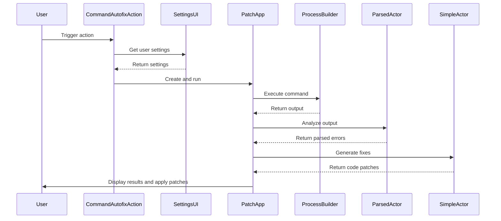

Here's a documentation overview for the provided code:

## Code Overview
- **Language & Frameworks:** Kotlin, IntelliJ Platform SDK
- **Primary Purpose:** Implement a command autofix action for IntelliJ-based IDEs
- **Brief Description:** This code defines a `CommandAutofixAction` class that extends `BaseAction`. It provides functionality to run a command, analyze its output, and automatically fix issues in the code based on the command's results.

## Public Interface
- **Exported Functions/Classes:**
  - `CommandAutofixAction` class
- **Public Constants/Variables:**
  - `tripleTilde`: A constant used for markdown code block formatting
- **Types/Interfaces:**
  - `OutputResult` data class
  - `ParsedErrors` data class
  - `ParsedError` data class
  - `Settings` data class

## Dependencies
- **External Libraries**
  - IntelliJ Platform SDK
  - SkyeNet library
  - JOpenAI library
- **Internal Code: Symbol References**
  - `BaseAction`
  - `AppSettingsState`
  - `UITools`
  - `AppServer`

## Architecture
- **Sequence Diagram:**

## Example Usage
This action is typically triggered from within an IntelliJ-based IDE, either through a menu item or a keyboard shortcut. The user selects files or a directory, configures the command to run, and the action automatically analyzes the output and suggests fixes.

## Code Analysis
- **Code Style Observations:**
  - Extensive use of Kotlin features like data classes and extension functions
  - Nested class structure for better organization
  - Use of functional programming concepts
- **Code Review Feedback:**
  - Consider breaking down the `PatchApp` class into smaller, more focused classes
  - Some methods in `PatchApp` could be extracted to improve readability
- **Features:**
  - Customizable command execution
  - Automatic error parsing and fix suggestion
  - Integration with IntelliJ's UI components
  - File diff generation and application
- **Potential Improvements:**
  - Add more robust error handling and logging
  - Implement unit tests for core functionality
  - Consider making the AI model selection more flexible

## Tags
- **Keyword Tags:** IntelliJ, Plugin, AI, CodeFix, CommandExecution
- **Key-Value Tags:**
  - Type: IntelliJ Plugin Action
  - AI-Integration: Yes
  - Language: Kotlin