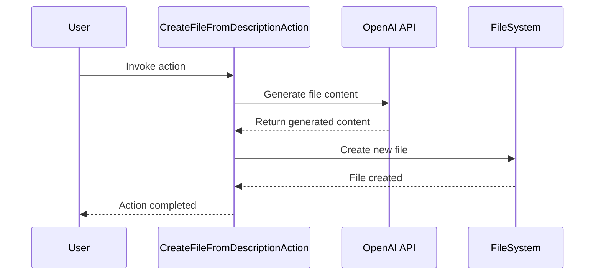

Here's a documentation overview for the provided code:

## Code Overview
- **Language & Frameworks:** Kotlin, IntelliJ Platform SDK
- **Primary Purpose:** Create a new file based on a user-provided description
- **Brief Description:** This action generates a new file with content based on a user's directive, using AI to interpret the requirements and create appropriate file content.

## Public Interface
- **Exported Classes:**
  - `CreateFileFromDescriptionAction`: Main action class
  - `ProjectFile`: Data class for holding file path and content
  - `Settings`: Configuration class for the action

## Dependencies
- **External Libraries:**
  - IntelliJ Platform SDK
  - OpenAI API (via `com.simiacryptus.jopenai`)
- **Internal Code: Symbol References:**
  - `FileContextAction`
  - `AppSettingsState`

## Architecture

## Example Usage
1. User selects a file or directory in the project
2. User invokes the "Create File from Description" action
3. User provides a directive describing the desired file
4. Action generates the file content using AI
5. New file is created in the project structure

## Code Analysis
- **Code Style Observations:** 
  - Follows Kotlin coding conventions
  - Uses nullable types and safe calls
- **Features:**
  - AI-powered file generation
  - Automatic file naming and path resolution
  - Handles file name conflicts
- **Potential Improvements:**
  - Add error handling for API failures
  - Implement user confirmation before file creation
  - Allow customization of AI model and parameters

## Tags
- **Keyword Tags:** #FileGeneration #AI #IntelliJPlugin #Kotlin
- **Key-Value Tags:**
  - complexity: medium
  - ai-integration: OpenAI
  - ide-integration: IntelliJ