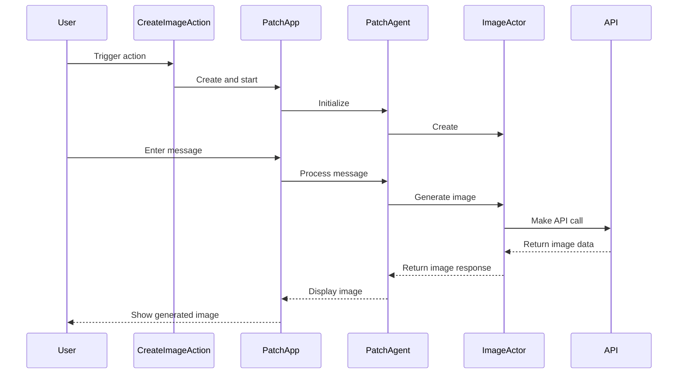

Here's a documentation overview for the provided code:

## Code Overview
- **Language & Frameworks:** Kotlin, IntelliJ Platform SDK
- **Primary Purpose:** Create an action for generating images based on code context in an IntelliJ IDEA plugin
- **Brief Description:** This code defines a `CreateImageAction` class that extends `BaseAction` to create an action for generating images based on selected code files in an IntelliJ IDEA project.

## Public Interface
- **Exported Functions/Classes:**
  - `CreateImageAction` class
- **Public Constants/Variables:**
  - `path: String = "/imageCreator"`

## Dependencies
- **External Libraries**
  - IntelliJ Platform SDK
  - SkyeNet library
  - JOpenAI library
- **Internal Code: Symbol References**
  - `BaseAction`
  - `AppServer`
  - `UITools`
  - `AppSettingsState`

## Architecture
- **Sequence Diagram:**

## Example Usage
This action would typically be triggered from the IntelliJ IDEA UI, such as a menu item or toolbar button. When activated, it opens a web interface for the user to interact with the image generation system.

## Code Analysis
- **Code Style Observations:**
  - Follows Kotlin coding conventions
  - Uses nested classes for organization
  - Implements the IntelliJ action system
- **Code Review Feedback:**
  - Consider breaking down the large `PatchAgent` class into smaller, more focused components
  - Add more inline comments to explain complex logic
- **Features:**
  - Integrates with IntelliJ's action system
  - Uses a web-based UI for interaction
  - Generates images based on code context
  - Supports multi-step conversations
- **Potential Improvements:**
  - Implement error handling and user feedback for failed operations
  - Add configuration options for image generation parameters
  - Optimize performance for large codebases

## Tags
- **Keyword Tags:** IntelliJ, Plugin, Image Generation, AI, Code Analysis
- **Key-Value Tags:**
  - Type: IntelliJ Plugin Action
  - Language: Kotlin
  - AI-Integration: Yes