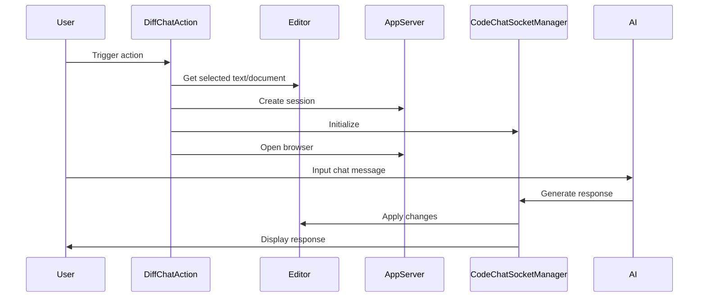

Here's the documentation for the provided code:

## Code Overview
- **Language & Frameworks:** Kotlin, IntelliJ Platform SDK
- **Primary Purpose:** Implements a diff-based chat action for code editing in an IntelliJ IDEA plugin
- **Brief Description:** This class, `DiffChatAction`, extends `BaseAction` to provide an interactive chat interface for code modifications using a diff-based approach.

## Public Interface
- **Exported Classes:** `DiffChatAction`
- **Public Constants/Variables:** 
  - `path: String = "/diffChat"`

## Dependencies
- **External Libraries**
  - IntelliJ Platform SDK
  - SkyeNet library
  - SLF4J for logging
- **Internal Code: Symbol References**
  - `BaseAction`
  - `AppServer`
  - `AppSettingsState`
  - `CodeChatSocketManager`
  - `ComputerLanguage`

## Architecture
- **Sequence Diagram:**

## Example Usage
This action is typically triggered from the IDE's action system, not called directly in code.

## Code Analysis
- **Code Style Observations:** 
  - Follows Kotlin coding conventions
  - Uses extension functions and properties for cleaner code
- **Code Review Feedback:**
  - Well-structured and organized
  - Good use of IntelliJ Platform APIs
- **Features:**
  - Integrates AI-powered code chat directly into the IDE
  - Supports diff-based code modifications
  - Provides an interactive web interface for chat
- **Potential Improvements:**
  - Consider adding error handling for network issues or AI service failures
  - Implement caching mechanism for frequently used responses

## Tags
- **Keyword Tags:** #IntelliJPlugin #AICodeAssistant #DiffChat #CodeModification
- **Key-Value Tags:**
  - Type: Action
  - IntegrationPoint: Editor
  - AIModel: ChatGPT