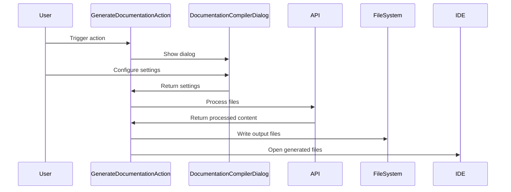

## Code Overview
- **Language & Frameworks:** Kotlin, IntelliJ Platform SDK
- **Primary Purpose:** Generate documentation for selected files in a project
- **Brief Description:** This action allows users to generate documentation for selected files in a project, either as a single output file or as individual files for each input file.

## Public Interface
- **Exported Functions/Classes:**
  - `GenerateDocumentationAction`: Main action class
  - `SettingsUI`: UI components for settings
  - `UserSettings`: Data class for user settings
  - `Settings`: Wrapper class for user settings and project
  - `DocumentationCompilerDialog`: Dialog for configuring documentation generation

## Dependencies
- **External Libraries**
  - IntelliJ Platform SDK
  - Apache Commons IO
  - JOpenAI
- **Internal Code: Symbol References**
  - `FileContextAction`
  - `TestResultAutofixAction`
  - `AppSettingsState`
  - `UITools`

## Architecture
- **Sequence Diagram:**

## Example Usage
1. User selects a directory in the project
2. User triggers the "Generate Documentation" action
3. User configures settings in the dialog (file selection, output options, etc.)
4. Action processes selected files and generates documentation
5. Generated documentation is saved and opened in the IDE

## Code Analysis
- **Code Style Observations:**
  - Kotlin idiomatic style is generally followed
  - Uses IntelliJ Platform SDK conventions
- **Code Review Feedback:**
  - Consider breaking down the `processSelection` method into smaller, more focused methods
  - Add more error handling and logging throughout the code
- **Features:**
  - Supports single file or multiple file output
  - Allows custom AI instructions for documentation generation
  - Integrates with IntelliJ's file system and editor
- **Potential Improvements:**
  - Add progress indicators for long-running operations
  - Implement caching to avoid regenerating unchanged files
  - Add more customization options for output formatting

## Tags
- **Keyword Tags:** documentation-generation, intellij-plugin, kotlin, ai-assisted
- **Key-Value Tags:**
  - complexity: high
  - maintenance: medium
  - performance: medium