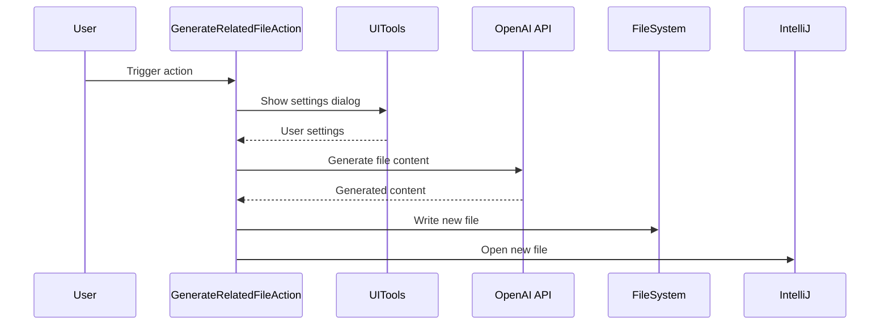

Here's the documentation for the provided code:

## Code Overview
- **Language & Frameworks:** Kotlin, IntelliJ Platform SDK
- **Primary Purpose:** Generate related files based on existing files in an IntelliJ IDEA project
- **Brief Description:** This action allows users to generate new files related to existing ones in their project, using AI-powered content generation.

## Public Interface
- **Exported Functions/Classes:**
  - `GenerateRelatedFileAction` class
- **Public Constants/Variables:**
  - None explicitly public
- **Types/Interfaces:**
  - `ProjectFile` data class
  - `SettingsUI` class
  - `UserSettings` class
  - `Settings` class

## Dependencies
- **External Libraries**
  - IntelliJ Platform SDK
  - Apache Commons IO
  - OpenAI API (via `com.simiacryptus.jopenai`)
- **Internal Code: Symbol References**
  - `FileContextAction`
  - `AppSettingsState`
  - `UITools`

## Architecture
- **Sequence Diagram:**

## Example Usage
1. User selects a file in the project
2. User triggers the "Generate Related File" action
3. User enters a directive in the settings dialog (e.g., "Create test cases")
4. Action generates a new file based on the selected file and directive
5. New file is created and opened in the editor

## Code Analysis
- **Code Style Observations:**
  - Follows Kotlin coding conventions
  - Uses data classes for configuration
  - Implements IntelliJ action interface
- **Code Review Feedback:**
  - Good separation of concerns
  - Effective use of IntelliJ Platform SDK
  - Could benefit from more error handling and user feedback
- **Features:**
  - AI-powered file generation
  - Custom user directives
  - Automatic file naming and conflict resolution
- **Potential Improvements:**
  - Add progress indicators for long-running operations
  - Implement undo functionality
  - Allow customization of AI model parameters

## Tags
- **Keyword Tags:** IntelliJ, Plugin, AI, Code Generation, File Creation
- **Key-Value Tags:**
  - Type: Action
  - Framework: IntelliJ Platform SDK
  - AI-Integration: OpenAI