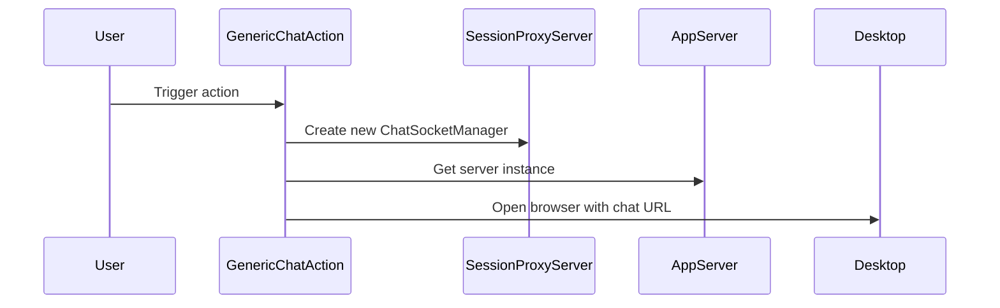

## Code Overview
- **Language & Frameworks:** Kotlin, IntelliJ Platform SDK
- **Primary Purpose:** To provide a generic chat action for code-related conversations
- **Brief Description:** This class implements a generic chat action that opens a web-based chat interface for code-related discussions using a specified AI model.

## Public Interface
- **Exported Functions/Classes:** GenericChatAction (extends BaseAction)
- **Public Constants/Variables:** 
  - path: String
  - systemPrompt: String
  - userInterfacePrompt: String
  - model: ChatLanguageModel

## Dependencies
- **External Libraries**
  - com.intellij.openapi.actionSystem
  - com.simiacryptus.skyenet
  - org.slf4j.LoggerFactory
  - java.awt.Desktop
- **Internal Code: Symbol References**
  - AppServer
  - BaseAction
  - AppSettingsState
  - SessionProxyServer

## Architecture
- **Sequence Diagram:**

## Example Usage
This action is typically triggered from the IDE's action system. When invoked, it creates a new chat session and opens a web browser to the chat interface.

## Code Analysis
- **Code Style Observations:** 
  - Follows Kotlin coding conventions
  - Uses companion object for static members
- **Code Review Feedback:**
  - Consider adding more documentation for class members
  - Error handling could be improved in the browser opening logic
- **Features:**
  - Custom chat model selection
  - Web-based chat interface
  - Integration with IntelliJ Platform
- **Potential Improvements:**
  - Add more configuration options for chat behavior
  - Implement error handling for server startup failures

## Tags
- **Keyword Tags:** chat, ai, code-assistance, intellij-plugin
- **Key-Value Tags:** 
  - type: action
  - framework: intellij-platform
  - ai-integration: true