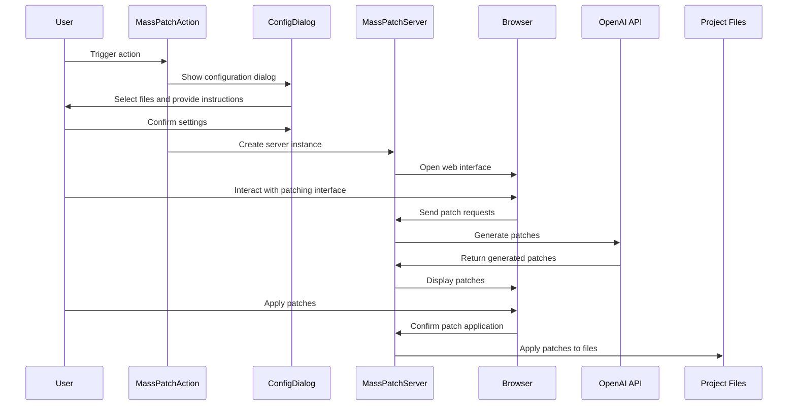

Here's a comprehensive documentation for the provided code:

## Code Overview
- **Language & Frameworks:** Kotlin, IntelliJ IDEA Plugin Development
- **Primary Purpose:** Implement a mass patching action for code files in an IntelliJ IDEA plugin
- **Brief Description:** This code defines a `MassPatchAction` class that allows users to apply AI-generated patches to multiple files in a project. It includes a UI for selecting files and providing instructions, and a server component for handling the patching process.

## Public Interface
- **Exported Functions/Classes:**
  - `MassPatchAction`: Main action class
  - `MassPatchServer`: Server class for handling the patching process
- **Public Constants/Variables:**
  - `SessionProxyServer.chats`: Map storing chat sessions
- **Types/Interfaces:**
  - `Settings`: Configuration class for the action
  - `UserSettings`: User-specific settings
  - `SettingsUI`: UI components for settings

## Dependencies
- **External Libraries**
  - IntelliJ Platform SDK
  - OpenAI API Client
  - SkyeNet (custom library for UI and server components)
- **Internal Code: Symbol References**
  - `AppServer`
  - `BaseAction`
  - `AppSettingsState`
  - `UITools`

## Architecture
- **Sequence or Flow Diagrams:**

- **Class Diagrams:** A class diagram would be helpful to illustrate the relationships between `MassPatchAction`, `MassPatchServer`, `ConfigDialog`, and their associated classes.

## Example Usage
1. User triggers the `MassPatchAction` from the IDE
2. User selects files to process and provides AI instructions in the configuration dialog
3. A web interface opens in the browser
4. User interacts with the patching interface to review and apply generated patches
5. Patches are applied to the selected project files

## Code Analysis
- **Code Style Observations:**
  - Follows Kotlin coding conventions
  - Uses IntelliJ Platform SDK idioms
  - Implements a mix of UI and server-side logic
- **Code Review Feedback:**
  - Good separation of concerns between action, server, and UI components
  - Effective use of Kotlin features like data classes and extension functions
  - Consider adding more error handling and logging
- **Features:**
  - File selection UI
  - AI-powered patch generation
  - Web-based patch review and application
  - Integration with IntelliJ IDEA
- **Potential Improvements:**
  - Add unit tests for critical components
  - Implement better error handling and user feedback
  - Consider adding progress indicators for long-running operations
  - Optimize performance for large projects with many files

## Tags
- **Keyword Tags:** IntelliJ, Plugin, AI, Code Patching, OpenAI, Kotlin
- **Key-Value Tags:**
  - Type: IntelliJ IDEA Plugin
  - Language: Kotlin
  - AI-Integration: OpenAI API
  - UI-Framework: Swing, Web