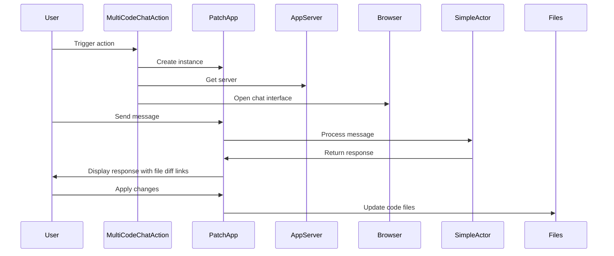

Here's a documentation overview for the provided code:

## Code Overview
- **Language & Frameworks:** Kotlin, IntelliJ Platform SDK
- **Primary Purpose:** Implements a multi-file code chat action for an IntelliJ IDEA plugin
- **Brief Description:** This action allows users to chat with an AI about multiple code files, view diffs, and apply changes directly from the chat interface.

## Public Interface
- **Exported Classes:**
  - `MultiCodeChatAction`: Main action class extending BaseAction
  - `PatchApp`: Inner class implementing ApplicationServer for the chat interface

## Dependencies
- **External Libraries:**
  - IntelliJ Platform SDK
  - SkyeNet library (com.simiacryptus.skyenet)
  - JOpenAI library (com.simiacryptus.jopenai)
- **Internal Code: Symbol References:**
  - `BaseAction`
  - `AppServer`
  - `AppSettingsState`
  - `UITools`

## Architecture
- **Sequence Diagram:**

## Example Usage
1. User selects multiple files or a folder in the IDE
2. User triggers the MultiCodeChatAction
3. A browser window opens with the chat interface
4. User can discuss the code and request changes
5. AI provides responses with clickable links to apply changes
6. User can apply changes directly from the chat interface

## Code Analysis
- **Code Style Observations:** 
  - Kotlin idiomatic style
  - Uses functional programming concepts
  - Extensive use of lambdas and higher-order functions
- **Features:**
  - Multi-file code chat
  - Integration with IntelliJ IDEA
  - AI-powered code discussions
  - Direct code modification from chat interface
- **Potential Improvements:**
  - Add error handling for file operations
  - Implement user authentication for the chat interface
  - Add support for more file types and languages

## Tags
- **Keyword Tags:** IntelliJ, Plugin, AI, Code Chat, Multi-file, Kotlin
- **Key-Value Tags:**
  - Type: IntelliJ Plugin Action
  - AI Model: GPT-4
  - Interface: Web-based Chat