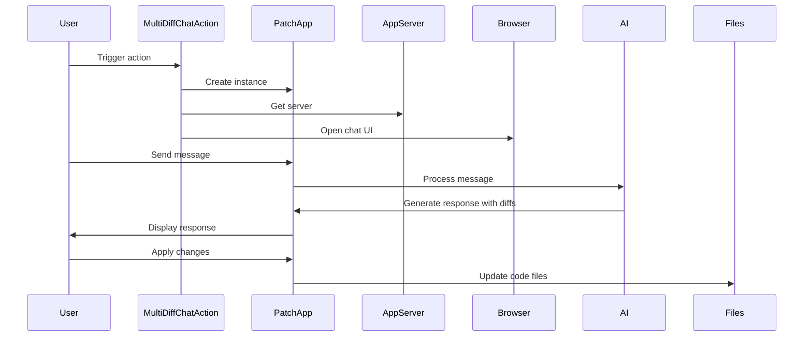

Here's a documentation overview for the provided code:

## Code Overview
- **Language & Frameworks:** Kotlin, IntelliJ Platform SDK
- **Primary Purpose:** Implements a multi-file diff chat action for an IntelliJ IDEA plugin
- **Brief Description:** This action allows users to chat with an AI about multiple code files, receive suggestions in the form of diffs, and apply those changes directly to the files.

## Public Interface
- **Exported Classes:**
  - `MultiDiffChatAction`: Main action class extending `BaseAction`
  - `PatchApp`: Inner class implementing the chat application

## Dependencies
- **External Libraries**
  - IntelliJ Platform SDK
  - SkyeNet library (com.simiacryptus.skyenet)
  - JOpenAI library (com.simiacryptus.jopenai)
- **Internal Code: Symbol References**
  - `BaseAction`
  - `AppServer`
  - `AppSettingsState`
  - `UITools`
  - `SessionProxyServer`

## Architecture
- **Sequence Diagram:**

## Example Usage
1. User selects multiple files or a folder in the IDE
2. User triggers the MultiDiffChatAction
3. A browser window opens with the chat interface
4. User discusses code changes with the AI
5. AI suggests changes in diff format
6. User can apply changes directly from the chat interface

## Code Analysis
- **Code Style Observations:**
  - Kotlin idiomatic code with functional programming elements
  - Extensive use of lambdas and higher-order functions
- **Code Review Feedback:**
  - Well-structured and modular design
  - Good separation of concerns between action handling and chat application
- **Features:**
  - Multi-file code discussion
  - AI-generated diff suggestions
  - Direct application of changes to files
  - Token count estimation for selected files
- **Potential Improvements:**
  - Add error handling for file operations
  - Implement caching for code summaries to improve performance
  - Add user settings for AI model selection and other preferences

## Tags
- **Keyword Tags:** IntelliJ, Plugin, AI, Code-Review, Diff, Chat
- **Key-Value Tags:**
  - Type: Action
  - Framework: IntelliJ Platform SDK
  - AI-Integration: GPT-4