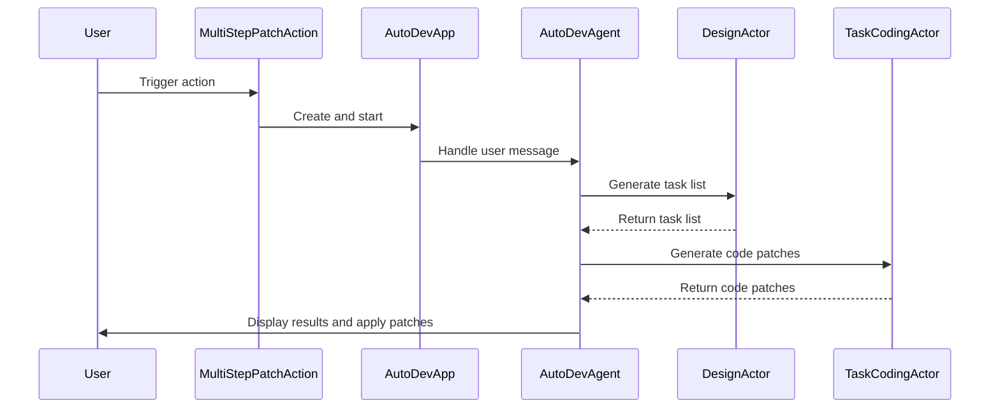

Here's a comprehensive documentation for the provided code:

## Code Overview
- **Language & Frameworks:** Kotlin, IntelliJ Platform SDK
- **Primary Purpose:** Implements a multi-step patch action for code modification in an IntelliJ IDEA plugin
- **Brief Description:** This code defines a `MultiStepPatchAction` class that extends `BaseAction`. It implements an AI-assisted code modification system that breaks down user requests into tasks, generates code patches, and applies them to the selected files in an IntelliJ IDEA project.

## Public Interface
- **Exported Functions/Classes:**
  - `MultiStepPatchAction`: Main action class
  - `AutoDevApp`: Application server for the AI assistant
  - `AutoDevAgent`: Agent class for handling user requests and generating code patches
- **Public Constants/Variables:**
  - `path`: String constant "/autodev"
- **Types/Interfaces:**
  - `TaskList`: Data class representing a list of tasks
  - `Task`: Data class representing a single task

## Dependencies
- **External Libraries**
  - IntelliJ Platform SDK
  - SkyeNet library (com.simiacryptus.skyenet)
  - JOpenAI library (com.simiacryptus.jopenai)
- **Internal Code: Symbol References**
  - `BaseAction`
  - `AppSettingsState`
  - `UITools`
  - `AppServer`

## Architecture
- **Sequence Diagram:**


## Example Usage
```kotlin
// Assuming this is triggered by a user action in IntelliJ IDEA
val action = MultiStepPatchAction()
action.actionPerformed(anActionEvent)
```

## Code Analysis
- **Code Style Observations:**
  - Follows Kotlin coding conventions
  - Uses functional programming concepts
  - Extensive use of lambdas and higher-order functions
- **Code Review Feedback:**
  - Well-structured and modular design
  - Good separation of concerns between different components
  - Proper use of IntelliJ Platform SDK
- **Features:**
  - AI-assisted code modification
  - Task breakdown and code patch generation
  - Integration with IntelliJ IDEA's file system and UI
- **Potential Improvements:**
  - Add more error handling and logging
  - Implement unit tests for critical components
  - Consider adding more customization options for users

## Tags
- **Keyword Tags:** IntelliJ, Plugin, AI, CodeGeneration, Patching, Kotlin
- **Key-Value Tags:**
  - Type: IntelliJ Plugin
  - AI-Powered: Yes
  - Language: Kotlin