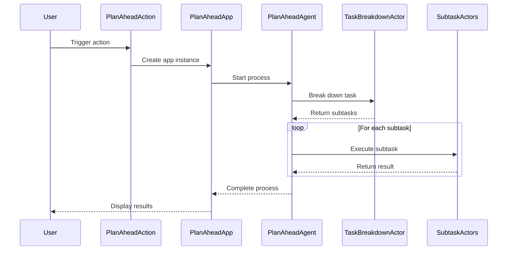

## Code Overview
- **Language & Frameworks:** Kotlin, IntelliJ IDEA Plugin Development
- **Primary Purpose:** Implements a "Plan Ahead" action for an IntelliJ IDEA plugin that breaks down user tasks into smaller, actionable steps and executes them.
- **Brief Description:** This code defines a `PlanAheadAction` class and related components for an IntelliJ IDEA plugin. It allows users to input a high-level task, which is then broken down into smaller subtasks. These subtasks are executed in order, with support for various types of actions like creating new files, editing existing files, generating documentation, and running shell commands.

## Public Interface
- **Exported Functions/Classes:**
  - `PlanAheadAction`: Main action class
  - `PlanAheadApp`: Application server for the plan ahead functionality
  - `PlanAheadAgent`: Agent class that manages the task breakdown and execution process
- **Public Constants/Variables:**
  - `PlanAheadAction.Companion.log`: Logger for the PlanAheadAction class
- **Types/Interfaces (if applicable):**
  - `PlanAheadAction.PlanAheadSettings`: Data class for storing plan ahead settings
  - `PlanAheadAgent.TaskBreakdownResult`: Data class for storing task breakdown results
  - `PlanAheadAgent.Task`: Data class representing a single task
  - `PlanAheadAgent.TaskState`: Enum for task states
  - `PlanAheadAgent.TaskType`: Enum for task types

## Dependencies
- **External Libraries**
  - IntelliJ Platform SDK
  - Kotlin Standard Library
  - SkyeNet library (com.simiacryptus.skyenet)
  - JOpenAI library (com.simiacryptus.jopenai)
- **Internal Code: Symbol References**
  - `AppSettingsState`: Referenced for accessing plugin settings
  - `UITools`: Used for UI-related operations
  - `AppServer`: Used for server-related operations
  - Various action classes (e.g., `BaseAction`, `SimpleActor`, `ParsedActor`, `CodingActor`)

## Architecture
- **Sequence or Flow Diagrams:**


## Example Usage
```kotlin
// This action is typically triggered from the IDE's action system
val planAheadAction = PlanAheadAction()
planAheadAction.actionPerformed(anActionEvent)
```

## Code Analysis
- **Code Style Observations:**
  - Follows Kotlin coding conventions
  - Uses data classes and enums for structured data representation
  - Extensive use of lambda functions and functional programming concepts
- **Code Review Feedback:**
  - Well-structured and modular design
  - Good separation of concerns between action, app, and agent classes
  - Comprehensive error handling and logging
- **Features:**
  - Task breakdown into smaller, actionable subtasks
  - Support for various task types (NewFile, EditFile, Documentation, Inquiry, TaskPlanning, RunShellCommand)
  - Integration with IntelliJ IDEA's action system
  - Configurable settings for model selection and task execution options
- **Potential Improvements:**
  - Consider adding more comprehensive documentation for complex methods
  - Implement unit tests for critical components
  - Evaluate performance impact of multiple API calls and consider optimization strategies

## Tags
- **Keyword Tags:** IntelliJ-Plugin, Task-Planning, Code-Generation, AI-Assisted-Development
- **Key-Value Tags:**
  - Type: IntelliJ-IDEA-Plugin
  - Language: Kotlin
  - AI-Integration: OpenAI-API