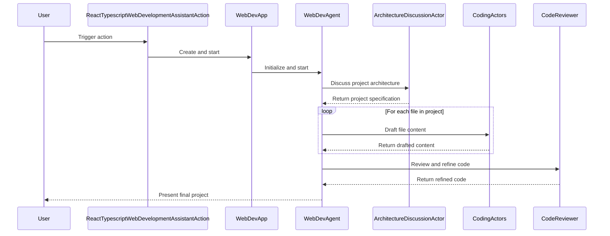

## Code Overview
- **Language & Frameworks:** Kotlin, IntelliJ IDEA Plugin Development, React, TypeScript
- **Primary Purpose:** To provide a web development assistant action for creating React and TypeScript applications within an IntelliJ IDEA plugin.
- **Brief Description:** This code defines a `ReactTypescriptWebDevelopmentAssistantAction` class that extends `BaseAction`. It implements a web development assistant that can generate and manage React and TypeScript projects within the IntelliJ IDEA environment.

## Public Interface
- **Exported Functions/Classes:**
  - `ReactTypescriptWebDevelopmentAssistantAction`
  - `WebDevApp`
  - `WebDevAgent`
- **Public Constants/Variables:**
  - `path: String = "/webDev"`
- **Types/Interfaces (if applicable):**
  - `Settings` data class
  - `ProjectSpec` data class
  - `ProjectFile` data class

## Dependencies
- **External Libraries**
  - IntelliJ Platform SDK
  - Skyenet (custom library for AI-assisted development)
  - JOpenAI (Java client for OpenAI API)
- **Internal Code: Symbol References**
  - `BaseAction`
  - `AppServer`
  - `UITools`
  - `ApplicationServer`
  - Various actor classes (e.g., `ParsedActor`, `SimpleActor`, `ImageActor`)

## Architecture
- **Sequence or Flow Diagrams:**


- **Class Diagrams:** A class diagram would be helpful to illustrate the relationships between `ReactTypescriptWebDevelopmentAssistantAction`, `WebDevApp`, `WebDevAgent`, and the various actor classes.

## Example Usage
```kotlin
val action = ReactTypescriptWebDevelopmentAssistantAction()
action.handle(anActionEvent)
```

## Code Analysis
- **Code Style Observations:**
  - Follows Kotlin coding conventions
  - Uses functional programming concepts (e.g., lambda expressions)
  - Extensive use of nested classes and enums for organization
- **Code Review Feedback:**
  - Well-structured and modular design
  - Good separation of concerns between different actors
  - Extensive use of AI-assisted code generation and review
- **Features:**
  - Project architecture discussion
  - Automated code generation for HTML, TypeScript, CSS, and other file types
  - Image generation capability
  - Code review and refinement
  - Integration with IntelliJ IDEA's action system
- **Potential Improvements:**
  - Consider breaking down large functions (e.g., `start` method in `WebDevAgent`) into smaller, more manageable pieces
  - Add more comprehensive error handling and logging
  - Implement unit tests for critical components

## Tags
- **Keyword Tags:** IntelliJ-Plugin, Web-Development, React, TypeScript, AI-Assisted-Coding
- **Key-Value Tags:**
  - Framework: React
  - Language: TypeScript
  - IDE: IntelliJ-IDEA
  - AI-Integration: OpenAI-API