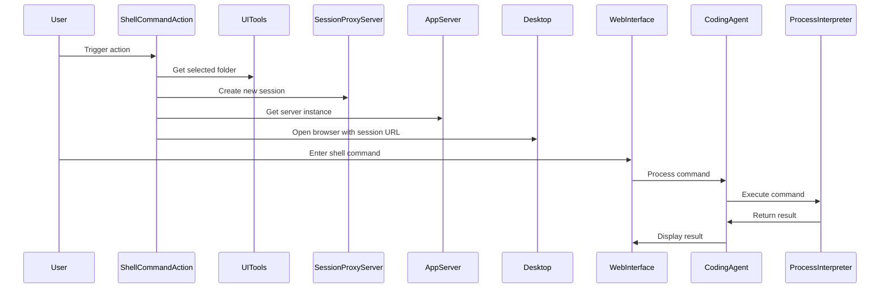

Here's the documentation for the provided code:

## Code Overview
- **Language & Frameworks:** Kotlin, IntelliJ Platform SDK
- **Primary Purpose:** Implement a shell command execution action for an IntelliJ IDEA plugin
- **Brief Description:** This action allows users to execute shell commands in a selected directory within the IDE, using a web-based interface for interaction.

## Public Interface
- **Exported Functions/Classes:** 
  - `ShellCommandAction` class (extends `BaseAction`)
- **Public Constants/Variables:**
  - `isWindows` (private companion object property)

## Dependencies
- **External Libraries**
  - IntelliJ Platform SDK
  - Skyenet library
  - JOpenAI library
- **Internal Code: Symbol References**
  - `BaseAction`
  - `AppSettingsState`
  - `UITools`
  - `AppServer`
  - `SessionProxyServer`

## Architecture
- **Sequence Diagram:**


## Example Usage
```kotlin
// This action is typically triggered from the IDE's action system
val action = ShellCommandAction()
action.actionPerformed(anActionEvent)
```

## Code Analysis
- **Code Style Observations:**
  - Follows Kotlin coding conventions
  - Uses lambda functions and functional programming concepts
  - Implements IntelliJ Platform's action system
- **Code Review Feedback:**
  - Consider adding more error handling and user feedback
  - The `acceptButton` function is empty and could be implemented
- **Features:**
  - Executes shell commands in a selected directory
  - Uses a web-based interface for command input and output display
  - Supports both Windows (PowerShell) and Unix-like (Bash) systems
- **Potential Improvements:**
  - Implement the `acceptButton` functionality
  - Add more robust error handling and user feedback
  - Consider adding command history or frequently used commands feature

## Tags
- **Keyword Tags:** IntelliJ, Plugin, Shell, Command, Execution, Web Interface
- **Key-Value Tags:**
  - Type: Action
  - Platform: IntelliJ
  - Language: Kotlin