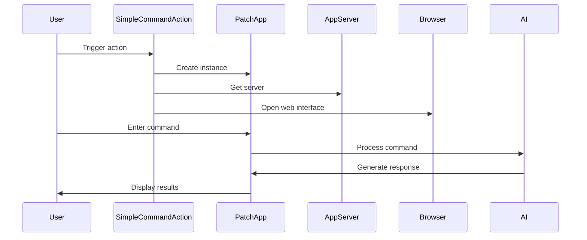

Here's a documentation overview for the provided code:

## Code Overview
- **Language & Frameworks:** Kotlin, IntelliJ Platform SDK
- **Primary Purpose:** Implements a custom action for IntelliJ-based IDEs that allows users to execute AI-assisted coding tasks.
- **Brief Description:** This class, `SimpleCommandAction`, extends `BaseAction` to create an action that opens a web-based interface for interacting with an AI assistant to perform coding tasks on selected files or directories.

## Public Interface
- **Exported Classes:** 
  - `SimpleCommandAction`
  - `PatchApp` (abstract inner class)
- **Public Constants/Variables:**
  - `tripleTilde` (companion object)

## Dependencies
- **External Libraries**
  - IntelliJ Platform SDK
  - SkyeNet library (com.simiacryptus.skyenet)
  - JOpenAI library (com.simiacryptus.jopenai)
- **Internal Code: Symbol References**
  - `AppServer`
  - `BaseAction`
  - `CommandAutofixAction`
  - `AppSettingsState`
  - `UITools`
  - `SessionProxyServer`

## Architecture
- **Sequence Diagram:**

## Example Usage
The action is typically triggered from the IDE's action system. Once triggered, it opens a web interface where users can enter commands. The AI processes these commands and provides code suggestions or modifications.

## Code Analysis
- **Code Style Observations:**
  - Extensive use of Kotlin features like data classes and companion objects
  - Heavy use of lambdas and functional programming concepts
- **Code Review Feedback:**
  - Consider breaking down the `run` method in `PatchApp` into smaller, more manageable functions
  - The `getUserSettings` method could benefit from additional error handling
- **Features:**
  - AI-assisted code modification
  - Web-based interface for interaction
  - File selection and filtering
  - Integration with IntelliJ's action system
- **Potential Improvements:**
  - Implement more robust error handling
  - Add unit tests for core functionality
  - Consider adding more customization options for users

## Tags
- **Keyword Tags:** IntelliJ, AI, Code Generation, Action, Kotlin
- **Key-Value Tags:**
  - Type: IntelliJ Plugin Action
  - AI-Integration: Yes
  - Web-Interface: Yes