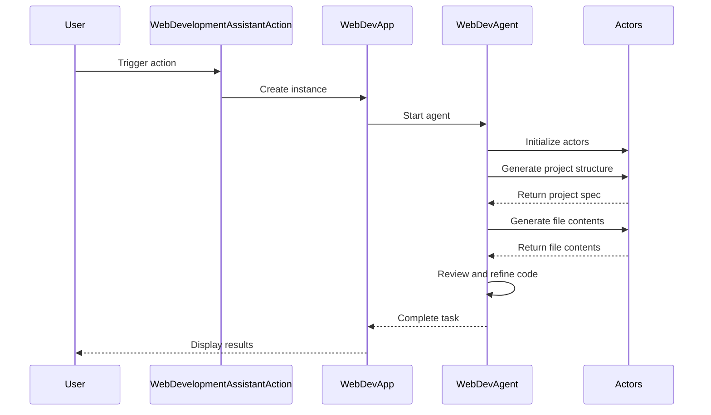

Here's a comprehensive overview of the provided Kotlin code:

## Code Overview
- **Language & Frameworks:** Kotlin, IntelliJ IDEA Plugin Development
- **Primary Purpose:** Implements a Web Development Assistant action for an IntelliJ IDEA plugin
- **Brief Description:** This code defines a WebDevelopmentAssistantAction class that creates a web development assistant within an IntelliJ IDEA environment. It uses AI-powered actors to generate and refine web application components.

## Public Interface
- **Exported Functions/Classes:**
  - WebDevelopmentAssistantAction
  - WebDevApp
  - WebDevAgent
- **Public Constants/Variables:**
  - VirtualFile.toFile (extension property)
- **Types/Interfaces:**
  - ProjectSpec (data class)
  - ProjectFile (data class)

## Dependencies
- **External Libraries**
  - com.intellij.openapi.actionSystem
  - com.intellij.openapi.vfs
  - com.simiacryptus.jopenai
  - com.simiacryptus.skyenet
  - javax.imageio
- **Internal Code: Symbol References**
  - com.github.simiacryptus.aicoder.actions.BaseAction
  - com.github.simiacryptus.aicoder.config.AppSettingsState
  - com.github.simiacryptus.aicoder.util.UITools

## Architecture
- **Sequence or Flow Diagrams:**

- **Class Diagrams:** A class diagram would be helpful to illustrate the relationships between WebDevelopmentAssistantAction, WebDevApp, WebDevAgent, and the various Actor classes.

## Example Usage
This code is typically used as part of an IntelliJ IDEA plugin. Users would trigger the WebDevelopmentAssistantAction from within the IDE, which would then open a web interface for interacting with the AI-powered web development assistant.

## Code Analysis
- **Code Style Observations:**
  - Follows Kotlin coding conventions
  - Uses data classes for structured data (ProjectSpec, ProjectFile)
  - Extensive use of lambda functions and functional programming concepts
- **Code Review Feedback:**
  - Well-structured and modular design
  - Good separation of concerns between different components (Action, App, Agent, Actors)
  - Extensive use of AI-powered code generation and review
- **Features:**
  - AI-powered web application structure generation
  - Automatic generation of HTML, CSS, JavaScript, and image files
  - Code review and refinement capabilities
  - Integration with IntelliJ IDEA's action system
- **Potential Improvements:**
  - Add more comprehensive error handling and logging
  - Consider breaking down some of the larger functions into smaller, more focused methods
  - Add unit tests for critical components
  - Implement caching mechanisms to improve performance for repeated tasks

## Tags
- **Keyword Tags:** IntelliJ, Plugin, Web Development, AI, Code Generation, Kotlin
- **Key-Value Tags:**
  - Type: IntelliJ IDEA Plugin
  - Language: Kotlin
  - AI-Powered: Yes
  - Target: Web Development