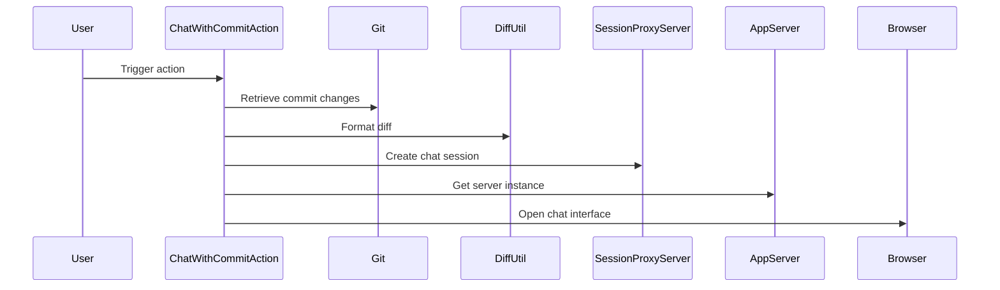

## Code Overview
- **Language & Frameworks:** Kotlin, IntelliJ Platform SDK
- **Primary Purpose:** Implement a Git commit chat action for IntelliJ-based IDEs
- **Brief Description:** This code defines a `ChatWithCommitAction` class that allows users to chat about Git commit changes within an IntelliJ-based IDE. It retrieves commit information, formats it, and opens a chat interface to discuss the changes.

## Public Interface
- **Exported Functions/Classes:**
  - `ChatWithCommitAction` class (extends `AnAction`)
- **Public Constants/Variables:**
  - `isBinary` extension property on `String`

## Dependencies
- **External Libraries**
  - IntelliJ Platform SDK
  - SkyeNet library
- **Internal Code: Symbol References**
  - `AppServer`
  - `SessionProxyServer`
  - `AppSettingsState`
  - `CodeChatSocketManager`
  - `IdeaOpenAIClient`

## Architecture
- **Sequence Diagram:**

## Example Usage
This action would typically be triggered from the IDE's version control menu or toolbar. When activated, it retrieves the selected Git commit changes, formats them, and opens a chat interface for discussing those changes.

## Code Analysis
- **Code Style Observations:**
  - Follows Kotlin coding conventions
  - Uses extension properties and functions
  - Implements threading for background tasks
- **Code Review Feedback:**
  - Good error handling and logging
  - Clear separation of concerns between action handling and chat setup
- **Features:**
  - Supports binary file detection
  - Handles added, deleted, and modified files
  - Integrates with IntelliJ's VCS system
- **Potential Improvements:**
  - Consider adding user preferences for chat model selection
  - Implement caching for better performance with large diffs

## Tags
- **Keyword Tags:** Git, Commit, Chat, IntelliJ, Plugin, VCS
- **Key-Value Tags:**
  - Type: Action
  - Integration: Git
  - UI: Chat Interface