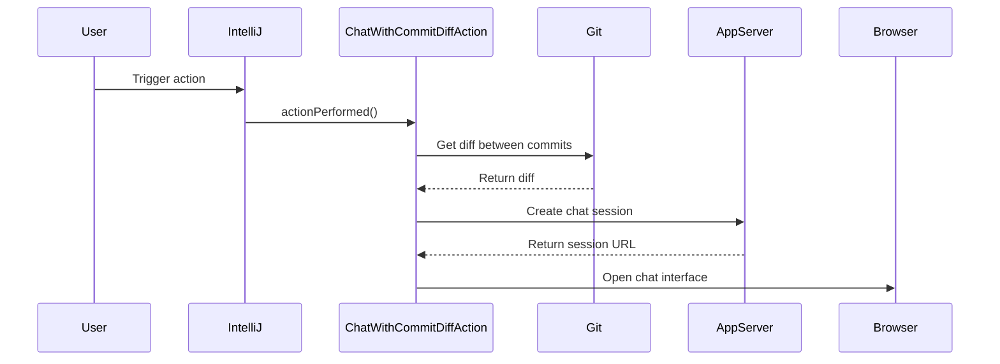

Here's the documentation for the provided code:

## Code Overview
- **Language & Frameworks:** Kotlin, IntelliJ Platform SDK, Git4Idea
- **Primary Purpose:** To provide a chat interface for discussing Git commit differences
- **Brief Description:** This action allows users to chat about the differences between a selected Git commit and the current HEAD, using an AI-powered chat interface.

## Public Interface
- **Exported Functions/Classes:** 
  - `ChatWithCommitDiffAction` class (extends AnAction)

## Dependencies
- **External Libraries**
  - IntelliJ Platform SDK
  - Git4Idea
  - SkyeNet (com.simiacryptus.skyenet)
- **Internal Code: Symbol References**
  - `AppServer`
  - `SessionProxyServer`
  - `AppSettingsState`
  - `CodeChatSocketManager`
  - `IdeaOpenAIClient`

## Architecture
- **Sequence Diagram:**

## Example Usage
This action is typically triggered from the Git commit history view in IntelliJ IDEA. The user selects a commit, and the action opens a chat interface to discuss the changes between that commit and the current HEAD.

## Code Analysis
- **Code Style Observations:** 
  - Follows Kotlin coding conventions
  - Uses companion object for logger
  - Utilizes IntelliJ Platform API effectively
- **Features:**
  - Integrates with Git version control
  - Opens a web-based chat interface
  - Uses AI-powered chat for discussing code changes
- **Potential Improvements:**
  - Error handling could be more robust
  - Consider adding user preferences for chat model selection
  - Could benefit from more detailed comments explaining complex logic

## Tags
- **Keyword Tags:** Git, Commit, Diff, Chat, AI, IntelliJ
- **Key-Value Tags:**
  - Type: Action
  - Integration: Git
  - UI: Web-based