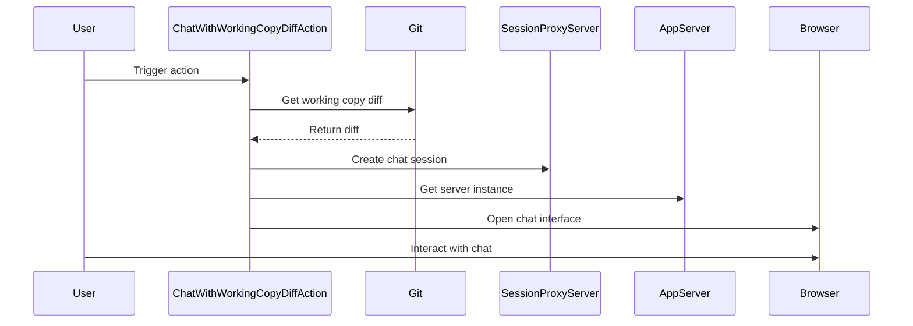

## Code Overview
- **Language & Frameworks:** Kotlin, IntelliJ Platform SDK, Git4Idea
- **Primary Purpose:** Provide a chat interface for discussing Git working copy changes
- **Brief Description:** This action allows users to chat about the differences between the current working copy and the HEAD commit in a Git repository.

## Public Interface
- **Exported Functions/Classes:** 
  - `ChatWithWorkingCopyDiffAction` (extends AnAction)

## Dependencies
- **External Libraries**
  - IntelliJ Platform SDK
  - Git4Idea
  - SkyeNet (com.simiacryptus.skyenet)
- **Internal Code: Symbol References**
  - `com.github.simiacryptus.aicoder.AppServer`
  - `com.github.simiacryptus.aicoder.actions.generic.SessionProxyServer`
  - `com.github.simiacryptus.aicoder.config.AppSettingsState`
  - `com.github.simiacryptus.aicoder.util.CodeChatSocketManager`
  - `com.github.simiacryptus.aicoder.util.IdeaOpenAIClient`

## Architecture
- **Sequence Diagram:**

## Example Usage
This action is typically triggered from the IDE's Git menu or context menu. Once triggered, it opens a browser window with a chat interface where users can discuss the current working copy changes.

## Code Analysis
- **Code Style Observations:** 
  - Follows Kotlin coding conventions
  - Uses companion object for logger
  - Implements AnAction for IntelliJ integration
- **Code Review Feedback:**
  - Good error handling and logging
  - Proper use of threading for background tasks
- **Features:**
  - Integrates with Git repositories in IntelliJ IDEA
  - Opens a chat interface in the browser for discussing changes
  - Uses AI-powered chat for code discussions
- **Potential Improvements:**
  - Consider adding user preferences for chat model selection
  - Implement caching mechanism for frequent diffs

## Tags
- **Keyword Tags:** Git, Diff, Chat, IntelliJ, Action
- **Key-Value Tags:**
  - Type: IDE Plugin
  - Integration: Git
  - UI: Web-based Chat