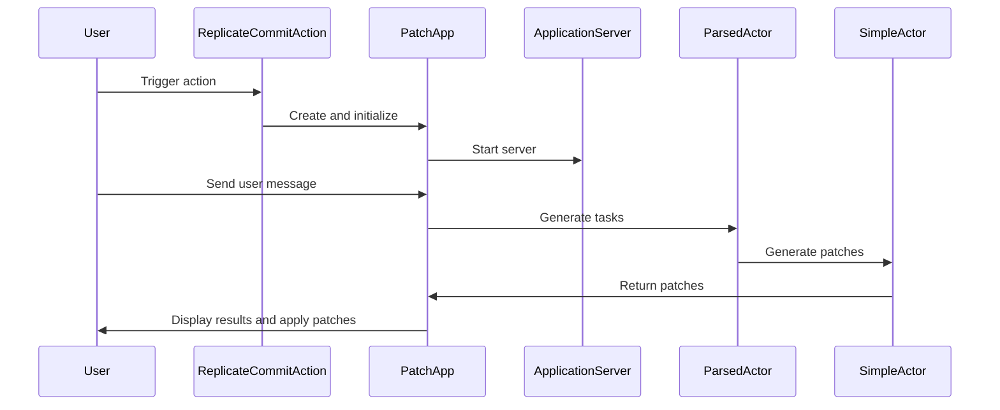

Here's a documentation overview for the provided code:

## Code Overview
- **Language & Frameworks:** Kotlin, IntelliJ Platform SDK
- **Primary Purpose:** Implement a "Replicate Commit" action for an IntelliJ IDEA plugin
- **Brief Description:** This action allows users to replicate a commit by analyzing changes, generating tasks, and applying patches to files.

## Public Interface
- **Exported Functions/Classes:**
  - `ReplicateCommitAction` class (extends BaseAction)
  - `PatchApp` abstract inner class (extends ApplicationServer)
- **Public Constants/Variables:**
  - `tripleTilde` in companion object

## Dependencies
- **External Libraries**
  - IntelliJ Platform SDK
  - SkyeNet library
  - JOpenAI library
- **Internal Code: Symbol References**
  - `BaseAction`
  - `AppServer`
  - `SessionProxyServer`
  - `AppSettingsState`
  - `UITools`

## Architecture
- **Sequence Diagram:**

## Example Usage
The action is triggered from the IDE, likely through a menu item or keyboard shortcut. The user interacts with the generated web interface to provide input and review/apply suggested changes.

## Code Analysis
- **Code Style Observations:**
  - Extensive use of Kotlin features (data classes, companion objects)
  - Nested class structure (PatchApp inside ReplicateCommitAction)
  - Use of abstract methods for customization (codeFiles, codeSummary, projectSummary)
- **Code Review Feedback:**
  - Consider breaking down the large `run` method in PatchApp for better readability
  - Error handling could be improved, especially in file operations
- **Features:**
  - Analyzes git commit changes
  - Generates tasks based on commit and user input
  - Creates patches for files
  - Provides a web interface for user interaction
- **Potential Improvements:**
  - Add more robust error handling and logging
  - Consider making PatchApp a separate class for better separation of concerns
  - Implement unit tests for core functionality

## Tags
- **Keyword Tags:** IntelliJ, Plugin, Git, Commit, AI, Code Generation
- **Key-Value Tags:**
  - Type: IntelliJ Plugin Action
  - Language: Kotlin
  - Complexity: High