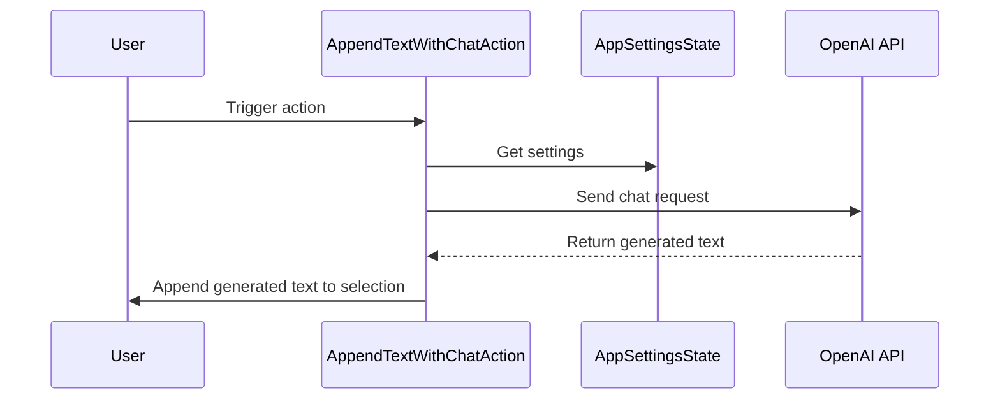

## Code Overview
- **Language & Frameworks:** Kotlin, IntelliJ Platform SDK
- **Primary Purpose:** To append text to the end of a user's selection using AI-generated content
- **Brief Description:** This action class extends SelectionAction to provide functionality for appending AI-generated text to the user's selected text in an IntelliJ-based IDE.

## Public Interface
- **Exported Functions/Classes:** AppendTextWithChatAction (class)
- **Public Constants/Variables:** None explicitly defined
- **Types/Interfaces (if applicable):** None explicitly defined

## Dependencies
- **External Libraries**
  - com.github.simiacryptus.aicoder.config.AppSettingsState
  - com.intellij.openapi.actionSystem.*
  - com.intellij.openapi.project.Project
  - com.simiacryptus.jopenai.ApiModel.*
  - com.simiacryptus.jopenai.util.ClientUtil

- **Internal Code: Symbol References**
  - SelectionAction
  - AppSettingsState
  - chatModel

## Architecture
- **Sequence or Flow Diagrams:** 

## Example Usage
This action would typically be triggered by a user selecting text in the IDE and then invoking the action through a menu item or shortcut.

## Code Analysis
- **Code Style Observations:** 
  - Follows Kotlin coding conventions
  - Uses nullable types and safe calls
  - Utilizes Kotlin's functional features like copy and listOf

- **Code Review Feedback:**
  - The action is well-structured and follows the SelectionAction pattern
  - Good use of AppSettingsState for configuration
  - Consider adding more error handling for API calls

- **Features:**
  - Appends AI-generated text to user's selection
  - Uses OpenAI's chat model for text generation
  - Configurable through AppSettingsState

- **Potential Improvements:**
  - Add error handling for API calls
  - Consider allowing user to input additional context or instructions
  - Implement caching to reduce API calls for similar requests

## Tags
- **Keyword Tags:** AI, text generation, IntelliJ, action, OpenAI, chat model
- **Key-Value Tags:** 
  - Type: Action
  - AI-Model: OpenAI Chat
  - IDE: IntelliJ