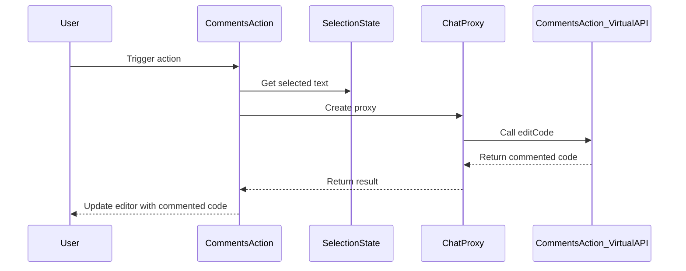

Here's the documentation for the provided code:

## Code Overview
- **Language & Frameworks:** Kotlin, IntelliJ Platform SDK
- **Primary Purpose:** Add comments to code explaining each line
- **Brief Description:** This action adds explanatory comments to selected code using AI-powered text generation.

## Public Interface
- **Exported Functions/Classes:** 
  - `CommentsAction` class (extends `SelectionAction<String>`)
- **Public Constants/Variables:** None
- **Types/Interfaces:**
  - `CommentsAction_VirtualAPI` interface (inner interface)
  - `CommentsAction_ConvertedText` class (inner class)

## Dependencies
- **External Libraries**
  - IntelliJ Platform SDK
  - OpenAI API (via `com.simiacryptus.jopenai.proxy.ChatProxy`)
- **Internal Code: Symbol References**
  - `AppSettingsState`
  - `ComputerLanguage`
  - `SelectionAction`

## Architecture
- **Sequence Diagram:**

## Example Usage
This action is typically used within an IDE. The user selects a block of code and triggers the CommentsAction. The action then processes the selected code and adds explanatory comments to each line.

## Code Analysis
- **Code Style Observations:** 
  - Follows Kotlin coding conventions
  - Uses dependency injection for API and settings
- **Code Review Feedback:**
  - Good use of interfaces for API abstraction
  - Consider adding more error handling and logging
- **Features:**
  - Supports multiple programming languages
  - Uses AI to generate contextual comments
  - Configurable through app settings
- **Potential Improvements:**
  - Add unit tests
  - Implement caching to improve performance for repeated requests
  - Allow customization of comment style based on language

## Tags
- **Keyword Tags:** #kotlin #intellij-plugin #code-comments #ai-assisted-coding
- **Key-Value Tags:**
  - feature: code-commenting
  - integration: openai-api
  - platform: intellij-idea