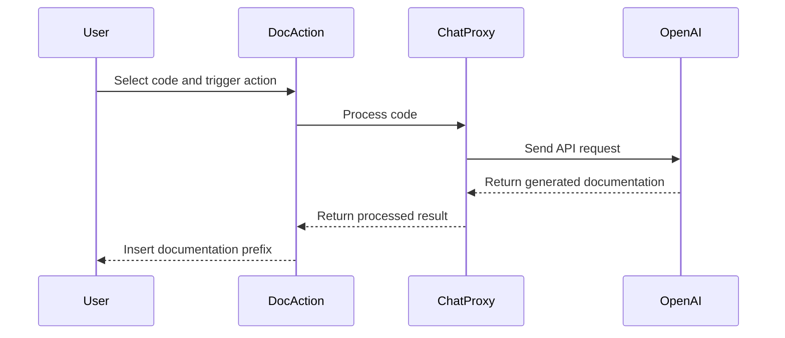

## Code Overview
- **Language & Frameworks:** Kotlin, IntelliJ Platform SDK
- **Primary Purpose:** To generate documentation for selected code blocks in various programming languages
- **Brief Description:** This action class, `DocAction`, extends `SelectionAction` to provide functionality for generating documentation prefixes for selected code blocks in supported programming languages.

## Public Interface
- **Exported Functions/Classes:** 
  - `DocAction` class
  - `DocAction_VirtualAPI` interface (nested)
- **Public Constants/Variables:** None
- **Types/Interfaces:**
  - `DocAction_VirtualAPI`: Interface for processing code and generating documentation
  - `DocAction_ConvertedText`: Data class for holding generated documentation

## Dependencies
- **External Libraries**
  - IntelliJ Platform SDK
  - OpenAI API (via `ChatProxy`)
- **Internal Code: Symbol References**
  - `SelectionAction`
  - `AppSettingsState`
  - `ComputerLanguage`
  - `IndentedText`
  - `PsiUtil`

## Architecture
- **Sequence Diagram:**


## Example Usage
```kotlin
// Assuming the user has selected the following code in a Kotlin file:
fun hello() {
    println("Hello, world!")
}

// After triggering the DocAction, the result might look like:
/**
 * Prints "Hello, world!" to the console.
 *
 * This function is a simple demonstration of Kotlin's print functionality.
 * It doesn't take any parameters and doesn't return any value.
 */
fun hello() {
    println("Hello, world!")
}
```

## Code Analysis
- **Code Style Observations:** 
  - Follows Kotlin coding conventions
  - Uses lazy initialization for the `proxy` property
- **Code Review Feedback:**
  - Consider adding more detailed error handling
  - The `getConfig` method returns an empty string, which might be improved
- **Features:**
  - Supports multiple programming languages
  - Uses AI-powered documentation generation
  - Integrates with IntelliJ's PSI (Program Structure Interface)
- **Potential Improvements:**
  - Add user customization options for documentation style
  - Implement caching to improve performance for repeated requests
  - Expand language support and improve language-specific documentation generation

## Tags
- **Keyword Tags:** documentation, code-generation, intellij-plugin, kotlin
- **Key-Value Tags:** 
  - language: kotlin
  - framework: intellij-platform
  - ai-integration: openai