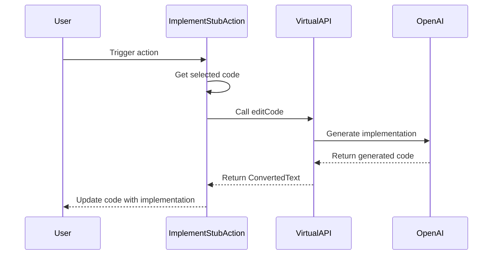

Here's the documentation for the provided code:

## Code Overview
- **Language & Frameworks:** Kotlin, IntelliJ Platform SDK
- **Primary Purpose:** Implement a stub action for code completion in an IDE
- **Brief Description:** This action implements a stub for selected code using AI-powered code generation

## Public Interface
- **Exported Functions/Classes:** 
  - `ImplementStubAction` class (extends `SelectionAction<String>`)
  - `VirtualAPI` interface (nested within `ImplementStubAction`)
- **Public Constants/Variables:** None
- **Types/Interfaces:**
  - `VirtualAPI` interface with `editCode` method
  - `ConvertedText` nested class within `VirtualAPI`

## Dependencies
- **External Libraries**
  - IntelliJ Platform SDK
  - OpenAI API (via `com.simiacryptus.jopenai` package)
- **Internal Code: Symbol References**
  - `AppSettingsState`
  - `ComputerLanguage`
  - `PsiUtil`
  - `SelectionAction`

## Architecture
- **Sequence Diagram:**

## Example Usage
This action would typically be triggered by a user selecting a code stub in their IDE and invoking the "Implement Stub" action. The action then uses AI to generate an implementation for the selected stub.

## Code Analysis
- **Code Style Observations:** 
  - Follows Kotlin coding conventions
  - Uses nullable types and safe calls
  - Implements IntelliJ Platform's action system
- **Code Review Feedback:**
  - Good use of extension functions and Kotlin's functional programming features
  - Proper error handling could be improved
- **Features:**
  - AI-powered stub implementation
  - Context-aware code generation
  - Supports multiple programming languages
- **Potential Improvements:**
  - Add more robust error handling
  - Implement caching for frequently used stubs
  - Allow customization of AI prompts

## Tags
- **Keyword Tags:** #kotlin #intellij-plugin #ai-code-generation #stub-implementation
- **Key-Value Tags:**
  - complexity: medium
  - ai-integration: openai
  - ide-integration: intellij