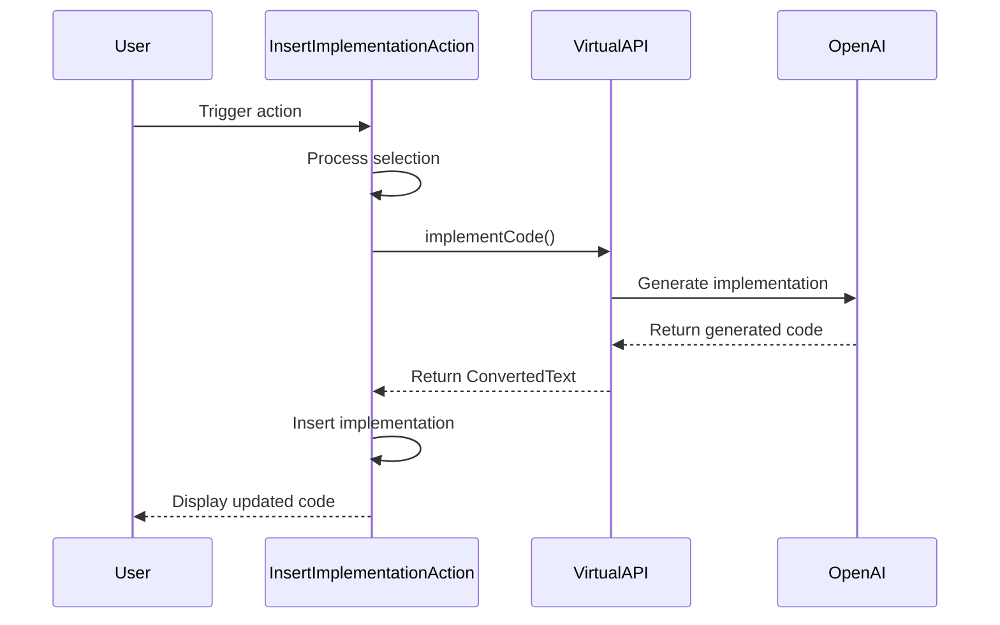

## Code Overview
- **Language & Frameworks:** Kotlin, IntelliJ Platform SDK
- **Primary Purpose:** Implement an action to insert code implementation based on comments or selected text
- **Brief Description:** This class, `InsertImplementationAction`, extends `SelectionAction` to provide functionality for inserting code implementations based on comments or selected text in the IntelliJ IDEA editor.

## Public Interface
- **Exported Functions/Classes:**
  - `InsertImplementationAction` class
  - `VirtualAPI` interface with `implementCode` method
- **Public Constants/Variables:** None
- **Types/Interfaces:**
  - `VirtualAPI` interface
  - `VirtualAPI.ConvertedText` inner class

## Dependencies
- **External Libraries**
  - IntelliJ Platform SDK
  - OpenAI API (via `ChatProxy`)
- **Internal Code: Symbol References**
  - `SelectionAction`
  - `AppSettingsState`
  - `ComputerLanguage`
  - `TextBlock`
  - `UITools`
  - `PsiClassContext`
  - `PsiUtil`

## Architecture
- **Sequence Diagram:**


## Example Usage
```kotlin
// This action is typically triggered by a user in the IntelliJ IDEA editor
// The user selects a comment or text and invokes the action
// The action then processes the selection and inserts the generated implementation
```

## Code Analysis
- **Code Style Observations:**
  - Follows Kotlin coding conventions
  - Uses nullable types and safe calls
  - Implements IntelliJ Platform's action system
- **Code Review Feedback:**
  - Consider adding more detailed comments for complex logic
  - Error handling could be improved
- **Features:**
  - Supports multiple programming languages
  - Uses OpenAI API for code generation
  - Integrates with IntelliJ's PSI (Program Structure Interface)
- **Potential Improvements:**
  - Add unit tests
  - Implement better error handling and user feedback
  - Consider caching generated implementations for performance

## Tags
- **Keyword Tags:** IntelliJ, Plugin, AI, CodeGeneration, OpenAI
- **Key-Value Tags:**
  - Type: Action
  - IntegrationPoint: Editor
  - AIModel: OpenAI