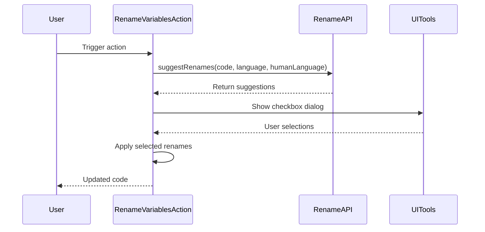

## Code Overview
- **Language & Frameworks:** Kotlin, IntelliJ Platform SDK
- **Primary Purpose:** Rename variables in selected code using AI suggestions
- **Brief Description:** This action suggests and applies variable renames in selected code using an AI-powered API

## Public Interface
- **Exported Functions/Classes:** 
  - `RenameVariablesAction` class
  - `RenameAPI` interface
- **Public Constants/Variables:** None
- **Types/Interfaces:**
  - `RenameAPI` interface with `suggestRenames` method
  - `SuggestionResponse` class with `suggestions` list
  - `Suggestion` class with `originalName` and `suggestedName` properties

## Dependencies
- **External Libraries**
  - IntelliJ Platform SDK
  - OpenAI API (via `ChatProxy`)
- **Internal Code: Symbol References**
  - `SelectionAction`
  - `AppSettingsState`
  - `ComputerLanguage`
  - `UITools`

## Architecture
- **Sequence Diagram:**


## Example Usage
```kotlin
// Assuming this action is registered in the IDE
// User selects code in the editor and triggers the action
// The action will suggest variable renames and apply the selected ones
```

## Code Analysis
- **Code Style Observations:** 
  - Follows Kotlin coding conventions
  - Uses nullable types and safe calls
- **Code Review Feedback:**
  - Consider adding more comments for complex logic
  - Error handling could be improved
- **Features:**
  - AI-powered variable rename suggestions
  - User selection of which renames to apply
  - Supports multiple programming languages
- **Potential Improvements:**
  - Add unit tests
  - Implement caching for API calls
  - Allow customization of AI model parameters

## Tags
- **Keyword Tags:** variable-renaming, ai-assisted-coding, intellij-plugin
- **Key-Value Tags:** 
  - language: kotlin
  - framework: intellij-platform-sdk
  - ai-integration: openai-api