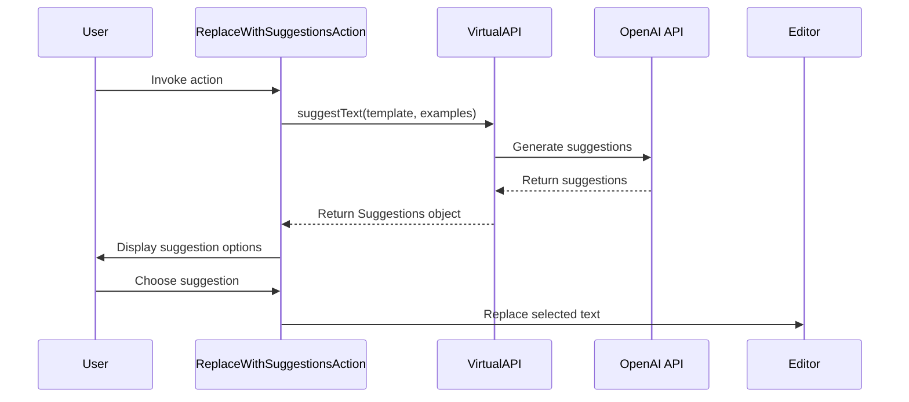

Here's a documentation overview for the provided code:

## Code Overview
- **Language & Frameworks:** Kotlin, IntelliJ Platform SDK
- **Primary Purpose:** To provide a user interface for replacing selected text with AI-generated suggestions
- **Brief Description:** This action allows users to select text in the editor and replace it with AI-generated suggestions based on the surrounding context.

## Public Interface
- **Exported Classes:** `ReplaceWithSuggestionsAction`
- **Types/Interfaces:** `VirtualAPI` (inner interface)

## Dependencies
- **External Libraries:**
  - IntelliJ Platform SDK
  - OpenAI API (via `com.simiacryptus.jopenai` package)
- **Internal Code: Symbol References:**
  - `com.github.simiacryptus.aicoder.actions.SelectionAction`
  - `com.github.simiacryptus.aicoder.config.AppSettingsState`
  - `com.github.simiacryptus.aicoder.util.UITools`

## Architecture
- **Sequence Diagram:**


## Example Usage
```kotlin
// This action is typically invoked through the IDE's action system
// When triggered, it will:
// 1. Get the selected text and surrounding context
// 2. Generate suggestions using the AI model
// 3. Present the suggestions to the user
// 4. Replace the selected text with the chosen suggestion
```

## Code Analysis
- **Code Style Observations:**
  - Follows Kotlin coding conventions
  - Uses functional programming concepts (e.g., lambda expressions)
- **Code Review Feedback:**
  - Consider adding more comments to explain complex logic
  - The `choose` method could be made more flexible by accepting a custom prompt
- **Features:**
  - AI-powered text suggestion
  - Context-aware suggestions based on surrounding text
  - User interface for selecting from multiple suggestions
- **Potential Improvements:**
  - Add error handling for API calls
  - Allow customization of the number of suggestions generated
  - Implement caching to improve performance for repeated requests

## Tags
- **Keyword Tags:** AI, text-generation, IntelliJ-plugin, context-aware
- **Key-Value Tags:**
  - Type: Action
  - AI-Model: OpenAI
  - UI-Component: RadioButtonDialog