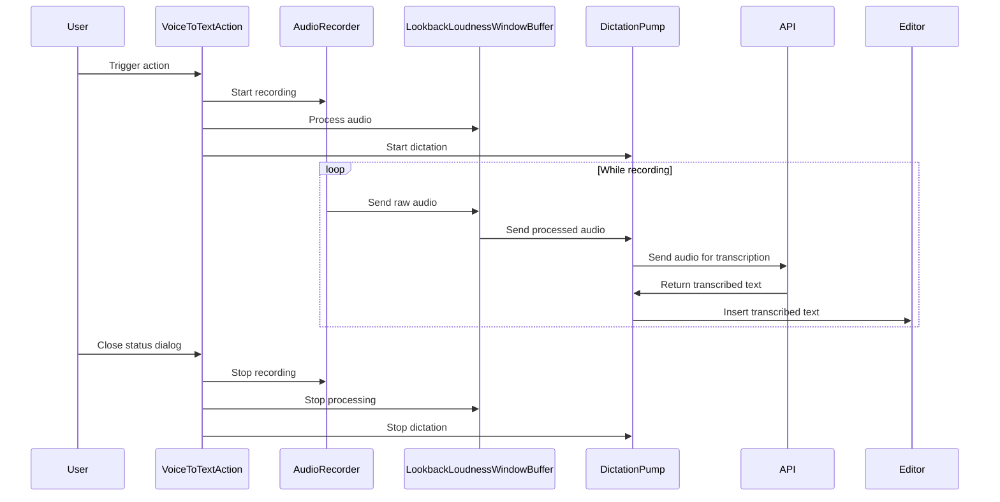

## Code Overview
- **Language & Frameworks:** Kotlin, IntelliJ Platform SDK
- **Primary Purpose:** Implement a voice-to-text action for IntelliJ-based IDEs
- **Brief Description:** This action records audio, processes it, and converts it to text which is then inserted into the editor.

## Public Interface
- **Exported Functions/Classes:**
  - `VoiceToTextAction` class (extends BaseAction)
- **Public Constants/Variables:** None
- **Types/Interfaces:** None

## Dependencies
- **External Libraries**
  - IntelliJ Platform SDK
  - SLF4J for logging
  - javax.sound.sampled for audio processing
  - com.simiacryptus.jopenai for audio recording and processing
- **Internal Code: Symbol References**
  - `BaseAction`
  - `AppSettingsState`
  - `UITools`

## Architecture
- **Sequence Diagram:**

## Example Usage
This action is typically triggered by the user through the IDE's action system, such as a menu item or keyboard shortcut.

## Code Analysis
- **Code Style Observations:**
  - Uses Kotlin idioms and language features
  - Implements multithreading for concurrent audio processing and transcription
- **Code Review Feedback:**
  - Consider adding more error handling and recovery mechanisms
  - The `targetDataLine` lazy initialization could be improved for better error handling
- **Features:**
  - Real-time voice-to-text transcription
  - Supports inserting text at cursor or replacing selected text
  - Uses a status dialog to control recording duration
- **Potential Improvements:**
  - Add user settings for customizing audio recording parameters
  - Implement a more robust error handling system
  - Consider using coroutines instead of raw threads for better concurrency management

## Tags
- **Keyword Tags:** voice-to-text, dictation, audio-processing, IntelliJ-plugin
- **Key-Value Tags:**
  - complexity: high
  - feature-category: accessibility
  - performance-impact: moderate