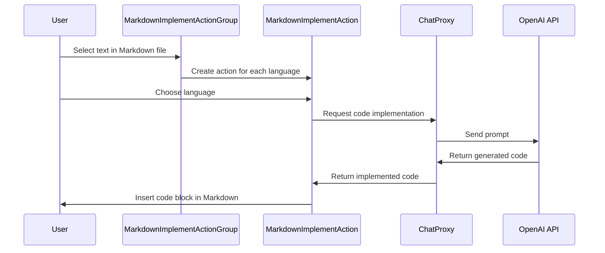

Here's a documentation overview for the provided Kotlin code:

## Code Overview
- **Language & Frameworks:** Kotlin, IntelliJ Platform SDK
- **Primary Purpose:** Implement a Markdown code block generation action group for various programming languages
- **Brief Description:** This file defines an action group and associated actions for generating code blocks in Markdown files for different programming languages.

## Public Interface
- **Exported Classes:**
  - `MarkdownImplementActionGroup`: Main action group class
  - `MarkdownImplementAction`: Individual action for each programming language
- **Public Constants/Variables:**
  - `markdownLanguages`: List of supported programming languages

## Dependencies
- **External Libraries**
  - IntelliJ Platform SDK
  - OpenAI API (via `ChatProxy`)
- **Internal Code: Symbol References**
  - `SelectionAction`
  - `AppSettingsState`
  - `ComputerLanguage`
  - `UITools`

## Architecture
- **Sequence Diagram:**

## Example Usage
1. Open a Markdown file in IntelliJ IDEA
2. Select some text describing code functionality
3. Right-click to open the context menu
4. Navigate to the Markdown Implement action group
5. Choose a target programming language
6. The plugin will generate a code block for the selected language and insert it into the Markdown file

## Code Analysis
- **Code Style Observations:**
  - Follows Kotlin coding conventions
  - Uses functional programming concepts (e.g., `map`, `toTypedArray`)
- **Code Review Feedback:**
  - Good separation of concerns between action group and individual actions
  - Utilizes IntelliJ Platform SDK effectively
- **Features:**
  - Supports multiple programming languages
  - Integrates with OpenAI API for code generation
  - Context-aware (only enabled for Markdown files with text selection)
- **Potential Improvements:**
  - Add error handling for API calls
  - Implement caching to reduce API calls for repeated requests
  - Allow customization of supported languages

## Tags
- **Keyword Tags:** Markdown, code-generation, IntelliJ-plugin, OpenAI, action-group
- **Key-Value Tags:**
  - Type: IntelliJ IDEA Plugin
  - Language: Kotlin
  - Feature: Markdown Code Block Generation