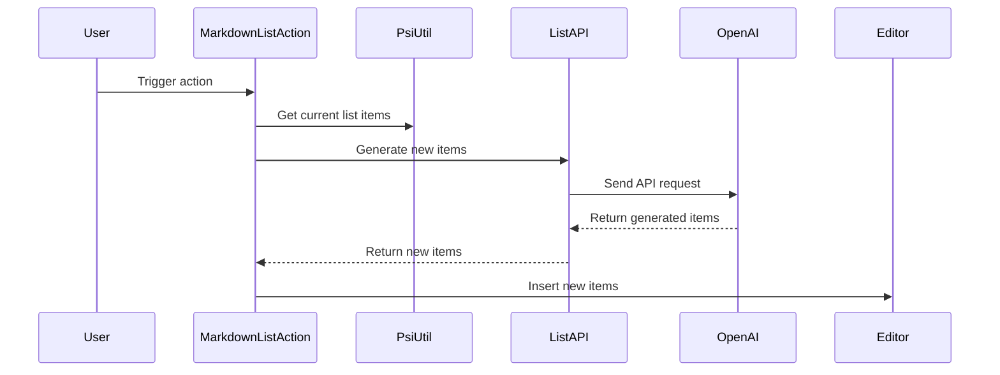

Here's a documentation overview for the provided Kotlin code:

## Code Overview
- **Language & Frameworks:** Kotlin, IntelliJ Platform SDK
- **Primary Purpose:** Extend Markdown lists in IntelliJ-based IDEs using AI-generated content
- **Brief Description:** This action adds new items to existing Markdown lists using an AI model to generate content

## Public Interface
- **Exported Functions/Classes:** 
  - `MarkdownListAction` class (extends BaseAction)
  - `ListAPI` interface (nested within MarkdownListAction)
- **Public Constants/Variables:** None
- **Types/Interfaces:**
  - `ListAPI`: Interface for AI-based list generation
  - `ListAPI.Items`: Data class for holding generated list items

## Dependencies
- **External Libraries**
  - IntelliJ Platform SDK
  - OpenAI API (via `com.simiacryptus.jopenai` package)
- **Internal Code: Symbol References**
  - `BaseAction`
  - `AppSettingsState`
  - `UITools`
  - `PsiUtil`
  - `ComputerLanguage`

## Architecture
- **Sequence Diagram:**

## Example Usage
This action is typically used within an IntelliJ-based IDE. The user would place their cursor at the end of a Markdown list and trigger the action, which would then extend the list with AI-generated items.

## Code Analysis
- **Code Style Observations:** 
  - Follows Kotlin coding conventions
  - Uses IntelliJ Platform SDK idioms
- **Code Review Feedback:**
  - Good separation of concerns between UI interaction and AI generation
  - Proper error handling could be improved
- **Features:**
  - AI-powered list extension
  - Maintains existing list formatting (bullet type, indentation)
  - Works with various Markdown list types (unordered, ordered, task lists)
- **Potential Improvements:**
  - Add user configuration for number of items to generate
  - Implement caching to reduce API calls
  - Add support for nested lists

## Tags
- **Keyword Tags:** Markdown, AI, IntelliJ, Plugin, List Generation
- **Key-Value Tags:**
  - Type: IntelliJ Plugin Action
  - AI-Model: OpenAI GPT
  - Language: Kotlin